<div class="content">

Our app's interface is currently quite basic:

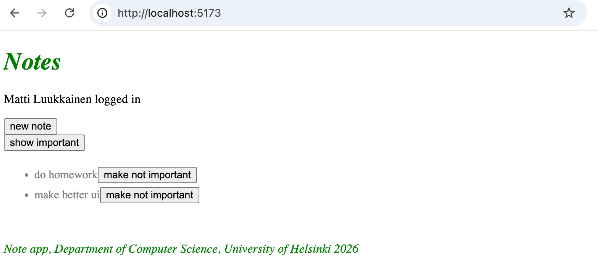

We want to change that. Let's start with the app's navigation structure:

It is very common for web apps to have a navigation bar that allows users to switch between different views within the app. Our note-taking app could include a home page

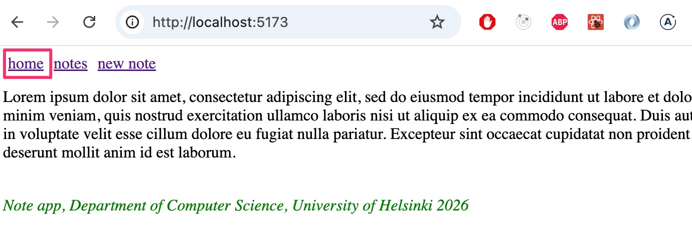

and a separate page for viewing notes:

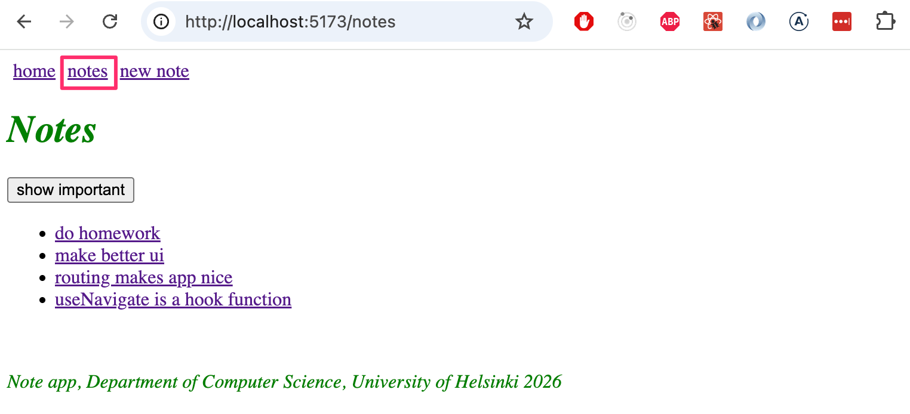

as well as a page for creating notes:

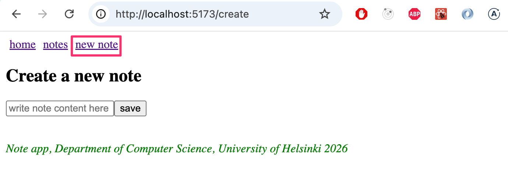

[In an old-school web application](/part0#traditional-web-application), switching between pages displayed by the application involved the browser sending a new HTTP GET request to the server and then rendering the HTML code returned by the server, which corresponded to the new view.

In single-page applications, however, you are actually on the same page the entire time, and JavaScript code executed in the browser creates the illusion of different "pages." If HTTP requests are made when changing views, they are used solely to fetch JSON-formatted data that may be required to display the new view.

An application with a navigation bar and multiple views would be easy to implement with React, for example, by having the application state <i>page</i> remember which page the user is on, and rendering the correct view based on this:


```js
const App = () => {
  const [page, setPage] = useState('home')

 const  toPage = (page) => (event) => {
    event.preventDefault()
    setPage(page)
  }

  const content = () => {
    if (page === 'home') {
      return <Home />
    } else if (page === 'notes') {
      return <Notes />
    } else if (page === 'users') {
      return <Users />
    }
  }

  return (
    <div>
      <div>
        <a href="" onClick={toPage('home')} >
          home
        </a>
        <a href="" onClick={toPage('notes')}>
          notes
        </a>
        <a href="" onClick={toPage('users')} >
          users
        </a>
      </div>

      {content()}
    </div>
  )
}
```

However, this method is not optimal: the website’s URL remains the same even when you’re on a different view. Each view should have its own URL, though, so that users can, for example, bookmark pages. Furthermore, the browser’s back button does not work logically if the pages do not have their own addresses; that is, clicking back does not take you to the previously viewed view of the application but somewhere else entirely.

### React Router

Fortunately, the [React Router](https://reactrouter.com/) library offers an excellent solution for managing navigation in a React application.

Install React Router:

```bash
npm install react-router-dom
```

Create a new component that serves as the application’s main page

```js
const Home = () => {
  return (
    <div>
      Lorem ipsum dolor sit amet, consectetur adipiscing elit, sed do eiusmod tempor incididunt ut labore et dolore magna aliqua. Ut enim ad minim veniam, quis nostrud exercitation ullamco laboris nisi ut aliquip ex ea commodo consequat. Duis aute irure dolor in reprehenderit in voluptate velit esse cillum dolore eu fugiat nulla pariatur. Excepteur sint occaecat cupidatat non proident, sunt in culpa qui officia deserunt mollit anim id est laborum.
    </div>
  )
}

export default Home
```

We’ll extract the app’s previous main view into its own component, but move the handling of the notes state outside the component:

```js
// list of notes passed as a parameter
const NoteList = ({ notes }) => { // highlight-line
  // content mostly the same as in the App component
  // reference to NoteForm is removed
}
```

The <i>App</i> component now changes as follows


```js
import { useState, useEffect } from 'react'
import noteService from './services/notes'

import {
  BrowserRouter as Router,
  Routes, Route, Link
} from 'react-router-dom'
import NoteList from './components/NoteList'
import Home from './components/Home'
import Footer from './components/Footer'
import NoteForm from './components/NoteForm'

const App = () => {
  const [notes, setNotes] = useState([])

  useEffect(() => {
    noteService.getAll().then(initialNotes => {
      setNotes(initialNotes)
    })
  }, [])

  const addNote = noteObject => {
    noteService.create(noteObject).then(returnedNote => {
      setNotes(notes.concat(returnedNote))
    })
  }

  const padding = {
    padding: 5
  }

  return (
    // highlight-start
    <Router>
      <div>
        <Link style={padding} to="/">home</Link>
        <Link style={padding} to="/notes">notes</Link>
        <Link style={padding} to="/create">new note</Link>
      </div>
        // highlight-end  

    // highlight-start
      <Routes>
        <Route path="/notes" element={
          <NoteList notes={notes} />
        } />
        <Route path="/create" element={
          <NoteForm createNote={addNote}/>
        } />
        <Route path="/" element={<Home />} />
      </Routes>

      <Footer />
    </Router>
    // highlight-end
  )
}

export default App
```

Routing—that is, the conditional rendering of components based on the browser’s <i>URL</i>—is enabled by placing components as children of the [Router](https://reactrouter.com/api/declarative-routers/Router) component, i.e., inside <i>Router</i> tags.

First, the application’s navigation bar is defined using the [Link](https://reactrouter.com/api/components/Link) component. The <i>to</i> attribute specifies how the browser’s URL is changed when the link is clicked:

```js
<div>
  <Link style={padding} to="/">home</Link>
  <Link style={padding} to="/notes">notes</Link>
  <Link style={padding} to="/create">new note</Link>
</div>
```

Next, the application’s routing is defined using the [Routes](https://reactrouter.com/api/components/Routes) component. Inside the component, we use [Route](https://reactrouter.com/api/components/Route) to define a set of rules and the corresponding renderable components:

```js
<Routes>
  <Route path="/notes" element={
    <NoteList notes={notes} />
  } />
  <Route path="/create" element={
    <NoteForm createNote={addNote}/>
  } />
  <Route path="/" element={<Home />} />
</Routes>
```

If you are at the application's root URL, the component <i>Home</i> is rendered:

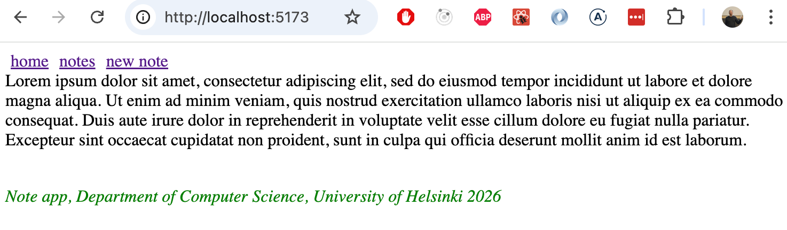

When you click "notes" in the navigation bar, the address in the browser's address bar changes to <i>notes</i>, and the component <i>NoteList</i> is rendered:

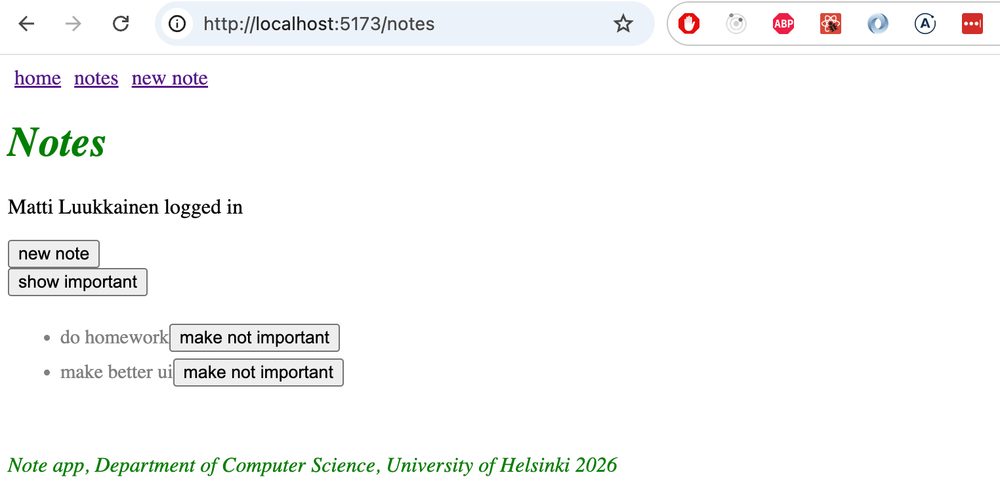

On a normal web page, changing the address in the browser’s address bar causes the page to reload. However, when using React Router, this does not happen; instead, routing is handled entirely via JavaScript on the frontend.

Similarly, when you click "new note," the URL becomes <i>create</i>, and the <i>NoteForm</i> component is rendered.

The Router component we use is [BrowserRouter](https://reactrouter.com/en/main/router-components/browser-router):

```js
import {
  BrowserRouter as Router, // highlight-line
  Routes, Route, Link
} from 'react-router-dom'
```

According to the [documentation](https://reactrouter.com/en/main/router-components/browser-router)

> <i>BrowserRouter</i> is a <i>Router</i> that uses the HTML5 history API (pushState, replaceState and the popstate event) to keep your UI in sync with the URL.

<i>BrowserRouter</i> uses the [HTML5 History API](https://css-tricks.com/using-the-html5-history-api/) to allow the URL in the browser's address bar to be used for internal "routing" within a React application, meaning that even if the URL in the address bar changes, the page content is manipulated solely via JavaScript, and the browser does not load new content from the server. However, the browser’s behavior regarding the back and forward functions and bookmarking is intuitive—it works just like on traditional websites.

The current code for the application is available in its entirety on [GitHub](https://github.com/fullstack-hy2020/part2-notes-frontend/tree/part5-10), in the branch <i>part5-10</i>.

### Parameterized route

Let’s move the details of a single note to its own view, which can be accessed by clicking the note’s name:

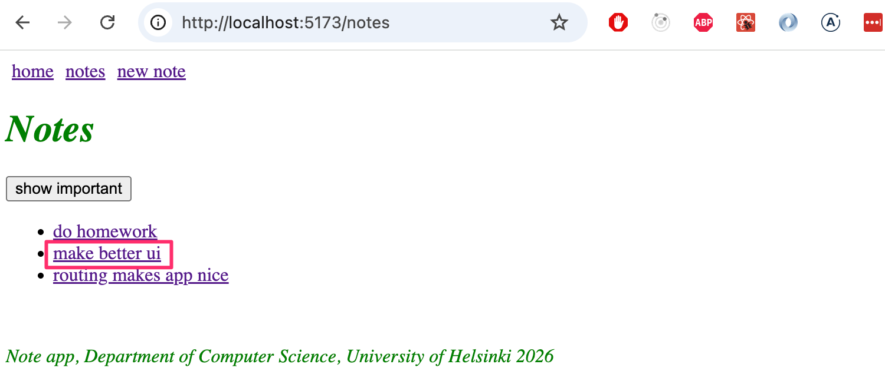


The clickability of the name has been implemented in the <i>NoteList</i> component as follows:

```js
import { Link } from 'react-router-dom' // highlight-line

const NoteList = ({ notes }) => {
  // ...

  return (
    <div>
      <h1>Notes</h1>
      <Notification message={errorMessage} />

      {!user && loginForm()}

      <div>
        <button onClick={() => setShowAll(!showAll)}>
          show {showAll ? 'important' : 'all'}
        </button>
      </div>
      <ul>
        {notesToShow.map(note => (
          <li key={note.id}>
            <Link to={`/notes/${note.id}`}>{note.content}</Link> // highlight-line
          </li>
        ))}
      </ul>
    </div>
  )
}

export default NoteList
```

So [Link](https://reactrouter.com/api/components/Link) is in use again. For example, clicking the name of a note whose <i>id</i> is 12345 causes the browser’s URL to update to <i>notes/12345</i>.

The parameterized URL is defined in the routing within the <i>App</i> component as follows:

```js
<Router>
  // ...

  <Routes>
    // highlight-start
    <Route path="/notes/:id" element={
      <Note notes={notes} toggleImportanceOf={toggleImportanceOf} />
     } />
    // highlight-end
    <Route path="/notes" element={<Notes notes={notes} />} />   
    <Route path="/users" element={user ? <Users /> : <Navigate replace to="/login" />} />
    <Route path="/login" element={<Login onLogin={login} />} />
    <Route path="/" element={<Home />} />      
  </Routes>
</Router>
```

The route that renders the view for a single note is defined in the "Express style" by marking the path parameter with the notation <i>:id</i> as follows:

```js
<Route path="/notes/:id" element={<Note notes={notes} ... />} />
```

When the browser navigates to the unique URL of a note, e.g., <i>/notes/12345</i>, the <i>Note</i> component is rendered, which we have now had to modify slightly:

```js
import { useParams } from 'react-router-dom' // highlight-line

const Note = ({ notes, toggleImportance }) => {
  // highlight-start
  const id = useParams().id
  const note = notes.find(n => n.id === id)
  // highlight-end

  const label = note.important ? 'make not important' : 'make important'

  return (
    <li className="note">
      <span>{note.content}</span>
      <button onClick={() => toggleImportance(id)}>{label}</button>
    </li>
  )
}

export default Note
```

Unlike before, the <i>Note</i> component now receives all notes as props via the <i>all</i> parameter, and it can access the unique part of the URL—specifically, the <i>id</i> of the note to be displayed—using the React Router function [useParams](https://reactrouter.com/api/hooks/useParams). 

### useNavigate

The backend already supports deleting notes. To implement this, let’s add a button to the individual note page in the app:

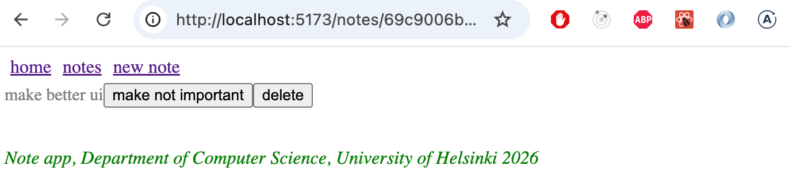

Let’s add a handler to the <i>App</i> component that performs the deletion, which is passed to the <i>Note</i> component:

```js
const App = () => {

  // highlight-start
  const deleteNote = (id) => {
    noteService.remove(id).then(() => {
      setNotes(notes.filter(n => n.id !== id))
    })
  }
  // highlight-end

  return (
      // ...

      <Routes>
        <Route path="/notes/:id" element={
          <Note notes={notes}
            toggleImportanceOf={toggleImportanceOf}
            deleteNote={deleteNote} // highlight-line
          />
        } />
        <Route path="/notes" element={
          <NoteList notes={notes} />
        } />
        <Route path="/create" element={
          <NoteForm createNote={addNote}/>
        } />
        <Route path="/" element={<Home />} />
      </Routes>

      <Footer />
    </Router>
  )
}  
```

Component <i>Note</i> changes as follows:

```js
import { useParams, useNavigate } from 'react-router-dom'

const Note = ({ notes, toggleImportanceOf, deleteNote }) => { // highlight-line
  const id = useParams().id
  const navigate = useNavigate()  // highlight-line
  const note = notes.find(n => n.id === id)

  const label = note.important ? 'make not important' : 'make important'

// highlight-start
  const handleDelete = () => {
    if (window.confirm(`Delete note "${note.content}"?`)) {
      deleteNote(id)
      navigate('/notes')
    }
  }
  // highlight-end

  return (
    <li className="note">
      <span>{note.content}</span>
      <button onClick={() => toggleImportanceOf(id)}>{label}</button>
      <button onClick={handleDelete}>delete</button>  // highlight-line
    </li>
  )
}

export default Note
```

When a note is deleted, the user is navigated back to the page listing all notes. This is done by calling the function returned by React Router’s [useNavigate](https://reactrouter.com/api/components/Navigate) method with the desired URL: <i>navigate('/notes')</i>.

Functions from the React Router library we use [useParams](https://reactrouter.com/api/hooks/useParams) and [useNavigate](https://reactrouter.com/api/components/Navigate) are both hook functions, just like, for example, the useState and useEffect we’ve used many times. As we recall from Part 1, there are certain [rules](/part1/more-complex-state-react-debugging#hook-rules) associated with using hook functions.

Let’s also modify the <i>NoteForm</i> component so that after adding a new note, the user is navigated to the page containing all notes:

```js
import { useState } from 'react' 
import { useNavigate } from 'react-router-dom' // highlight-line

const NoteForm = ({ createNote }) => {
  const [newNote, setNewNote] = useState('')
  const navigate = useNavigate() // highlight-line

  const addNote = event => {
    event.preventDefault()
    createNote({
      content: newNote,
      important: true
    })

    navigate('/notes') // highlight-line
    setNewNote('')
  }

  return (
    <div>
      <h2>Create a new note</h2>

      <form onSubmit={addNote}>
        <input
          value={newNote}
          onChange={event => setNewNote(event.target.value)}
          placeholder="write note content here"
        />
        <button type="submit">save</button>
      </form>
    </div>
  )
}
```

### Parameterized Route Revisited

There is one slightly annoying issue with the app. The _Note_ component receives <i>all notes</i> as props, even though it only displays the one whose <i>id</i> matches the parameterized part of the URL:

```js
const Note = ({ notes, toggleImportance }) => { 
  const id = useParams().id
  const note = notes.find(n => n.id === Number(id))
  // ...
}
```

Would it be possible to modify the application so that _Note_ receives only the note to be displayed as a prop:

```js
import { useParams, useNavigate } from 'react-router-dom'

const Note = ({ note, id, toggleImportanceOf, deleteNote }) => {  // highlight-line
  const id = useParams().id
  const navigate = useNavigate()

  const label = note.important ? 'make not important' : 'make important'

  const handleDelete = () => {
    if (window.confirm(`Delete note "${note.content}"?`)) {
      deleteNote(id)
      navigate('/notes')
    }
  }

  return (
    <li className="note">
      <span>{note.content}</span>
      <button onClick={() => toggleImportanceOf(id)}>{label}</button>
      <button onClick={handleDelete}>delete</button>
    </li>
  )
}

export default Note
```

One way is to determine the <i>id</i> of the note to be displayed within the component using React Router's [useMatch](https://reactrouter.com/en/main/hooks/use-match) hook function.

It is not possible to use the <i>useMatch</i> hook in the same component that defines the routable part of the application. Let’s move the <i>Router</i> component outside of <i>App</i>:

```js
ReactDOM.createRoot(document.getElementById('root')).render(
  <Router> // highlight-line
    <App />
  </Router> // highlight-line
)
```

Component <i>App</i> becomes:

```js
import {
  // ...
  useMatch  // highlight-line
} from 'react-router-dom'

const App = () => {
  // ...

 // highlight-start
  const match = useMatch('/notes/:id')

  const note = match
    ? notes.find(note => note.id === match.params.id)
    : null
  // highlight-end

  return (
    <div>
      <div>
        <Link style={padding} to="/">home</Link>
        // ...
      </div>

      <Routes>
        <Route path="/notes/:id" element={
          <Note
            note={note} // highlight-line
            toggleImportanceOf={toggleImportanceOf}
            deleteNote={deleteNote}
          />
        } />
        <Route path="/notes" element={
          <NoteList notes={notes} />
        } />
        <Route path="/create" element={
          <NoteForm createNote={addNote}/>
        } />
        <Route path="/" element={<Home />} />
      </Routes>

      <div>
        <em>Note app, Department of Computer Science 2026</em>
      </div>
    </div>
  )
}    
```

Every time the <i>App</i> component is rendered—which, in practice, happens whenever the URL in the browser's address bar changes—the following command is executed

```js
const match = useMatch('/notes/:id')
```

If the URL is in the form _/notes/:id_, i.e., corresponds to the URL of a single note, the variable <i>match</i> is assigned an object that can be used to determine the parameterized part of the path, i.e., the note's <i>id</i>. This allows us to retrieve the note to be rendered:

```js
const note = match 
  ? notes.find(note => note.id === match.params.id)
  : null
```


There is still a small bug in our application. If the browser is reloaded on a single note page, an error occurs:


The problem arises because the page is attempted to be rendered before the notes have been fetched from the backend. We can resolve this issue with conditional rendering:

```js
const Note = ({ note, toggleImportanceOf, deleteNote }) => {
  const id = useParams().id
  const navigate = useNavigate()

// highlight-start
  if(!note) {
    return null
  }
  // highlight-end

  return (
    //...
  )
}
```

The app has one more annoying feature: the login logic is still all on the page that lists the notes. However, we’ll leave the functionality in this somewhat incomplete state for now.

The current code for the app is available in its entirety on [GitHub](https://github.com/fullstack-hy2020/part2-notes-frontend/tree/part5-11), in the <i>part5-11</i> branch.

</div>

<div class="tasks">

### Tasks 5.24–5.29.

#### 5.24: routed blogs, step1

Add React Router to the application so that clicking the links in the navigation bar allows you to control which view is displayed.

At the root of the application, i.e., the path _/_, a list of all blogs is displayed:

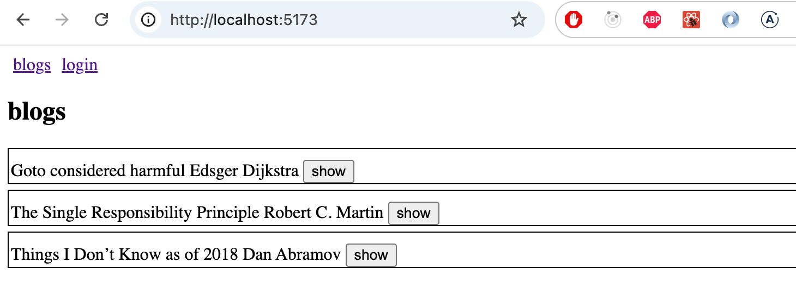

The path _/login_ allows users to log in

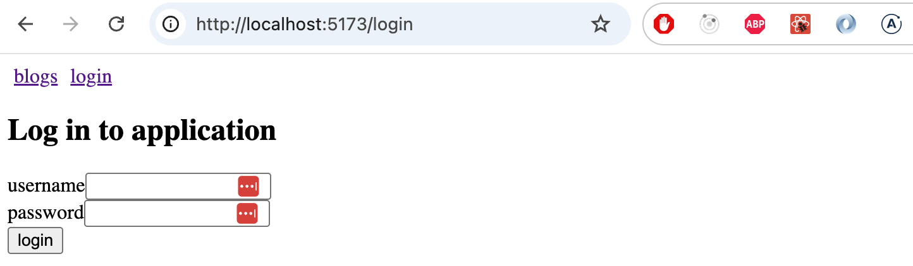

If the user is logged in, a logout button appears in the navigation bar:

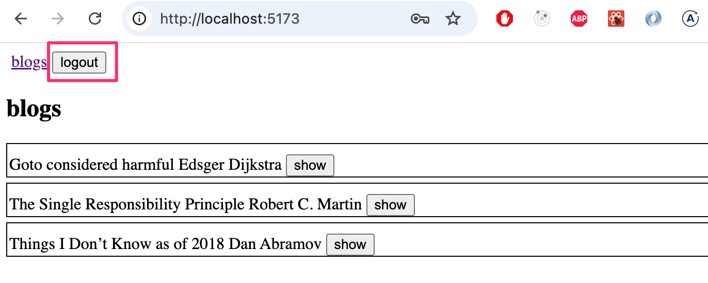

After logging in and out, the user is shown the page listing all blogs.

At this stage, you don’t need to worry about creating blogs yet.

#### 5.25: routed blogs, step2

Implement a view in the application that displays information for a single blog post:

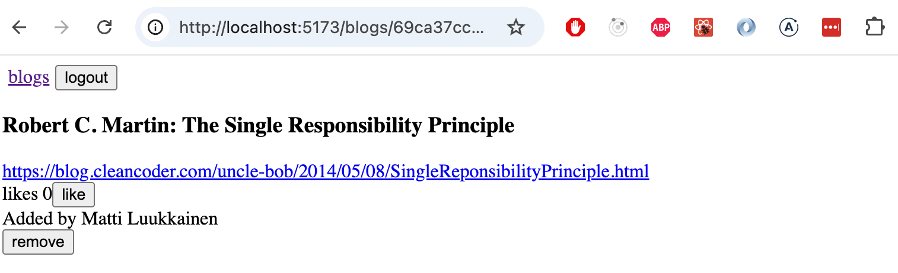

Users navigate to the single blog post view from the blog list:

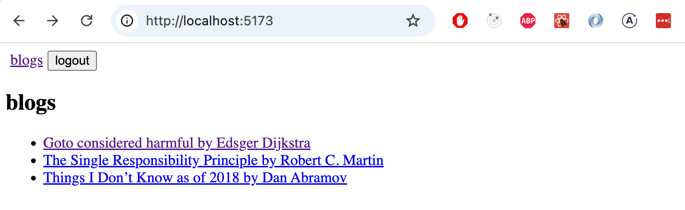

Make sure that the "Like" feature for blogs still works! Also modify the functionality so that only logged-in users can "Like" a blog.

#### 5.27: routed blogs, step3

Create a new view for creating a new blog, which logged-in users can access via the navigation:

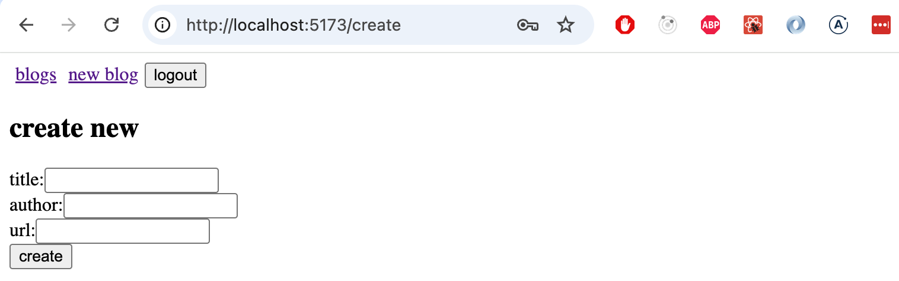

Adding a new blog and deleting an existing blog should redirect the user to the All Blogs view

#### 5.28: routed blogs, step4

The app’s usability and appearance are now better than before. Unfortunately, some of the tests have broken. 

Now modify the unit tests for the single blog view created in Vitest as follows
- Blog information and the number of likes are displayed to unauthenticated users; buttons are not displayed
- Authenticated users who are not the blog’s creator are shown only the like button
- The blog’s creator is also shown the delete button

#### 5.29: routed blogs, step4

Next up is fixing the end-to-end tests created with Playwright. The tests we wrote earlier are completely broken, and we’ll have to make major changes to them. 

Create tests for the following scenarios:
- Login succeeds with the correct username/password combination
- Login fails if the username/password is incorrect
- A logged-in user can create a blog
- A logged-in user can like blogs
- A logged-in user can delete a blog

So, sorting blogs by likes is not being tested right now.

</div>

<div class="content">

In Part 2, we already looked at two ways to add styles: the old-school [single CSS](/part2#adding-styles) file and [inline styles](/part2/adding-styles-to-a-react-app#inline-styles). In this section, we’ll look at a few more ways.

### Pre-built UI style libraries

One approach to defining an app’s styles is to use a pre-built “UI framework,” or, in other words, a UI style library.

The first UI framework to gain widespread popularity was [Bootstrap](https://getbootstrap.com/), developed by Twitter, which is likely still the most widely used UI framework. Recently, UI frameworks have been popping up like mushrooms after rain. The selection is so vast that it’s not even worth trying to make an exhaustive list here.

Many UI frameworks include predefined themes for web applications as well as "components," such as buttons, menus, and tables. The term "component" is written in quotes above because it does not refer to the same thing as a React component. Most often, UI frameworks are used by including the framework’s CSS style sheets and JavaScript code in the application.

Many UI frameworks have been adapted into React-friendly versions, where the “components” defined by the UI framework have been converted into React components. For example, there are a couple of React versions of Bootstrap, the most popular of which is [React-Bootstrap](https://react-bootstrap.github.io/).

Instead of Bootstrap, let’s next look at what is perhaps the most popular UI framework right now: the React library [MaterialUI](https://mui.com/), which implements Google’s “design language” [Material Design](https://material.io/). 

Install the library:

```bash
npm install @mui/material @emotion/react @emotion/styled
```

When using MaterialUI, the entire app’s content is usually rendered inside the [Container](https://material-ui.com/components/container/) component:

```js
import { Container } from '@mui/material'

const App = () => {
  // ...
  return (
    <Container>
      // ...
    </Container>
  )
}
```

#### Table

Let's start with the <i>NoteList</i> component and render the list of notes [as a table](https://mui.com/material-ui/react-table/#simple-table), which also displays the user who created each note:

```js
import { useState, useEffect } from 'react'

import { Table, TableBody, TableCell, TableContainer, TableHead, TableRow, Paper } from '@mui/material'

//...

const NoteList = ({ notes }) => {

  // ...

  return (
    <div>
      // ...
      <h2>Notes</h2>

      <TableContainer component={Paper}>
        <Table>
          <TableHead>
            <TableRow>
              <TableCell>content</TableCell>
              <TableCell>user</TableCell>
              <TableCell>important</TableCell>
            </TableRow>
          </TableHead>
          <TableBody>
            {notes.map(note => (
              <TableRow key={note.id}>
                <TableCell>
                  <Link to={`/notes/${note.id}`}>{note.content}</Link>
                </TableCell>
                <TableCell>
                  {note.user.name}
                </TableCell>
                <TableCell>
                  {note.important ? 'yes': ''}
                </TableCell>
              </TableRow>
            ))}
          </TableBody>
        </Table>
      </TableContainer>

    </div>
  )
}

export default NoteList
```

The table looks like this:

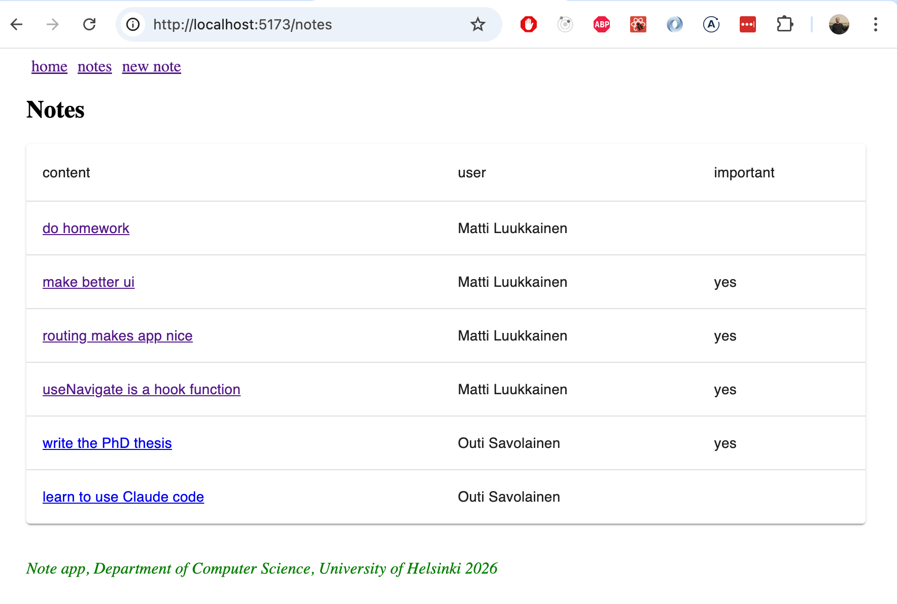


#### Form

Next, let’s improve the view for creating a new note <i>NoteForm</i> using the [TextField](https://mui.com/components/text-fields/) and [Button](https://mui.com/api/button/) components:

```js 
import { TextField, Button } from '@mui/material'

// ...

const NoteForm = ({ createNote }) => {
  // ...

  return (
    <div>
      <h2>Create a new note</h2>

      <form onSubmit={addNote}>
        <TextField
          label="note content"
          value={newNote}
          onChange={event => setNewNote(event.target.value)}
        />
        <div>
          <Button type="submit" variant="contained" style={{ marginTop: 10 }}>save</Button>
        </div>
      </form>
    </div>
  )
}

export default NoteForm

```

The result is elegant:

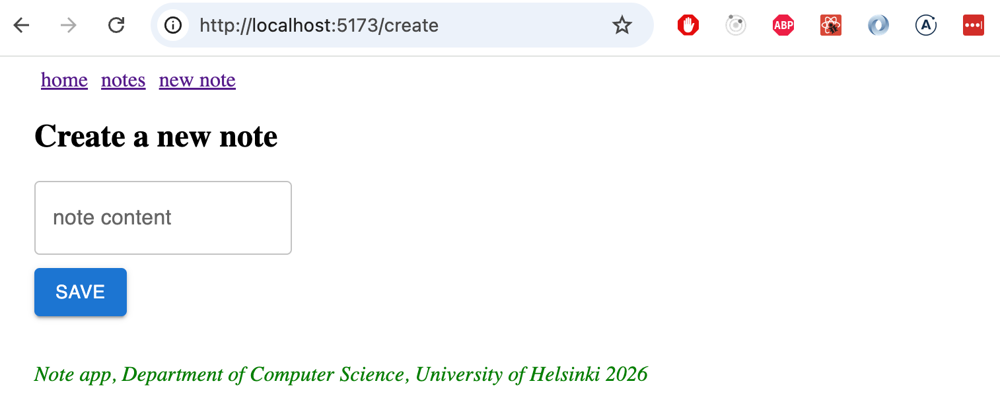

#### Notifications


Let’s improve the app’s notification component using MaterialUI’s [Alert](https://mui.com/components/alert/) component:

```js
import { Alert } from '@mui/material'

const Notification = ({ notification }) => {
  if (notification === null) {
    return null
  }

  return (
    <Alert style={{ marginTop: 10, marginBottom: 10 }} severity={notification.type}>
      {notification.text}
    </Alert>
  )
}

export default Notification
```

Move the notification component and its state management to the <i>App</i> component:

```js
const App = () => {
  const [notes, setNotes] = useState([])
  const [notification, setNotification] = useState(null) // highlight-line

  // ...

  const addNote = noteObject => {
    noteService.create(noteObject).then(returnedNote => {
      setNotes(notes.concat(returnedNote))
      setNotification({ text: `Note '${returnedNote.content}' added!`, type: 'success' }) // highlight-line
      setTimeout(() => {
        setNotification(null)
      }, 5000)
    })
  }

  return (
    <Container>
      <div>
        <Link style={padding} to="/">home</Link>
        <Link style={padding} to="/notes">notes</Link>
        <Link style={padding} to="/create">new note</Link>
      </div>

      <Notification notification={notification} /> // highlight-line

      <Routes>
        <Route path="/notes/:id" element={
          <Note
            note={note}
            toggleImportanceOf={toggleImportanceOf}
            deleteNote={deleteNote}
          />
        } />
        <Route path="/notes" element={
          <NoteList notes={notes} setNotification={setNotification} />
        } />
        <Route path="/create" element={
          <NoteForm createNote={addNote} />
        } />
        <Route path="/" element={<Home />} />
      </Routes>

      <Footer />
    </Container>
  )
}
```

Alert has a sleek design:

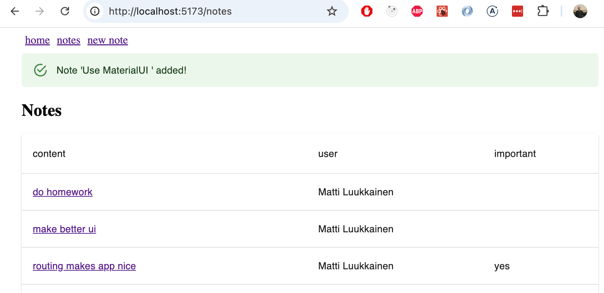

#### Navigation Menu

The navigation menu is implemented using the [AppBar](https://mui.com/components/app-bar/) component

If we apply the example from the documentation directly  

```js
<AppBar position="static">
  <Toolbar>
    <Button color="inherit"><Link to="/">home</Link></Button>
    <Button color="inherit"><Link to="/notes">notes</Link></Button>
    <Button color="inherit"><Link to="/create">new note</Link></Button>
  </Toolbar>
</AppBar>
```

This does provide a working solution, but its appearance isn’t the best possible:

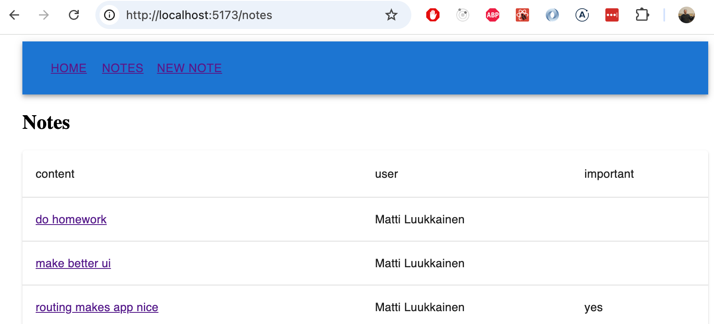

By browsing the [documentation](https://mui.com/material-ui/guides/composition/# routing-libraries), you’ll find a better way: the [component prop](https://mui.com/material-ui/guides/composition/#component-prop), which allows you to change how the root element of a MaterialUI component is rendered.

By defining

```js
<Button color="inherit" component={Link} to="/">
  home
</Button>
```

The _Button_ component is rendered such that its root component is the _Link_ component from the react-router-dom library, to which the _to_ prop—which specifies the path—is passed.  

The complete code for the navigation bar is as follows

```js
<AppBar position="static">
  <Toolbar>
    <Button color="inherit" component={Link} to="/">home</Button>
    <Button color="inherit" component={Link} to="/notes">notes</Button>
    <Button color="inherit" component={Link} to="/create">new note</Button>
  </Toolbar>
</AppBar>
```

and the result looks just as we want:


However, we notice that when the mouse is moved over the navigation bar, the hover indicator is too subtle. Let’s fix this by defining a slightly better background color for these situations: 

```js
const hoverStyle = { '&:hover': { bgcolor: 'rgba(255,255,255,0.3)' } }

return (
  <Container>
    <AppBar position="static">
      <Toolbar>
        <Button color="inherit" component={Link} to="/" sx={hoverStyle}>home</Button>
        <Button color="inherit" component={Link} to="/notes" sx={hoverStyle}>notes</Button>
        <Button color="inherit" component={Link} to="/create" sx={hoverStyle}>new note</Button>
      </Toolbar>
    </AppBar>

    // ...
)
```

We're finally satisfied:

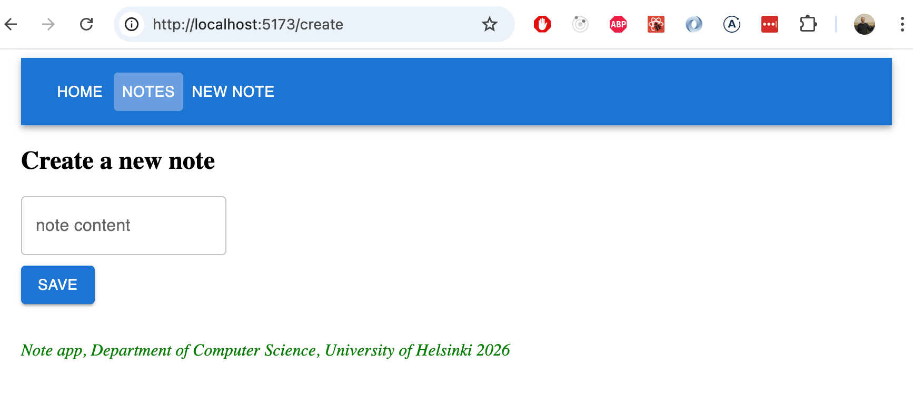

The current code for the app is available in its entirety on [GitHub](https://github.com/fullstack-hy2020/part2-notes-frontend/tree/part5-12), in the <i>part5-12</i> branch.


### Styled Components

In addition to what we’ve already seen, there are [other ways](https://blog.bitsrc.io/5-ways-to-style-react-components-in-2019-30f1ccc2b5b) to apply styles to a React app.

The [styled-components](https://www.styled-components.com/) library, which utilizes ES6’s [tagged template literal](https://developer.mozilla.org/en-US/docs/Web/JavaScript/Reference/Template_literals) syntax, offers an interesting approach to defining styles. [styled-components](https://www.styled-components.com/) library, which utilizes ES6’s [tagged template literal](https://developer.mozilla.org/en-US/docs/Web/JavaScript/Reference/Template_literals) syntax.

[Install](https://styled-components.com/docs/basics#installation) styled-components and use it to make a few stylistic changes to the note-taking app (the version before installing MaterialUI). First, let’s create two style definitions for the components we’ll be using:

```js
import styled from 'styled-components'

const Button = styled.button`
  background: Bisque;
  font-size: 1em;
  margin: 1em;
  padding: 0.25em 1em;
  border: 2px solid Chocolate;
  border-radius: 3px;
`

const Input = styled.input`
  margin: 0.25em;
  width: 300px;  
`
```

The code creates versions of the HTML elements <i>button</i> and <i>input</i> that are styled, and assigns them to the variables <i>Button</i> and <i>Input</i>.

The syntax for defining styles is quite interesting, as CSS definitions are placed inside backtick quotes.

The defined components function like normal <i>button</i> and <i>input</i> elements, and are used in the application in the usual way:


```js
const NoteForm = ({ createNote }) => {
  // ...

  return (
    <div>
      <h2>Create a new note</h2>

      <form onSubmit={addNote}>
        <Input> // highlight-line
          value={newNote}
          onChange={event => setNewNote(event.target.value)}
          placeholder="write note content here"
        />
        <Button type="submit">save</Button> // highlight-line
      </form>
    </div>
  )
}
```

The form now looks like this:

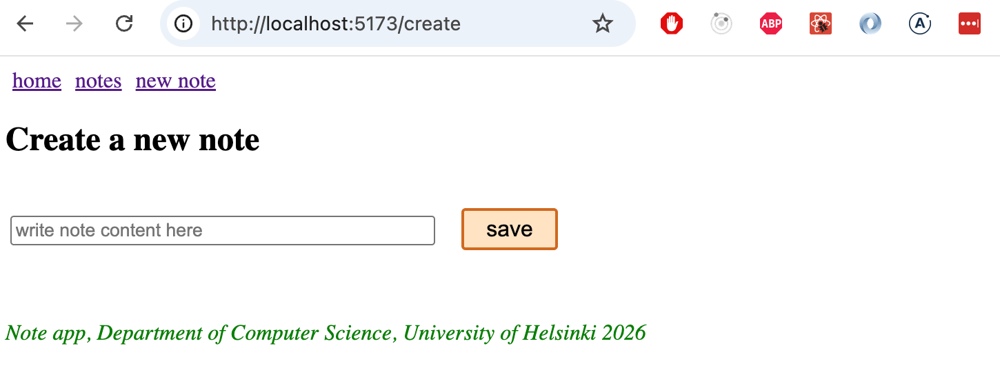

Let’s define the following components for adding styles, all of which are enhanced versions of the <i>div</i> elements:

```js
const Page = styled.div`
  padding: 1em;
  background: papayawhip;
`

const Navigation = styled.div`
  background: BurlyWood;
  padding: 1em;
`

const Footer = styled.div`
  background: Chocolate;
  padding: 1em;
  margin-top: 1em;
`
```

Let's implement the new components in the application:

```js
const App = () => {
  // ...

  return (
    <Page> // highlight-line
      <Navigation> // highlight-line
        <Link style={padding} to="/">home</Link>
        <Link style={padding} to="/notes">notes</Link>
        <Link style={padding} to="/create">new note</Link>
      </Navigation> // highlight-line

      <Routes>
        <Route path="/notes/:id" element={
          <Note
            note={note}
            toggleImportanceOf={toggleImportanceOf}
            deleteNote={deleteNote}
          />
        } />
        <Route path="/notes" element={
          <NoteList notes={notes} />
        } />
        <Route path="/create" element={
          <NoteForm createNote={addNote}/>
        } />
        <Route path="/" element={<Home />} />
      </Routes>
// highlight-start
      <Footer>
         Note app, Department of Computer Science, University of Helsinki 2026
      </Footer>
    </Page>
    // highlight-end
  )
}
```

The final result is as follows:

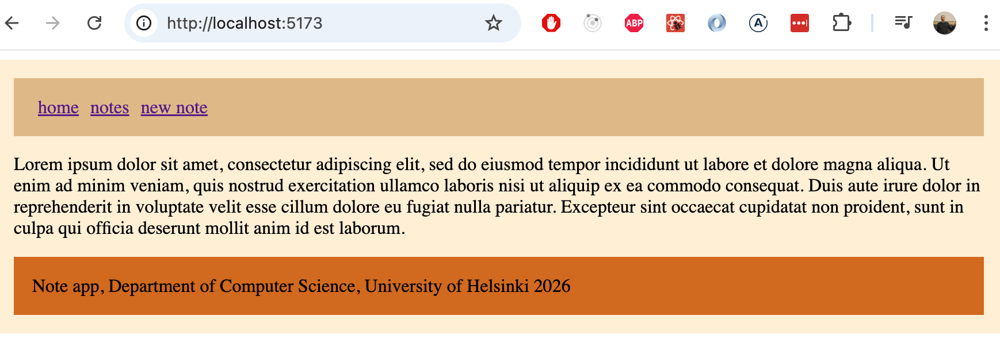

Styled-Components has been steadily gaining popularity lately, and it currently seems that many people consider it the best way to define styles for React applications.

</div>

<div class="tasks">

### Tasks 5.30–5.32

Next, let’s improve the styles of the blog app using either MaterialUI or Styled Components.

#### 5.30: styled blogs, step 1

Add styles to the application’s forms.

Your solution might look something like this. Login form:

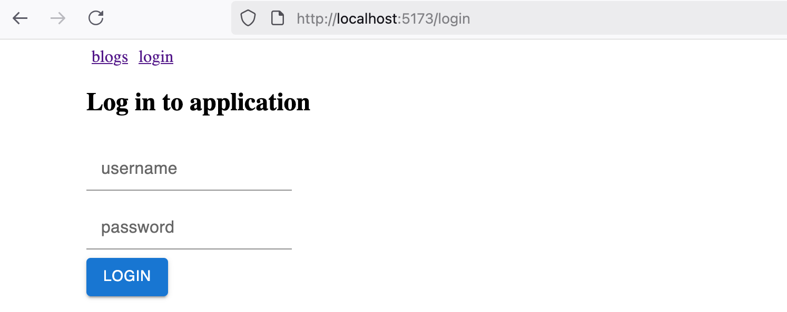

Creating a new blog:

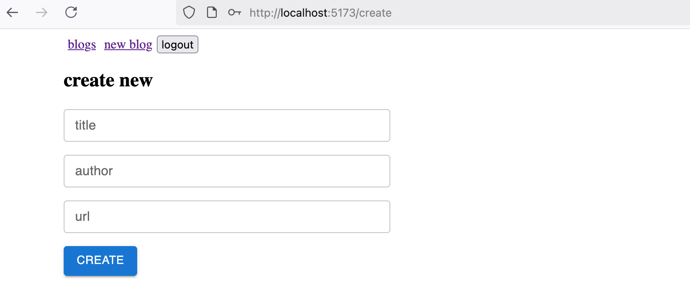


#### 5.31: styled blogs, step2

Now style the app's navigation bar and the component that displays notifications. The result might look something like this:

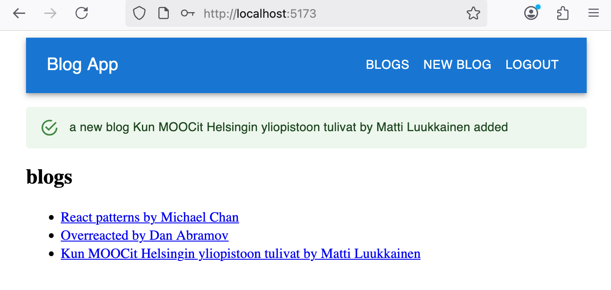

#### 5.32: styled blogs, step 3

Customize the appearance of the single blog display component as you see fit. Here is an example:

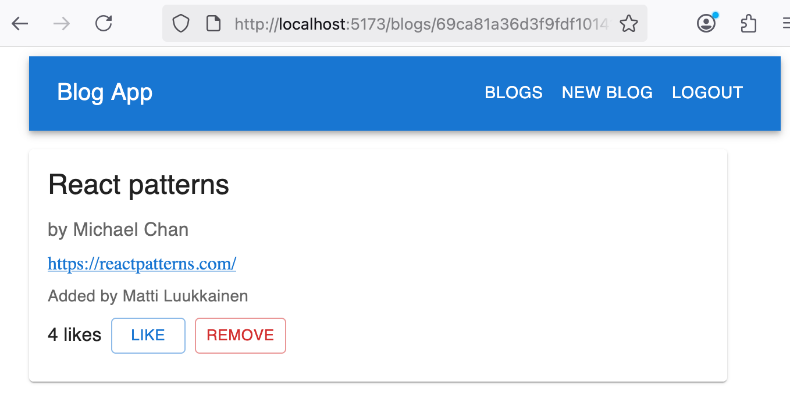


This was the last task of the section and it's time to push the code to GitHub and mark the completed tasks in the [exercise submission system](https://studies.cs.helsinki.fi/stats/courses/fullstackopen).


</div>

