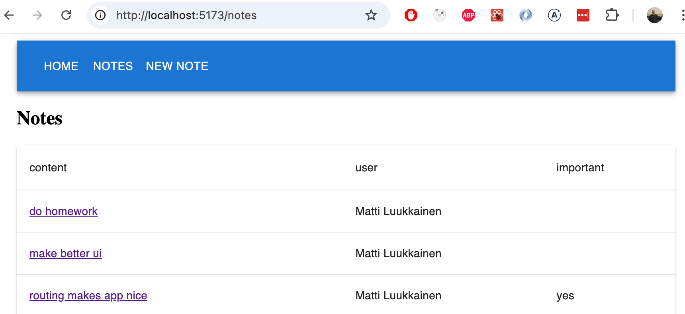

<div class="content">

Sovelluksemme ulkoasu on tällä hetkellä melko karu:


Haluamme tilanteeseen muutoksen. Aloitetaan sovelluksen navigaatiorakenteesta.

On erittäin tyypillistä, että web-sovelluksissa on navigaatiopalkki, jonka avulla on mahdollista vaihtaa sovelluksen näkymää. Muistiinpanosovelluksemme voisi sisältää pääsivun:


ja oma sivunsa muistiinpanojen näyttämiseen:


sekä muistiinpanojen luomiseen:


[Vanhan koulukunnan web-sovelluksessa](/osa0#perinteinen-web-sovellus) sovelluksen näyttämän sivun vaihto tapahtui siten, että selain teki palvelimelle uuden HTTP GET ‑pyynnön ja renderöi sitten palvelimen palauttaman, uutta näkymää vastaavan HTML-koodin.

Single page -sovelluksissa taas ollaan todellisuudessa koko ajan samalla sivulla, ja selaimessa suoritettava JavaScript-koodi luo illuusion eri "sivuista". Jos näkymää vaihdettaessa tehdään HTTP-kutsuja, niiden avulla haetaan ainoastaan JSON-muotoista dataa, jota uuden näkymän näyttäminen ehkä edellyttää.

Navigaatiopalkki ja useita näkymiä sisältävä sovellus olisi helppo toteuttaa Reactilla, esim. siten että sovelluksen tila <i>page</i> muistaisi millä sivulla käyttäjä on, ja oikea näkymä renderöitäisiin tämän perusteella:

```js
const App = () => {
  const [page, setPage] = useState('home')

 const  toPage = (page) => (event) => {
    event.preventDefault()
    setPage(page)
  }

  const content = () => {
    if (page === 'home') {
      return <Home />
    } else if (page === 'notes') {
      return <Notes />
    } else if (page === 'users') {
      return <Users />
    }
  }

  return (
    <div>
      <div>
        <a href="" onClick={toPage('home')} >
          home
        </a>
        <a href="" onClick={toPage('notes')}>
          notes
        </a>
        <a href="" onClick={toPage('users')} >
          users
        </a>
      </div>

      {content()}
    </div>
  )
}
```

Menetelmä ei kuitenkaan ole optimaalinen: sivuston osoite pysyy samana vaikka välillä ollaankin eri näkymässä. Jokaisella näkymällä tulisi kuitenkin olla oma osoitteensa, jotta esim. kirjanmerkkien tekeminen olisi mahdollista. Myöskään selaimen back-painike ei toimi  loogisesti jos sivuja ei vastaa oma osoite, eli back ei vie edelliseksi katsottuun sovelluksen näkymään vaan jonnekin ihan muualle.

### React Router

Kirjasto [React Router](https://reactrouter.com/), tarjoaa onneksi erinomaisen ratkaisun React-sovelluksen navigaation hallintaan.

Asennetaan React Router:

```bash
npm install react-router-dom
```

Luodaan uusi komponentti, joka toimii sovelluksen pääsivuna

```js
const Home = () => {
  return (
    <div>
      Lorem ipsum dolor sit amet, consectetur adipiscing elit, sed do eiusmod tempor incididunt ut labore et dolore magna aliqua. Ut enim ad minim veniam, quis nostrud exercitation ullamco laboris nisi ut aliquip ex ea commodo consequat. Duis aute irure dolor in reprehenderit in voluptate velit esse cillum dolore eu fugiat nulla pariatur. Excepteur sint occaecat cupidatat non proident, sunt in culpa qui officia deserunt mollit anim id est laborum.
    </div>
  )
}

export default Home
```

Eriytetään sovelluksen aiempi komponentissa <i>App</i> ollut päänäkymä omaksi komponentiksi, Siirretään kuitenkin muistiinpanojen tilan käsittely komponentin ulkopuolelle:


```js
// list of notes passed as parameter
const NoteList = ({ notes }) => { // highlight-line
  // content mostly same as was in component App 
  // reference to NoteForm is removed
}
```

Komponentti <i>App</i> muuttuu nyt seuraavasti

```js
import { useState, useEffect } from 'react'
import noteService from './services/notes'

import {
  BrowserRouter as Router,
  Routes, Route, Link
} from 'react-router-dom'
import NoteList from './components/NoteList'
import Home from './components/Home'
import Footer from './components/Footer'
import NoteForm from './components/NoteForm'

const App = () => {
  const [notes, setNotes] = useState([])

  useEffect(() => {
    noteService.getAll().then(initialNotes => {
      setNotes(initialNotes)
    })
  }, [])

  const addNote = noteObject => {
    noteService.create(noteObject).then(returnedNote => {
      setNotes(notes.concat(returnedNote))
    })
  }

  const padding = {
    padding: 5
  }

  return (
    // highlight-start
    <Router>
      <div>
        <Link style={padding} to="/">home</Link>
        <Link style={padding} to="/notes">notes</Link>
        <Link style={padding} to="/create">new note</Link>
      </div>
        // highlight-end  

    // highlight-start
      <Routes>
        <Route path="/notes" element={
          <NoteList notes={notes} />
        } />
        <Route path="/create" element={
          <NoteForm createNote={addNote}/>
        } />
        <Route path="/" element={<Home />} />
      </Routes>

      <Footer />
    </Router>
    // highlight-end
  )
}

export default App
```


Reititys eli komponenttien ehdollinen, selaimen <i>URL:iin perustuva</i> renderöinti otetaan käyttöön sijoittamalla komponentteja [Router](https://reactrouter.com/api/declarative-routers/Router)-komponentin lapsiksi eli <i>Router</i>-tagien sisälle.

Ensimmäisenä on määritelty sovelluksen navigaatiopalkki komponentin [Link](https://reactrouter.com/api/components/Link) avulla. Attribuutti <i>to</i> määrittelee miten selaimen osoitetta muutetaan linkkiä klikatessa:

```js
<div>
  <Link style={padding} to="/">home</Link>
  <Link style={padding} to="/notes">notes</Link>
  <Link style={padding} to="/create">new note</Link>
</div>
```

Seuraavana määritellään sovelluksen reititys komponentin [Routes](https://reactrouter.com/api/components/Routes) avulla. Komponentin sisälle määritellään [Route](https://reactrouter.com/api/components/Route):n avulla joukko sääntöjä ja niitä vastaavat renderöitävät komponentit:

```js
<Routes>
  <Route path="/notes" element={
    <NoteList notes={notes} />
  } />
  <Route path="/create" element={
    <NoteForm createNote={addNote}/>
  } />
  <Route path="/" element={<Home />} />
</Routes>
```

Jos ollaan sovelluksen juuriosoitteessa, renderöidään komponentti <i>Home</i>:


Klikatessa navigaatiopalkista "notes", vaihtuu selaimen osoiterivin osoitteeksi <i>notes</i>, ja renderöidään komponentti <i>NoteList</i>:


Vastaavasti, kun klikataan "new note" osoitteeksi tulee <i>create</i> renderöidään komponentti <i>NoteForm</i>.

Normaalissa Web-sivussa selaimen osoiterivillä olevan osoitteen vaihtuminen aiheuttaa sivun uudelleenlataamisen. React Routeria käyttäen näin ei kuitenkaan tapahdtu vaan reititys tehdään täysin JavaScriptin avulla frontendissa.

Käyttämämme Router-komponentti on [BrowserRouter](https://reactrouter.com/en/main/router-components/browser-router):

```js
import {
  BrowserRouter as Router, // highlight-line
  Routes, Route, Link
} from 'react-router-dom'
```

[Dokumentaation](https://reactrouter.com/en/main/router-components/browser-router) mukaan

> <i>BrowserRouter</i> is a <i>Router</i> that uses the HTML5 history API (pushState, replaceState and the popstate event) to keep your UI in sync with the URL.

<i>BrowserRouter</i> mahdollistaa [HTML5 history API](https://css-tricks.com/using-the-html5-history-api/):n avulla  sen, että selaimen osoiterivillä olevaa URL:ia voidaan käyttää React-sovelluksen sisäiseen "reitittämiseen", eli vaikka osoiterivillä oleva URL muuttuu, sivun sisältöä manipuloidaan ainoastaan JavaScriptillä, eikä selain lataa uutta sisältöä palvelimelta. Selaimen toiminta back- ja forward-toimintojen ja kirjanmerkkien tekemisen suhteen on kuitenkin intuitiivista eli toimii kuten perinteisillä verkkosivuilla.

Sovelluksen tämänhetkinen koodi on kokonaisuudessaan [GitHubissa](https://github.com/fullstack-hy2020/part2-notes-frontend/tree/part5-10), branchissa <i>part5-10</i>.

### Parametrisoitu reitti

Päätetään siirtää yksittäisen muistiinpanon tarkemmat tiedot omaan näkymään, johon päästään muistiinpanon nimeä klikkaamalla:


Nimen klikattavuus on toteutettu komponenttiin <i>NoteList</i> seuraavasti:

```js
import { Link } from 'react-router-dom' // highlight-line

const NoteList = ({ notes }) => {
  // ...

  return (
    <div>
      <h1>Notes</h1>
      <Notification message={errorMessage} />

      {!user && loginForm()}

      <div>
        <button onClick={() => setShowAll(!showAll)}>
          show {showAll ? 'important' : 'all'}
        </button>
      </div>
      <ul>
        {notesToShow.map(note => (
          <li key={note.id}>
            <Link to={`/notes/${note.id}`}>{note.content}</Link> // highlight-line
          </li>
        ))}
      </ul>
    </div>
  )
}

export default NoteList
```

Käytössä on siis jälleen  [Link](https://reactrouter.com/api/components/Link). Esimerkiksi muistiinpanon, jonka <i>id</i> on 12345 nimen klikkaaminen aiheuttaa selaimen osoitteen arvon päivittymisen muotoon <i>notes/12345</i>.

Parametrisoitu URL määritellään komponentissa <i>App</i> olevaan reititykseen seuraavasti:

```js
<Router>
  // ...

  <Routes>
    // highlight-start
    <Route path="/notes/:id" element={
      <Note notes={notes} toggleImportanceOf={toggleImportanceOf} />
     } />
    // highlight-end
    <Route path="/notes" element={<Notes notes={notes} />} />   
    <Route path="/users" element={user ? <Users /> : <Navigate replace to="/login" />} />
    <Route path="/login" element={<Login onLogin={login} />} />
    <Route path="/" element={<Home />} />      
  </Routes>
</Router>
```

Yksittäisen muistiinpanon näkymän renderöivä route siis määritellään "Expressin tyyliin" merkitsemällä reitin parametrina oleva osa merkinnällä <i>:id</i> näin:

```js
<Route path="/notes/:id" element={<Note notes={notes} ... />} />
```

Kun selain siirtyy muistiinpanon yksilöivään osoitteeseen, esim. <i>/notes/12345</i>, renderöidään komponentti <i>Note</i>, jota olemme nyt hieman joutuneet muuttamaan:

```js
import { useParams } from 'react-router-dom' // highlight-line

const Note = ({ notes, toggleImportance }) => {
  // highlight-start
  const id = useParams().id
  const note = notes.find(n => n.id === id)
  // highlight-end

  const label = note.important ? 'make not important' : 'make important'

  return (
    <li className="note">
      <span>{note.content}</span>
      <button onClick={() => toggleImportance(id)}>{label}</button>
    </li>
  )
}

export default Note
```

Toisin kuin aiemmin, komponentti <i>Note</i> saa nyt parametrikseen <i>kaikki muistiinpanot</i> propsina <i>notes</i> ja se pääsee URL:n yksilöivään osaan eli näytettävän muistiinpanon <i>id</i>:hen käsiksi React Routerin funktion [useParams](https://reactrouter.com/api/hooks/useParams) avulla. 

### useNavigate

Backend tukee jo muistiinpanojen poistamista. Toteutetaan tätä varten nappi sovellukseen yksittäisten muistiinpanojen sivulle:


Lisätään komponenttiin <i>App</i> poiston suorittava käsittelijä, joka annetaan komponentille <i>Note</i>:

```js
const App = () => {

  // highlight-start
  const deleteNote = (id) => {
    noteService.remove(id).then(() => {
      setNotes(notes.filter(n => n.id !== id))
    })
  }
  // highlight-end

  return (
      // ...

      <Routes>
        <Route path="/notes/:id" element={
          <Note 
            notes={notes}
            toggleImportanceOf={toggleImportanceOf}
            deleteNote={deleteNote} // highlight-line
          />
        } />
        <Route path="/notes" element={
          <NoteList notes={notes} />
        } />
        <Route path="/create" element={
          <NoteForm createNote={addNote}/>
        } />
        <Route path="/" element={<Home />} />
      </Routes>

      <Footer />
    </Router>
  )
}  
```

Komponentti <i>Note</i> muuttuu seuraavasti:

```js
import { useParams, useNavigate } from 'react-router-dom'

const Note = ({ notes, toggleImportanceOf, deleteNote }) => { // highlight-line
  const id = useParams().id
  const navigate = useNavigate()  // highlight-line
  const note = notes.find(n => n.id === id)

  const label = note.important ? 'make not important' : 'make important'

// highlight-start
  const handleDelete = () => {
    if (window.confirm(`Delete note "${note.content}"?`)) {
      deleteNote(id)
      navigate('/notes')
    }
  }
  // highlight-end

  return (
    <li className="note">
      <span>{note.content}</span>
      <button onClick={() => toggleImportanceOf(id)}>{label}</button>
      <button onClick={handleDelete}>delete</button>  // highlight-line
    </li>
  )
}

export default Note
```

Kun muistiinpano poistuu, navigoidaan takaisin kaikkien muistiinpanojen sivulle. Tämä tapahtuu kutsumalla React Routerin funktion [useNavigate](https://reactrouter.com/api/components/Navigate) palauttamaa funktiota halutulla osoitteella <i>navigate('/notes')</i> .

Käyttämämme React Router ‑kirjaston funktiot [useParams](https://reactrouter.com/api/hooks/useParams) ja [useNavigate](https://reactrouter.com/api/components/Navigate) ovat molemmat hook-funktioita samaan tapaan kuin esim. moneen kertaan käyttämämme useState ja useEffect. Kuten muistamme osasta 1, hook-funktioiden käyttöön liittyy tiettyjä [sääntöjä](/osa1/monimutkaisempi_tila_reactin_debuggaus#hookien-saannot).

Muutetaan myös komponenttia <i>NoteForm</i> siten, että uuden muistiinpanon lisäämisen jälkeen navigoidaan käyttäjä kaikkien muistiinpanojen sivulle:

```js
import { useState } from 'react' 
import { useNavigate } from 'react-router-dom' // highlight-line

const NoteForm = ({ createNote }) => {
  const [newNote, setNewNote] = useState('')
  const navigate = useNavigate() // highlight-line

  const addNote = event => {
    event.preventDefault()
    createNote({
      content: newNote,
      important: true
    })

    navigate('/notes') // highlight-line
    setNewNote('')
  }

  return (
    <div>
      <h2>Create a new note</h2>

      <form onSubmit={addNote}>
        <input
          value={newNote}
          onChange={event => setNewNote(event.target.value)}
          placeholder="write note content here"
        />
        <button type="submit">save</button>
      </form>
    </div>
  )
}
```

### Parametrisoitu reitti revisited

Sovelluksessa on eräs hieman ikävä seikka. Komponentti _Note_ saa propseina <i>kaikki muistiinpanot</i>, vaikka se näyttää niistä ainoastaan sen, jonka <i>id</i> vastaa URL:n parametrisoitua osaa:

```js
const Note = ({ notes, toggleImportance }) => { 
  const id = useParams().id
  const note = notes.find(n => n.id === Number(id))
  // ...
}
```

Olisiko sovellusta mahdollista muuttaa siten, että _Note_ saisi propsina ainoastaan näytettävän muistiinpanon:

```js
import { useParams, useNavigate } from 'react-router-dom'

const Note = ({ note, id, toggleImportanceOf, deleteNote }) => {  // highlight-line
  const id = useParams().id
  const navigate = useNavigate()

    // ...

  return (
    <li className="note">
      <span>{note.content}</span>
      <button onClick={() => toggleImportanceOf(id)}>{label}</button>
      <button onClick={handleDelete}>delete</button>
    </li>
  )
}

export default Note

```

Eräs tapa on selvittää näytettävän muistiinpanon <i>id</i> komponentissa jo <i>App</i> React Routerin hook-funktion [useMatch](https://reactrouter.com/en/main/hooks/use-match) avulla.

<i>useMatch</i>-hookin käyttö ei ole mahdollista samassa komponentissa, joka määrittelee sovelluksen reititettävän osan. Siirretään <i>Router</i> komponentin <i>App</i> ulkopuolelle:

```js
ReactDOM.createRoot(document.getElementById('root')).render(
  <Router> // highlight-line
    <App />
  </Router> // highlight-line
)
```

Komponentti <i>App</i> muuttuu seuraavasti:

```js
import {
  // ...
  useMatch  // highlight-line
} from 'react-router-dom'

const App = () => {
  // ...

 // highlight-start
  const match = useMatch('/notes/:id')

  const note = match
    ? notes.find(note => note.id === match.params.id)
    : null
  // highlight-end

  return (
    <div>
      <div>
        <Link style={padding} to="/">home</Link>
        // ...
      </div>

      <Routes>
        <Route path="/notes/:id" element={
          <Note
            note={note} // highlight-line
            toggleImportanceOf={toggleImportanceOf}
            deleteNote={deleteNote}
          />
        } />
        <Route path="/notes" element={
          <NoteList notes={notes} />
        } />
        <Route path="/create" element={
          <NoteForm createNote={addNote}/>
        } />
        <Route path="/" element={<Home />} />
      </Routes>

      <div>
        <em>Note app, Department of Computer Science 2026</em>
      </div>
    </div>
  )
}    
```

Joka kerta, kun komponentti <i>App</i> renderöidään eli käytännössä aina kun sovelluksen osoiterivillä oleva URL vaihtuu, suoritetaan komento

```js
const match = useMatch('/notes/:id')
```

Jos URL on muotoa _/notes/:id_, eli vastaa yksittäisen muistiinpanon URL:ia, muuttuja <i>match</i> saa arvokseen olion, jonka avulla polun parametroitu osa, eli muistiinpanon <i>id</i> voidaan selvittää. Näin saadaan haettua renderöitävä muistiinpano:

```js
const note = match 
  ? notes.find(note => note.id === match.params.id)
  : null
```


Sovelluksessamme on vielä pieni vika. Jos selain uudelleen ladataan yksittäisen muistiinpanon sivulla, seurauksena on virhe:


Ongelma johtuu siitä, että sivua yritetään renderöidä ennen kuin muistiinpanot on haettu backendista. Pääsemme ongelmasta eroon ehdollisella renderöinnillä:

```js
const Note = ({ note, toggleImportanceOf, deleteNote }) => {
  const id = useParams().id
  const navigate = useNavigate()

// highlight-start
  if(!note) {
    return null
  }
  // highlight-end

  return (
    //...
  )
}
```

Sovelluksessa on vielä eräs ikävä piirre, kirjautumiseen liittyvä logiikka on edelleen kaikki muistiinpanot listaavalla sivulla. Jätämme kuitenkin toiminnallisuuden tähän hieman vajavaiseen tilaan.

Sovelluksen tämänhetkinen koodi on kokonaisuudessaan [GitHubissa](https://github.com/fullstack-hy2020/part2-notes-frontend/tree/part5-11), branchissa <i>part5-11</i>.

</div>

<div class="tasks">

### Tehtävät 5.24-5.29.

#### 5.24: routed blogs, step1

Lisää blogisovellukseen React Router siten, että navigaatiopalkissa olevia linkkejä klikkailemalla saadaan säädeltyä näytettävää näkymää.

Sovelluksen juuressa eli polulla _/_ näytetään kaikkien blogien lista:


Polulla _/login_ päästään kirjautumaan


Jos käyttäjä on kirjautunut, navigaatiopalkkiin tulee uloskirjautumisnappi:


Kirjautumisen ja uloskirjautumisen jälkeen käyttäjälle näytetään kaikkien blogien sivu.

Tässä vaiheessa ei tarvitse vielä huolehtia blogien luomisesta.

#### 5.25: routed blogs, step2

Toteuta sovellukseen yksittäisen blogin tiedot näyttävä näkymä:


Yksittäisen blogin näkymään navigoidaan blogien listalta:


Varmista, että blogien tykkääminen toimii edelleen! Muuta myös toiminnallisuutta siten, että ainoastaan kirjautunut käyttäjä voi tykätä blogista.

#### 5.27: routed blogs, step3

Tee uuden blogin luomista varten uusi näkymä, jonne kirjautunut käyttäjä pääsee navigaation kautta:


Uuden blogin lisäyksen sekä olemassa olevan blogin poiston tulee viedä sovellus kaikkien blogien näkymään

#### 5.28: routed blogs, step4

Sovelluksen käytettävyys ja ulkoasu on nyt aiempaa parempi. Ikävä kyllä osa testeistä on päässyt hajoamaan. 

Muuta nyt yksittäisen blogin näkymän Vitestillä tehtyjä yksikkötestejä seuraavasti
- blogin tiedot sekä tykkäysten määrä näytetään kirjautumattomalle käyttäjälle, nappeja ei näytetä
- kirjautuneelle käyttäjälle, joka ei ole blogin luoja näytetään ainoastaan tykkäysnappi
- blogin luojalle näytetään myös blogin poistonappi

#### 5.29: routed blogs, step4

Seuraavana on vuorossa Playwrightillä tehtyjen end to end -testien korjaaminen. Aiemmin tekemämme testit ovat totaalisesti rikki, ja joudumme tekemään testeihin suuria muutoksia. 

Tee testit seuraaviin tilanteisiin
- kirjautuminen onnistuu oikealla salasana/käyttäjätunnus-yhdistelmällä
- kirjautuminen epäonnistuu jos salasana/käyttäjätunnus väärin
- kirjautunut käyttäjä pystyy luomaan blogin
- kirjautunut käyttäjä voi tykätä blogeista
- kirjautunut käyttäjä voi poistaa blogin

Blogien järjestämistä tykkäysjärjestykseen ei siis nyt testata.

</div>

<div class="content"

### Valmiit käyttöliittymätyylikirjastot

Osassa 2 on jo katsottu kahta tapaa tyylien lisäämiseen, eli vanhan koulukunnan [yksittäistä CSS](/osa2#tyylien-lisääminen)-tiedostoa ja [inline-tyylejä](/osa2/tyylien_lisaaminen_react_sovellukseen#inline-tyylit). Katsotaan tässä osassa vielä muutamaa tapaa.

Eräs lähestymistapa sovelluksen tyylien määrittelyyn on valmiin "UI-frameworkin" eli käyttöliittymätyylikirjaston käyttö.

Ensimmäinen laajaa kuuluisuutta saanut UI-framework oli Twitterin kehittämä [Bootstrap](https://getbootstrap.com/). Viime vuosina UI-frameworkeja on noussut kuin sieniä sateella. Valikoima on niin iso, ettei tyhjentävää listaa kannata edes yrittää tehdä.

Monet UI-frameworkit sisältävät web-sovellusten käyttöön valmiiksi määriteltyjä teemoja sekä "komponentteja", kuten painikkeita, menuja ja taulukkoja. Termi komponentti on edellä kirjoitettu hipsuissa sillä kyse ei ole samasta asiasta kuin React-komponentti. Useimmiten UI-frameworkeja käytetään sisällyttämällä sovellukseen frameworkin määrittelemät CSS-tyylitiedostot sekä JavaScript-koodi.

Monista UI-frameworkeista on tehty React-ystävällinen versio, jossa UI-frameworkin avulla määritellyistä "komponenteista" on tehty React-komponentteja. Esim. Bootstrapista on olemassa parikin React-versiota, joista suosituin on [React-Bootstrap](https://react-bootstrap.github.io/).

Bootstrapin sijaan katsotaan seuraavaksi tämän hetken kenties suosituinta UI-frameworkia eli Googlen kehittämän "muotokielen" [Material Designin](https://material.io/) toteuttavaa React-kirjastoa [MaterialUI](https://mui.com/). 

Asennetaan kirjasto:

```bash
npm install @mui/material @emotion/react @emotion/styled
```

MaterialUI:ta käytettäessa koko sovelluksen sisältö renderöidään useimmiten komponentin [Container](https://material-ui.com/components/container/) sisälle:

```js
import { Container } from '@mui/material'

const App = () => {
  // ...
  return (
    <Container>
      // ...
    </Container>
  )
}
```

#### Taulukko

Aloitetaan komponentista <i>NoteList</i> ja renderöidään muistiinpanojen lista [taulukkona](https://mui.com/material-ui/react-table/#simple-table), joka näyttää myös muistiinpanon luoneen käyttäjän:

```js
import { useState, useEffect } from 'react'

import { Table, TableBody, TableCell, TableContainer, TableHead, TableRow, Paper } from '@mui/material'

//...

const NoteList = ({ notes }) => {

  // ...

  return (
    <div>
      // ...
      <h2>Notes</h2>

      <TableContainer component={Paper}>
        <Table>
          <TableHead>
            <TableRow>
              <TableCell>content</TableCell>
              <TableCell>user</TableCell>
              <TableCell>important</TableCell>
            </TableRow>
          </TableHead>
          <TableBody>
            {notes.map(note => (
              <TableRow key={note.id}>
                <TableCell>
                  <Link to={`/notes/${note.id}`}>
                    {note.content}
                  </Link>
                </TableCell>
                <TableCell>
                  {note.user.name}
                </TableCell>
                <TableCell>
                  {note.important ? 'yes': ''}
                </TableCell>
              </TableRow>
            ))}
          </TableBody>
        </Table>
      </TableContainer>

    </div>
  )
}

export default NoteList

```

Taulukko näyttää seuraavalta:


#### Lomake

Parannellaan seuraavaksi uuden muistiinpanon luovaa näkymää <i>NoteForm</i> käyttäen komponentteja [TextField](https://mui.com/components/text-fields/) ja [Button](https://mui.com/api/button/):

```js 
import { TextField, Button } from '@mui/material'

// ...

const NoteForm = ({ createNote }) => {
  // ...

  return (
    <div>
      <h2>Create a new note</h2>

      <form onSubmit={addNote}>
        <TextField
          label="note content"
          value={newNote}
          onChange={event => setNewNote(event.target.value)}
        />
        <div>
          <Button type="submit" variant="contained" style={{ marginTop: 10 }}>
            save
          </Button>
        </div>
      </form>
    </div>
  )
}

export default NoteForm

```

Lopputulos on elegantti:


#### Notifikaatio


Parannellaan sovelluksen notifikaatiot näyttävää komponenttia MaterialUI:n [Alert](https://mui.com/components/alert/) komponentin avulla:

```js
import { Alert } from '@mui/material'

const Notification = ({ notification }) => {
  if (notification === null) {
    return null
  }

  return (
    <Alert style={{ marginTop: 10, marginBottom: 10 }} severity={notification.type}>
      {notification.text}
    </Alert>
  )
}

export default Notification
```

Siirretään notifikaatiokomponentti ja sen tilan hallinta  komponenttiin <i>App</i>:

```js
const App = () => {
  const [notes, setNotes] = useState([])
  const [notification, setNotification] = useState(null) // highlight-line

  // ...

  const addNote = noteObject => {
    noteService.create(noteObject).then(returnedNote => {
      setNotes(notes.concat(returnedNote))
      setNotification({ text: `Note '${returnedNote.content}' added!`, type: 'success' }) // highlight-line
      setTimeout(() => {
        setNotification(null)
      }, 5000)
    })
  }

  return (
    <Container>
      <div>
        <Link style={padding} to="/">home</Link>
        <Link style={padding} to="/notes">notes</Link>
        <Link style={padding} to="/create">new note</Link>
      </div>

      <Notification notification={notification} /> // highlight-line

      <Routes>
        <Route path="/notes/:id" element={
          <Note
            note={note}
            toggleImportanceOf={toggleImportanceOf}
            deleteNote={deleteNote}
          />
        } />
        <Route path="/notes" element={
          <NoteList notes={notes} setNotification={setNotification} />
        } />
        <Route path="/create" element={
          <NoteForm createNote={addNote} />
        } />
        <Route path="/" element={<Home />} />
      </Routes>

      <Footer />
    </Container>
  )
}
```

Alert on ulkoasultaan tyylikäs:


#### Navigaatiovalikko

Navigaatiovalikko toteutetaan komponentin [AppBar](https://mui.com/components/app-bar/) avulla.

Jos sovelletaan suoraan dokumentaation esimerkkiä  

```js
<AppBar position="static">
  <Toolbar>
    <Button color="inherit"><Link to="/">home</Link></Button>
    <Button color="inherit"><Link to="/notes">notes</Link></Button>
    <Button color="inherit"><Link to="/create">new note</Link></Button>
  </Toolbar>
</AppBar>
```

saadaan kyllä toimiva ratkaisu, mutta sen ulkonäkö ei ole paras mahdollinen:


[Dokumentaatiota](https://mui.com/material-ui/guides/composition/#routing-libraries) lueskelemalla löytyy parempi tapa eli [component prop](https://mui.com/material-ui/guides/composition/#component-prop), jonka avulla voidaan muuttaa se miten MaterialUI-komponentin juurielementti renderöityy.

Määrittelemällä

```js
<Button color="inherit" component={Link} to="/">
  home
</Button>
```

renderöidään komponentti <i>Button</i> siten, että sen juurikomponenttina onkin react-router-dom-kirjaston komponentti <i>Link</i>, jolle siirtyy polun kertova prop <i>to</i>.  

Navigaatiopalkin koodi kokonaisuudessaan on seuraava

```js
<AppBar position="static">
  <Toolbar>
    <Button color="inherit" component={Link} to="/">home</Button>
    <Button color="inherit" component={Link} to="/notes">notes</Button>
    <Button color="inherit" component={Link} to="/create">new note</Button>
  </Toolbar>
</AppBar>
```

ja lopputulos on haluamamme kaltainen:



Huomaamme kuitenkin, että kun hiiri viedään navigaatiopalkin päälle, on hover-indikaattori liian huomaamaton. Korjataan tilanne määrittelemällä tilanteisiin hieman parempi taustaväri: 


```js
const style = { '&:hover': { bgcolor: 'rgba(255,255,255,0.3)' } }

return (
  <Container>
    <AppBar position="static">
      <Toolbar>
        <Button color="inherit" component={Link} to="/" sx={style}>
          home
        </Button>
        <Button color="inherit" component={Link} to="/notes" sx={style}>
          notes
        </Button>
        <Button color="inherit" component={Link} to="/create" sx={style}>
          new note
        </Button>
      </Toolbar>
    </AppBar>

    // ...
)
```

Olemme vihdoin tyytyväisiä:


Sovelluksen tämänhetkinen koodi on kokonaisuudessaan [GitHubissa](https://github.com/fullstack-hy2020/part2-notes-frontend/tree/part5-12), branchissa <i>part5-12</i>.


### Styled components

Tapoja liittää tyylejä React-sovellukseen on jo näkemiemme lisäksi [muitakin](https://blog.bitsrc.io/5-ways-to-style-react-components-in-2019-30f1ccc2b5b).

Mielenkiintoisen näkökulman tyylien määrittelyyn tarjoaa ES6:n [tagged template literal](https://developer.mozilla.org/en-US/docs/Web/JavaScript/Reference/Template_literals) ‑syntaksia hyödyntävä [styled-components](https://www.styled-components.com/)-kirjasto.

[Asennetaan](https://styled-components.com/docs/basics#installation) styled-components ja tehdään sen avulla muistiinpanosovellukseen (versioon ennen MaterialUI:n asentamista) muutama tyylillinen muutos. Tehdään ensin kaksi tyylimäärittelyä käytettävää komponenttia:

```js
import styled from 'styled-components'

const Button = styled.button`
  background: Bisque;
  font-size: 1em;
  margin: 1em;
  padding: 0.25em 1em;
  border: 2px solid Chocolate;
  border-radius: 3px;
`

const Input = styled.input`
  margin: 0.25em;
  width: 300px;  
`
```

Koodi luo HTML:n elementeistä <i>button</i> ja <i>input</i> tyyleillä rikastetut versiot ja sijoittaa ne muuttujiin <i>Button</i> ja <i>Input</i>.

Tyylien määrittelyn syntaksi on varsin mielenkiintoinen, sillä CSS-määrittelyt asetetaan backtick-hipsujen sisään.

Määritellyt komponentit toimivat kuten normaalit <i>button</i> ja <i>input</i>, ja sovelluksessa käytetään niitä tavanomaiseen tapaan:

```js
const NoteForm = ({ createNote }) => {
  // ...

  return (
    <div>
      <h2>Create a new note</h2>

      <form onSubmit={addNote}>
        <Input> // highlight-line
          value={newNote}
          onChange={event => setNewNote(event.target.value)}
          placeholder="write note content here"
        />
        <Button type="submit">save</Button> // highlight-line
      </form>
    </div>
  )
}
```

Lomake näyttää nyt seuraavalta:


Määritellään vielä seuraavat tyylien lisäämiseen tarkoitetut komponentit, jotka ovat kaikki rikastettuja versioita <i>div</i>-elementistä:

```js
const Page = styled.div`
  padding: 1em;
  background: papayawhip;
`

const Navigation = styled.div`
  background: BurlyWood;
  padding: 1em;
`

const Footer = styled.div`
  background: Chocolate;
  padding: 1em;
  margin-top: 1em;
`
```

Otetaan uudet komponentit käyttöön sovelluksessa:

```js
const App = () => {
  // ...


  return (
    <Page> // highlight-line
      <Navigation> // highlight-line
        <Link style={padding} to="/">home</Link>
        <Link style={padding} to="/notes">notes</Link>
        <Link style={padding} to="/create">new note</Link>
      </Navigation> // highlight-line

      <Routes>
        <Route path="/notes/:id" element={
          <Note
            note={note}
            toggleImportanceOf={toggleImportanceOf}
            deleteNote={deleteNote}
          />
        } />
        <Route path="/notes" element={
          <NoteList notes={notes} />
        } />
        <Route path="/create" element={
          <NoteForm createNote={addNote}/>
        } />
        <Route path="/" element={<Home />} />
      </Routes>
// highlight-start
      <Footer>
         Note app, Department of Computer Science, University of Helsinki 2026
      </Footer>
    </Page>
    // highlight-end
  )
}
```

Lopputulos on seuraavassa:


styled-components on nostanut tasaisesti suosiotaan viime aikoina ja tällä hetkellä näyttääkin, että se on melko monien mielestä paras tapa React-sovellusten tyylien määrittelyyn.

</div>

<div class="tasks">

### Tehtävät 5.30.-5.32.

Parannellaan seuraavaksi blogisovelluksen tyylejä joko MaterialUI:n tai Styled Componentsin avulla.

#### 5.30: styled blogs, step1

Lisää tyylit sovelluksen lomakkeille.

Ratkaisusi voi esim. näyttää seuraavalta. Kirjautumislomake:


Uuden blogin luominen:


#### 5.31: styled blogs, step2

Tyylittele nyt sovelluksen navigaatiopalkki sekä notifikaatiot näyttävä komponentti. Ratkaisu voi näyttää esim. seuraavalta


#### 5.32: styled blogs, step3

Paranna haluamallasi tavalla yksittäisen blogin näyttävän komponentin ulkonäköä. Seuraavassa eräs esimerkki:


Tämä oli osan viimeinen tehtävä ja on aika pushata koodi GitHubiin sekä merkata tehdyt tehtävät [palautussovellukseen](https://studies.cs.helsinki.fi/stats/courses/fullstackopen).

</div>

