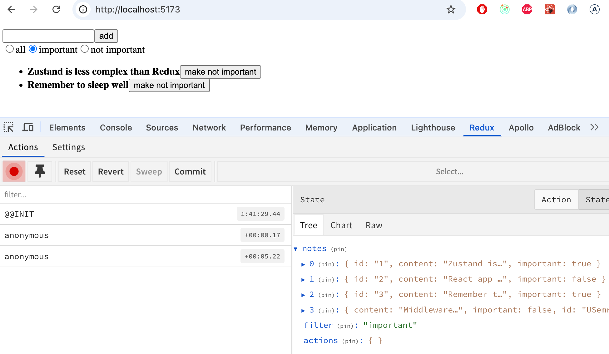

 
<div class="content">

Let's continue extending the Zustand version of the notes application.

To make development easier, let's change the initial state so that it already contains a few notes:

```js
// highlight-start
const initialNotes = [
    {
      id: 1,
      content: 'Zustand is less complex than Redux',
      important: true,
    }, {
      id: 2,
      content: 'React app benefits from custom hooks',
      important: false,
    }, {
      id: 3,
      content: 'Remember to sleep well',
      important: true,
    }
  ]


//highlight-end

const useNoteStore = create((set) => ({
  notes: initialNotes,
  // ...
}
```

### More complex state

Let's implement filtering of the notes displayed in the application, allowing the visible notes to be restricted. The filter is implemented using [radio buttons](https://developer.mozilla.org/en-US/docs/Web/HTML/Element/input/radio):


The question arises of how best to handle the filter's state management. There are essentially two options: create a separate Zustand store for the filter, or add it to the existing store. Both solutions are justifiable. The [best practices](https://tkdodo.eu/blog/working-with-zustand#keep-the-scope-of-your-store-small) found online recommend keeping completely unrelated things in separate stores. However, the list of notes and filtering are closely enough related that we will place both in the same store:

```js
const useNoteStore = create((set) => ({
  notes: initialNotes,
  filter: 'all', // highlight-line
  actions: {
    add: note => set(
      state => ({ notes: state.notes.concat(note) })
    ),
    toggleImportance: id => set(
      state => ({
        notes: state.notes.map(note =>
          note.id === id ? { ...note, important: !note.important } : note
        )
      })
    ),
    setFilter: value => set(() => ({ filter: value })) // highlight-line
  }
}))

export const useNotes = () => useNoteStore((state) => state.notes)
export const useFilter = () => useNoteStore((state) => state.filter) // highlight-line
export const useNoteActions = () => useNoteStore((state) => state.actions)
```

The component that sets the filter value:

```js
import { useNoteActions } from './store'

const VisibilityFilter = () => {
  const { setFilter } = useNoteActions()

  return (
    <div>
      <input
        type="radio"
        name="filter"
        onChange={() => setFilter('all')}
        defaultChecked
      />
      all
      <input
        type="radio"
        name="filter"
        onChange={() => setFilter('important')}
      />
      important
      <input
        type="radio"
        name="filter"
        onChange={() => setFilter('nonimportant')}
      />
      not important
    </div>
  )
}

export default VisibilityFilter
```

The <i>App</i> component renders the filter:

```js
const App = () => (
  <div>
    <NoteForm />
    <VisibilityFilter /> // highlight-line
    <NoteList />
  </div>
)
```

The filtering of the displayed notes could be handled in the <i>NoteList</i> component, for example as follows:

```js
import { useNotes, useFilter } from './store'
import Note from './Note'

const NoteList = () => {
  const notes = useNotes()
  const filter = useFilter() // highlight-line

  // highlight-start
  const notesToShow = notes.filter(note => {
    if (filter === 'important') return note.important
    if (filter === 'nonimportant') return !note.important
    return true
  })
  // highlight-end

  return (
    <ul>
      {notesToShow.map(note => ( // highlight-line
        <Note key={note.id} note={note} />
      ))}
    </ul>
  )
}
```

A better solution is reached by including the filtering logic directly in the store's <i>useNotes</i> function:

```js
import { create } from 'zustand'

const useNoteStore = create((set) => ({
  // ...
}))

// highlight-start
export const useNotes = () => {
  const notes = useNoteStore((state) => state.notes)
  const filter = useNoteStore((state) => state.filter)

  if (filter === 'important') return notes.filter(n => n.important)
  if (filter === 'nonimportant') return notes.filter(n => !n.important)

  return notes
}
// highlight-end
```

The function <i>useNotes</i> thus always returns a list of notes filtered in the desired way. The consumer of the function, the <i>NoteList</i> component, doesn't even need to be aware of the filter's existence:

```js
import { useNotes } from './store'
import Note from './Note'

const NoteList = () => {
  // component gets always the properly filtered set of notes
  const notes = useNotes()

  return (
    <ul>
      {notes.map(note => (
        <Note key={note.id} note={note} />
      ))}
    </ul>
  )
}
```

The solution is elegant!

> #### A possible alternative solution
>
> An alternative would be to implement filtering directly inside a selector function, so that both the notes and the filter are read in a single <i>useNoteStore</i> call:
>
>```js
>export const useNotes = () => useNoteStore(({ notes, filter }) => {
>  if (filter === 'important') return notes.filter(n => n.important)
>  if (filter === 'nonimportant') return notes.filter(n => !n.important)
>  return notes
>})
>```
>
> This approach does not work, however, as it leads to an infinite re-rendering loop when the filter is changed.
>
> The reason is as follows: Zustand compares the selector's return value using the <i>===</i> operator. Since <i>notes.filter(...)</i> creates a new array on every render, React always interprets it as a new state and triggers another render, which again creates a new array, and so on.
>
> The fix is to add [useShallow](https://zustand.docs.pmnd.rs/reference/hooks/use-shallow), which replaces the <i>===</i> comparison with a shallow comparison: it compares the array elements one by one. If the content has not changed, it returns the old array reference instead of a new one, so React sees the state as stable and does not re-render.
>
>```js
>import { useShallow } from 'zustand/react/shallow'
>
>//...
>
>export const useNotes = () => useNoteStore(useShallow(({ notes, filter }) => {
>  if (filter === 'important') return notes.filter(n => n.important)
>  if (filter === 'nonimportant') return notes.filter(n => !n.important)
>  return notes
>}))
>```
>
> The solution works, but it is slightly harder to understand. In the course material we use the earlier-presented version with two separate <i>useNoteStore</i> calls.

The current code of the application is available in its entirety on [GitHub](https://github.com/fullstack-hy2020/zustand-notes/tree/part6-3), in the branch <i>part6-3</i>.

</div>

<div class="tasks">

### Exercise 6.6

Let's continue with the anecdote application.

#### 6.6 anecdotes, step5

Implement filtering of the anecdotes displayed in the application:


Create a <i>Filter</i> component for displaying the filter on screen. You can use the following as its starting point:

```js
const Filter = () => {
  const handleChange = (event) => {
    // the value of the input field is in event.target.value
  }
  const style = {
    marginBottom: 10
  }

  return (
    <div style={style}>
      filter <input onChange={handleChange} />
    </div>
  )
}

export default Filter
```

</div>

<div class="content">

### Data to the server

Let's extend the application so that notes are stored in a backend. We'll use the [JSON Server](/en/part2/getting_data_from_server) familiar from Part 2.

Save the initial state of the database to the file <i>db.json</i> at the root of the project:

```json
{
  "notes": [
    {
      "id": 1,
      "content": "Zustand is less complex than Redux",
      "important": true
    },
    {
      "id": 2,
      "content": "React app benefits from custom hooks",
      "important": false
    },
    {
      "id": 3,
      "content": "Remember to sleep well",
      "important": true
    }
  ]
}
```

Install JSON Server:

```bash
npm install json-server --save-dev
```

and add the following line to the <i>scripts</i> section of <i>package.json</i>:

```js
"scripts": {
  "server": "json-server -p 3001 db.json",
  // ...
}
```

Start JSON Server with the command _npm run server_.

### Fetch API

In software development, one often has to consider whether to implement a certain feature using an external library or to take advantage of the native solutions provided by the environment. Both approaches have their own advantages and challenges.

In earlier parts of this course we have used the [Axios](https://axios-http.com/docs/intro) library for making HTTP requests. Let's now get familiar with an alternative way to make HTTP requests using the native [Fetch API](https://developer.mozilla.org/en-US/docs/Web/API/Fetch_API).

It is typical that an external library like <i>Axios</i> is implemented using other external libraries. For example, if you install Axios in a project with the command <i>npm install axios</i>, the console output is:

```bash
$ npm install axios

added 23 packages, and audited 302 packages in 1s

71 packages are looking for funding
  run `npm fund` for details

found 0 vulnerabilities
```

So the command would install not only the Axios library but over 20 other npm packages that Axios requires to work.

The <i>Fetch API</i> offers a similar way to make HTTP requests as Axios, but using the Fetch API does not require installing external libraries. Application maintenance becomes easier when there are fewer libraries to update, and security also improves since the potential attack surface of the application is reduced. Application security and maintenance are touched upon in [Part 7](https://fullstackopen.com/en/part7/class_components_miscellaneous#security-in-react-and-node-applications) of the course.

Making requests is done in practice by using the <i>fetch()</i> function. The syntax used has some differences compared to Axios. We'll also soon notice that Axios took care of some things for us and made our lives easier. We'll use the Fetch API now, however, because it is a widely-used native solution that every Full Stack developer should be familiar with.

### Fetching data from the server

Let's create a function that fetches data from the backend in the file <i>src/services/notes.js</i>:

```js
const baseUrl = 'http://localhost:3001/notes'

const getAll = async () => {
  const response = await fetch(baseUrl)

  if (!response.ok) {
    throw new Error('Failed to fetch notes')
  }

  const data = await response.json()
  return data
}

export default { getAll }
```

Let's look more closely at the implementation of the <i>getAll</i> function. The notes are now fetched from the backend by calling the <i>fetch()</i> function, which has been given the backend URL as an argument. The request type is not separately specified, so <i>fetch</i> performs the default action, which is a GET request.

When the response has arrived, we check whether the request succeeded by looking at the <i>response.ok</i> field and throw an error if necessary:

```js
if (!response.ok) {
  throw new Error('Failed to fetch notes')
}
```

The attribute <i>response.ok</i> gets the value <i>true</i> if the request succeeded, i.e., if the response status code is in the range 200-299. For all other status codes, such as 404 or 500, it gets the value <i>false</i>.

Note that <i>fetch</i> does not automatically throw an error even if the response status code is, for example, 404. Error handling must be implemented manually, as we have done now.

If the request succeeded, the data contained in the response is converted to JSON format:

```js
const data = await response.json()
```

<i>fetch</i> does not automatically convert the data that may accompany the response to JSON format; the conversion must be done manually. It is also worth noting that <i>response.json()</i> is an asynchronous function, so the <i>await</i> keyword must be used with it.

Let's simplify the code a bit by returning the data returned by the <i>response.json()</i> function directly:

```js
const getAll = async () => {
  const response = await fetch(baseUrl)

  if (!response.ok) {
    throw new Error('Failed to fetch notes')
  }

  return await response.json() // highlight-line
}
```

Let's add a function to the store that can be used to initialize the state with notes fetched from the server:

```js
const useNoteStore = create((set) => ({
  notes: [], // highlight-line
  filter: '',
  actions: {
    // ...
    setFilter: value => set(() => ({ filter: value })),
    initialize: notes => set(() => ({ notes })) // highlight-line
  }
}))
```

Let's implement the initialization of notes in the <i>App</i> component — as usual when fetching data from a server, we use the <i>useEffect</i> hook:

```js
const App = () => {
  const { initialize } = useNoteActions()

 // highlight-start
  useEffect(() => {
    noteService.getAll().then(notes => initialize(notes))
  }, [initialize])
 // highlight-end

  return (
    <div>
      <NoteForm />
      <VisibilityFilter />
      <NoteList />
    </div>
  )
}
```

The notes are thus fetched from the server using the  <i>getAll()</i> function we defined and then stored using the store's <i>initialize</i> function. These actions are done in the <i>useEffect</i> hook, meaning they are executed during the first render of the App component.

Let's look more closely at one small detail. We have added the <i>initialize</i> function to the dependency array of the <i>useEffect</i> hook. If we try to use an empty dependency array, ESLint gives the following warning: <i>React Hook useEffect has a missing dependency: 'initialize'</i>. What is going on?

The code would work logically exactly the same even if we used an empty dependency array, because <i>initialize</i> refers to the same function throughout the program's execution. However, it is good programming practice to add all variables and functions used by the _useEffect_ hook that are defined inside the component to the dependencies. This helps avoid unexpected bugs.

### Sending data to the server

Let's next implement the functionality for sending a new note to the server. At the same time we can practice how to make a POST request using the <i>fetch()</i> function.

Let's extend the server communication code in <i>src/services/notes.js</i> as follows:

```js
const baseUrl = 'http://localhost:3001/notes'

const getAll = async () => {
  const response = await fetch(baseUrl)

  if (!response.ok) {
    throw new Error('Failed to fetch notes')
  }

  return await response.json()
}

// highlight-start
const createNew = async (content) => {
  const response = await fetch(baseUrl, {
    method: 'POST',
    headers: { 'Content-Type': 'application/json' },
    body: JSON.stringify({ content, important: false }),
  })
  
  if (!response.ok) {
    throw new Error('Failed to create note')
  }
  
  return await response.json()
}
// highlight-end

export default { getAll, createNew } // highlight-line
```

Let's look more closely at the implementation of the <i>createNew</i> function. The first parameter of the <i>fetch()</i> function specifies the URL to which the request is made. The second parameter is an object that defines the other details of the request, such as the request type, headers and the data sent with the request. We can further clarify the code by storing the object defining the request details in a separate <i>options</i> helper variable:

```js
const createNew = async (content) => {
  // highlight-start
  const options = {
    method: 'POST',
    headers: { 'Content-Type': 'application/json' },
    body: JSON.stringify({ content, important: false }),
  }
  
  const response = await fetch(baseUrl, options)
  // highlight-end

  if (!response.ok) {
    throw new Error('Failed to create note')
  }
  
  return await response.json()
}
```

Let's look more closely at the <i>options</i> object:

- <i>method</i> defines the request type, which in this case is <i>POST</i>
- <i>headers</i> defines the request headers. We attach the header <i>'Content-Type': 'application/json'</i> to the request so that the server knows that the data included with the request is in JSON format, and can handle the request correctly
- <i>body</i> contains the data to be sent with the request. The field cannot directly contain a JavaScript object, it must first be converted to a JSON string by calling <i>JSON.stringify()</i>

As with the GET request, we also check the response status code here for errors:

```js
if (!response.ok) {
  throw new Error('Failed to create note')
}
```

If the request succeeds, <i>JSON Server</i> returns the just-created note, for which it has also generated a unique <i>id</i>. The data contained in the response must still be converted to JSON format using the <i>response.json()</i> function: 

```js
return await response.json()
```

Let's then change our application's <i>NoteForm</i> component so that a new note is sent to the backend. The component's <i>addNote</i> function changes slightly:

```js
import { useNoteActions } from './store'
import noteService from './services/notes'

const NoteForm = () => {
  const { add } = useNoteActions()

  const addNote = async (e) => {
    e.preventDefault()
    const content = e.target.note.value
    const newNote = await noteService.createNew(content) // highlight-line
    add(newNote)
    e.target.reset()
  }

  return (
    <form onSubmit={addNote}>
      <input name="note" />
      <button type="submit">add</button>
    </form>
  )
}

export default NoteForm
```

When a new note is created in the backend by calling the function <i>createNew()</i>, we get back an object describing the note, for which the backend has generated an <i>id</i>.

The current code of the application is available in its entirety on [GitHub](https://github.com/fullstack-hy2020/zustand-notes/tree/part6-4), in the branch <i>part6-4</i>.

### Async actions

Our approach is fairly good, but in one sense unfortunate, in that the communication with the server happens inside the code of the functions that define the components. It would be better if the communication could be abstracted away from the components, so that they only need to call an appropriate function that the store provides.

We want <i>App</i> to initialize the application state as follows:

```js
const App = () => {
  const { initialize } = useNoteActions()  // highlight-line

  useEffect(() => {
    initialize()  // highlight-line
  }, [initialize])

  return (
    <div>
      <NoteForm />
      <VisibilityFilter />
      <NoteList />
    </div>
  )
}
```


<i>NoteForm</i> in turn creates a new note like this:

```js
const NoteForm = () => {
  const { add } = useNoteActions()  // highlight-line

  const addNote = async (e) => {
    e.preventDefault()
    const content = e.target.note.value
    await add(content)  // highlight-line
    e.target.reset()
  }

  return (
    <form onSubmit={addNote}>
      <input name="note" />
      <button type="submit">add</button>
    </form>
  )
}
```

The change to <i>store.js</i> is as follows:

```js
import { create } from 'zustand'
import noteService from './services/notes' // highlight-line

const useNoteStore = create((set) => ({
  notes: [],
  filter: '',
  actions: {
    add: async (content) => {  // highlight-line
      const newNote = await noteService.createNew(content)  // highlight-line
      set(state => ({ notes: state.notes.concat(newNote) })) 
    },
    initialize: async () => {  // highlight-line
      const notes = await noteService.getAll()  // highlight-line
      set(() => ({ notes }))
    },
    // ...
  }
}))
```

The functions <i>add</i> and <i>initialize</i> have thus been changed into asynchronous functions, which first call the appropriate noteService function, and then update the state.

The solution is elegant; state management and communication with the server are entirely separated outside of React components.

Let's finalize the application by synchronizing the importance toggle change to the server.

<i>noteService.js</i> is extended as follows:

```js
const update = async (id, note) => {
  const response = await fetch(`${baseUrl}/${id}`, {
    method: 'PUT',
    headers: { 'Content-Type': 'application/json' },
    body: JSON.stringify(note),
  })

  if (!response.ok) {
    throw new Error('Failed to update note')
  }

  return await response.json()
}

export default { getAll, createNew, update } 
```

The change to the store's <i>toggleImportance</i> function is as follows:

```js
const useNoteStore = create((set) => ({
  notes: [],
  filter: '',
  actions: {
    add: async (content) => {
      const newNote = await noteService.createNew(content)
      set(state => ({ notes: state.notes.concat(newNote) }))
    },
    // highlight-start
    toggleImportance: async (id) => {
      const note = useNoteStore.getState().notes.find(n => n.id === id)
      const updated = await noteService.update(
        id, { ...note, important: !note.important }
      )
      set(state => ({
        notes: state.notes.map(n => n.id === id ? updated : n)
      }))
    },
    // highlight-end
    setFilter: value => set(() => ({ filter: value })),
    initialize: async () => {
      const notes = await noteService.getAll()
      set(() => ({ notes }))
    }
  }
}))
```

There is one noteworthy detail in the new function. The function receives the note's id as a parameter. However, the modified note must be sent to the backend. It can be found by calling the store's <i>getState</i> function:

```js
const note = useNoteStore.getState().notes.find(n => n.id === id)
```

Zustand stores also have a number of other [helper functions](https://zustand.docs.pmnd.rs/reference/apis/create#returns), which may be useful in some situations.

Let's however also change the store definition so that we also pass the parameter <i>get</i> to the function given to <i>create</i>, through which we can then access the state values when needed:

```js
const useNoteStore = create((set, get) => ({ // highlight-line
  notes: [],
  filter: '',
  actions: {
    toggleImportance: async (id) => {
      const note = get().notes.find(n => n.id === id) // highlight-line
      const updated = await noteService.update(
        id, { ...note, important: !note.important }
      )
      set(state => ({
        notes: state.notes.map(n => n.id === id ? updated : n)
      }))
    },
    // ...
  }
}))
```

The function <i>get</i> returns the current state of the store. For example, the call <i>get().notes</i> gives the store's current notes. The function <i>get</i> is functionally equivalent to calling <i>useNoteStore.getState()</i>, but is the most idiomatic way to refer to the store's state from within the store's own functions.

The code of the application is on [GitHub](https://github.com/fullstack-hy2020/zustand-notes/tree/part6-5) in the branch <i>part6-5</i>.

</div>

<div class="tasks">

### Exercises 6.7.-6.11.

#### 6.7 anecdotes, step6

Fetch the anecdotes from the JSON Server backend when the application starts. Use the Fetch API to make the HTTP request.

You can find the initial content for the backend e.g. [here](https://github.com/fullstack-hy2020/misc/blob/master/anecdotes.json).

#### 6.8 anecdotes, step7

Change the creation of new anecdotes so that anecdotes are stored in the backend. Use the Fetch API in your implementation.

#### 6.9 anecdotes, step8

Voting does not yet save changes to the backend. Fix the situation.

#### 6.10 anecdotes, step9

The application has a ready-made skeleton for the <i>Notification</i> component:

```js
const Notification = () => {
  const style = {
    border: 'solid',
    padding: 10,
    borderWidth: 1,
    marginBottom: 10
  }

  return (
    <div style={style}>
      render here notification...
    </div>
  )
}

export default Notification
```

Extend the application so that it shows a notification using the <i>Notification</i> component for five seconds when anecdotes are voted on or new anecdotes are created:


Use Zustand for notification state management. It may be a good idea to create a separate Zustand store for notifications, since notification usage may expand to other areas of the application as it grows, such as user login.

#### 6.11 anecdotes, step10

We notice that some of the anecdotes added by users are not very good. Implement a feature that allows deleting anecdotes that have zero votes.

</div>

<div class="content">

### Middlewares

When developing an application, one often encounters situations where it is hard to understand why the application behaves unexpectedly. The state changes as a result of some action function call, but it is unclear which call changed what and in which order. Traditional console logging of individual functions only helps to a limited extent.

Zustand supports so-called middlewares, which can be used to add functionality to stores transparently, without touching the store's own logic. The idea of middleware is simple: it "wraps" around the store and can, for example, automatically log every state change.

The form of middleware functions is somewhat cryptic. Below is a <i>logger</i> that always prints the store's old and new state whenever the state changes:

```js
const logger = (config) => (set, get) => config(
  (...args) => {
    console.log('prev state', get());
    set(...args);
    console.log('next state', get());
  },
  get
);
```

The middleware is activated by "wrapping" the function given to Zustand's <i>create</i> as its parameter:

```js
const useNoteStore = create(logger((set, get) => ({ // highlight-line
  notes: [],
  filter: '',
  actions: {
    // ...
  }
}))) // highlight-line
```

Now whenever the store's state changes, we can always see in the console how the state changes:


In practice our defined middleware works by replacing the original function <i>set</i> with the function

```js
  (...args) => {
    console.log('prev state', get());
    set(...args);
    console.log('next state', get());
  }
```

which in addition to calling <i>set</i>, also prints the old and new state (accessible via the <i>get</i> function) to the console. The second parameter is the old <i>get</i> unchanged.

Zustand also has a ready-made <i>devtools</i> middleware that integrates the store with the browser's [Redux DevTools](https://chromewebstore.google.com/detail/redux-devtools/lmhkpmbekcpmknklioeibfkpmmfibljd) extension. Devtools is an extremely useful development tool, as it allows you to visually track state changes.

The setup is straightforward:

```js
import { create } from 'zustand'
import { devtools } from 'zustand/middleware' // highlight-line

const useNoteStore = create(devtools((set, get) => ({ // highlight-line
  notes: [],
  filter: '',
  actions: {
    // ...
  }
}))) // highlight-line
```

When the Redux DevTools extension is installed in the browser, the state of the store and its changes can be inspected in the browser's developer tools:



### Testing Zustand stores

Finally, let's look at testing Zustand stores with Vitest.

For simplicity, let's start with the counter store:

```js
import { create } from 'zustand'

const useCounterStore = create(set => ({
  counter: 0,
  actions: {
    increment: () => set(state => ({ counter: state.counter + 1 })),
    decrement: () => set(state => ({ counter: state.counter - 1 })),
    zero: () => set(() => ({ counter: 0 })),
  }  
}))

export const useCounter = () => useCounterStore(state => state.counter)
export const useCounterControls = () => useCounterStore(state => state.actions)

export default useCounterStore // highlight-line
```

We added an export to the definition for the tests, through which the test can access the store.

Let's install Vitest:

```
npm install --save-dev vitest
```

Let's implement the test in the file <i>store.test.js</i>:

```js
import { beforeEach, describe, expect, it } from 'vitest'
import useCounterStore from './store'

beforeEach(() => {
  useCounterStore.setState({ counter: 0 })
})

describe('counter store', () => {
  it('initial state is 0', () => {
    expect(useCounterStore.getState().counter).toBe(0)
  })

  it('increment increases counter by 1', () => {
    useCounterStore.getState().actions.increment()
    expect(useCounterStore.getState().counter).toBe(1)
  })

  it('decrement decreases counter by 1', () => {
    useCounterStore.getState().actions.decrement()
    expect(useCounterStore.getState().counter).toBe(-1)
  })

  it('zero resets counter to 0', () => {
    useCounterStore.getState().actions.increment()
    useCounterStore.getState().actions.increment()
    useCounterStore.getState().actions.zero()
    expect(useCounterStore.getState().counter).toBe(0)
  })
})
```

The tests are quite straightforward, utilizing the store's [getState](https://zustand.docs.pmnd.rs/reference/apis/create#returns) function, which allows them to read the store's state and execute the store's functions.

Before each test, the store is reset to its initial state in the <i>beforeEach</i> block using the store's [setState](https://zustand.docs.pmnd.rs/reference/apis/create#returns) function.

Resetting the store to its initial state is simple in our case. This is not always necessarily so. Zustand's [documentation](https://zustand.docs.pmnd.rs/learn/guides/testing#vitest) describes a way to create a version of stores for testing that is automatically reset to its initial state before each test. The method is, however, complex enough and unnecessary for us that we will skip it for now.

The tests thus use the store directly. If more complex logic has been implemented through custom hooks for using the store, it may be necessary to write tests that also utilize the hooks. In the counter, store usage happens through the hooks <i>useCounter</i> and <i>useCounterControls</i>:


```js
const useCounterStore = create(set => ({
  // ...
}))

// hightlight-start
export const useCounter = () => useCounterStore(state => state.counter)
export const useCounterControls = () => useCounterStore(state => state.actions)
// hightlight-end
```

In this case the hooks do not contain any logic, they just separately expose the value stored in the store and the store's functions. The testing approach we used above is therefore perfectly fine.

Let's however make another version of the tests for example purposes, where the store is used in exactly the same way as the application uses it.

<i>useCounter</i> and <i>useCounterControls</i> are React hooks, so testing them requires [React Testing Library](https://github.com/testing-library/react-testing-library) and the [jsdom](https://github.com/jsdom/jsdom) library:

```
npm install --save-dev @testing-library/react jsdom
```

Let's add the testing environment configuration to <i>vite.config.js</i>:

```js
import { defineConfig } from 'vite'
import react from '@vitejs/plugin-react'

export default defineConfig({
  plugins: [react()],
  // highlight-start
  test: {
    environment: 'jsdom',
  },
   // highlight-end
})
```

The tests are as follows:

```js
import { beforeEach, describe, expect, it } from 'vitest'
import { renderHook, act } from '@testing-library/react'
import useCounterStore, { useCounter, useCounterControls } from './store'

beforeEach(() => {
  useCounterStore.setState({ counter: 0 })
})

describe('counter hooks', () => {
  it('useCounter returns initial value of 0', () => {
    const { result } = renderHook(() => useCounter())
    expect(result.current).toBe(0)
  })

  it('increment updates counter', () => {
    const { result: counter } = renderHook(() => useCounter())
    const { result: controls } = renderHook(() => useCounterControls())

    act(() => controls.current.increment())

    expect(counter.current).toBe(1)
  })

  it('decrement updates counter', () => {
    const { result: counter } = renderHook(() => useCounter())
    const { result: controls } = renderHook(() => useCounterControls())

    act(() => controls.current.decrement())

    expect(counter.current).toBe(-1)
  })

  it('zero resets counter', () => {
    const { result: counter } = renderHook(() => useCounter())
    const { result: controls } = renderHook(() => useCounterControls())

    act(() => {
      controls.current.increment()
      controls.current.increment()
      controls.current.zero()
    })

    expect(counter.current).toBe(0)
  })
})
```

There are a few interesting things in the test. At the start of the tests, the hooks are rendered using the [renderHook](https://testing-library.com/docs/react-testing-library/api/#renderhook) function:

```js
const { result: counter } = renderHook(() => useCounter())
const { result: controls } = renderHook(() => useCounterControls())
```

This way the test gets access to the values returned by the hooks, which are stored in the variables <i>counter</i> and <i>controls</i>.

The hooks are called by wrapping the call inside the [act](https://testing-library.com/docs/react-testing-library/api/#act) function:

```js
act(() => {
  controls.current.increment()
  controls.current.increment()
  controls.current.zero()
})
```

Lopuksi tapahtuu testin ekspektaatio:

```js
expect(counter.current).toBe(0)
```

As we can see, to access the hook itself we still need to take the <i>current</i> field from the object returned by <i>renderHook</i>, which corresponds to the hook's current value.

> ### What is act?
>
> <i>act</i> is a helper function that ensures all state updates and their side effects have been processed before the test code continues.
>
> When a state change occurs in a React component or hook, React does not update the state immediately but queues the updates. act forces these queued updates to be executed.
>
> Without act, a test might check the state before React has had time to update it, causing the test to fail or give incorrect results.
>
> React Testing Library wraps many of its functions (such as fireEvent, userEvent) in act automatically, but when testing hooks directly it is often needed manually, or by using the act provided by renderHook.

Testing via hooks uses React Testing Library and renders the hooks in a real React context using jsdom. This approach is considerably slower than tests that use the store directly, so if the hooks do not contain complex logic, it may be sufficient to run the tests using the store directly.

The code containing the Zustand counter tests is available on [GitHub](https://github.com/fullstack-hy2020/zustand-counter).

### Testing the notes store

Testing the store of the note application is a somewhat more challenging case, since the store contains asynchronous functions that call the server:

```js
import { create } from 'zustand'
import noteService from './services/notes'

const useNoteStore = create(set => ({
  notes: [],
  filter: '',
  actions: {
    add: async (content) => {
      const newNote = await noteService.createNew(content) // highlight-line
      set(state => ({ notes: state.notes.concat(newNote) }))
    },
    toggleImportance: async (id) => {
      const note = useNoteStore.getState().notes.find(n => n.id === id)
      // highlight-start
      const updated = await noteService.update(
        id, { ...note, important: !note.important }
      )
       // highlight-end
      set(state => ({
        notes: state.notes.map(n => n.id === id ? updated : n)
      }))
    },
    setFilter: value => set(() => ({ filter: value })),
    initialize: async () => {
      const notes = await noteService.getAll() // highlight-line
      set(() => ({ notes }))
    }
  }
}))

export const useNotes = () => { 
  const notes = useNoteStore((state) => state.notes)
  const filter = useNoteStore((state) => state.filter)
  if (filter === 'important') return notes.filter(n => n.important)
  if (filter === 'nonimportant') return notes.filter(n => !n.important)
  return notes
}

export const useFilter = () => useNoteStore((state) => state.filter)
export const useNoteActions = () => useNoteStore((state) => state.actions)
```

This time <i>useNotes</i> also contains a significant amount of logic, so testing should probably be done via hooks with React Testing Library.

Let's install the required libraries:

```
npm install --save-dev vitest @testing-library/react jsdom
```

Let's add the testing environment configuration to <i>vite.config.js</i>:

```js
import { defineConfig } from 'vite'
import react from '@vitejs/plugin-react'

export default defineConfig({
  plugins: [react()],
  // highlight-start
  test: {
    environment: 'jsdom',
  },
   // highlight-end
})
```

The first part of the tests is as follows:

```js
import { describe, it, expect, beforeEach, vi } from 'vitest'
import { renderHook, act } from '@testing-library/react'

vi.mock('./services/notes', () => ({
  default: {
    getAll: vi.fn(),
    createNew: vi.fn(),
    update: vi.fn(),
  }
}))

import noteService from './services/notes'
import useNoteStore, { useNotes, useFilter, useNoteActions } from './store'

beforeEach(() => {
  useNoteStore.setState({ notes: [], filter: '' })
  vi.clearAllMocks()
})

describe('useNoteActions', () => {
  it('initialize loads notes from service', async () => {
    const mockNotes = [{ id: 1, content: 'Test', important: false }]
    noteService.getAll.mockResolvedValue(mockNotes)

    const { result } = renderHook(() => useNoteActions())

    await act(async () => {
      await result.current.initialize()
    })

    const { result: notesResult } = renderHook(() => useNotes())
    expect(notesResult.current).toEqual(mockNotes)
  })

  it('add appends a new note', async () => {
    const newNote = { id: 2, content: 'New note', important: false }
    noteService.createNew.mockResolvedValue(newNote)

    const { result } = renderHook(() => useNoteActions())

    await act(async () => {
      await result.current.add('New note')
    })

    const { result: notesResult } = renderHook(() => useNotes())
    expect(notesResult.current).toContainEqual(newNote)
  })

  it('toggleImportance flips important flag', async () => {
    const note = { id: 1, content: 'Test', important: false }
    useNoteStore.setState({ notes: [note] })
    noteService.update.mockResolvedValue({ ...note, important: true })

    const { result } = renderHook(() => useNoteActions())

    await act(async () => {
      await result.current.toggleImportance(1)
    })

    const { result: notesResult } = renderHook(() => useNotes())
    expect(notesResult.current[0].important).toBe(true)
  })

  it('setFilter updates filter', () => {
    const { result: actionsResult } = renderHook(() => useNoteActions())
    const { result: filterResult } = renderHook(() => useFilter())

    act(() => {
      actionsResult.current.setFilter('important')
    })

    expect(filterResult.current).toBe('important')
  })
})
```

There is a lot to digest in the tests. The tests create, using Vitest, a [mock](https://vitest.dev/guide/mocking) version of the <i>noteService</i> responsible for communicating with the server:
 
```js
import { describe, it, expect, beforeEach, vi } from 'vitest'

vi.mock('./services/notes', () => ({
  default: {
    getAll: vi.fn(),
    createNew: vi.fn(),
    update: vi.fn(),
  }
}))
```

[vi.mock](https://vitest.dev/api/vi.html#vi-mock) replaces the <i>noteService</i> in the <i>./services/notes</i> module with its own version, where all functions are replaced with mock functions returned by [vi.fn](https://vitest.dev/api/vi.html#vi-fn).

Before each test, the store is reset to its initial state and the mock functions are cleared:

```js
beforeEach(() => {
  useNoteStore.setState({ notes: [], filter: '' })
  vi.clearAllMocks()
})
```

At the start of each test, the mocked <i>noteService</i> is told via the [mockResolvedValue](https://vitest.dev/api/mock.html#mockresolvedvalue) function how it should behave in the context of the test:

```js
it('initialize loads notes from service', async () => {
  // highlight-start
  const mockNotes = [{ id: 1, content: 'Test', important: false }]
  noteService.getAll.mockResolvedValue(mockNotes)
  // highlight-end

  const { result } = renderHook(() => useNoteActions())

  await act(async () => {
    await result.current.initialize()
  })

  const { result: notesResult } = renderHook(() => useNotes())
  expect(notesResult.current).toEqual(mockNotes)
})
```

First, the test defines that when the <i>noteService.getAll</i> function is called, the notes in the <i>mockNotes</i> array are returned to the store.

The thing being tested is the call to the <i>initialize</i> function:

```js
await act(async () => {
  await result.current.initialize()
})
```

Since this is an asynchronous function, the completion of the call must be awaited with the <i>await</i> command.

Finally, the test verifies that the store's state contains the same list of notes that the mocked <i>noteService.getAll</i> returned:

```js
const { result: notesResult } = renderHook(() => useNotes())
expect(notesResult.current).toEqual(mockNotes)
```

The other tests follow the same pattern: first, what the store's called <i>noteService</i> function returns is defined, and then the actual test is run.

The second part of the tests verifies that filtering works correctly:

```js
describe('useNotes filtering', () => {
  const notes = [
    { id: 1, content: 'A', important: true },
    { id: 2, content: 'B', important: false },
  ]

  beforeEach(() => {
    useNoteStore.setState({ notes })
  })

  it('returns all notes with no filter', () => {
    const { result } = renderHook(() => useNotes())
    expect(result.current).toHaveLength(2)
  })

  it('filters important notes', () => {
    useNoteStore.setState({ notes, filter: 'important' })
    const { result } = renderHook(() => useNotes())
    expect(result.current).toEqual([notes[0]])
  })

  it('filters nonimportant notes', () => {
    useNoteStore.setState({ notes, filter: 'nonimportant' })
    const { result } = renderHook(() => useNotes())
    expect(result.current).toEqual([notes[1]])
  })
})
```

The application's final code is on [GitHub](https://github.com/fullstack-hy2020/zustand-notes/tree/part6-6) in the branch <i>part6-6</i>.

</div>

<div class="tasks">

### Exercises 6.12.-6.15.

#### 6.12 Anecdotes, step11

Write a test that verifies the state is initialized with the anecdotes returned by the backend.

#### 6.13 Anecdotes, step12

Write a test that verifies the component displaying anecdotes receives the anecdotes from the store sorted by votes.

#### 6.14 Anecdotes, step13

Write a test that verifies the correct React component receives a properly filtered list of anecdotes.

#### 6.15 Anecdotes, step14

Write a test that verifies that voting increases the number of votes for an anecdote.

</div>
