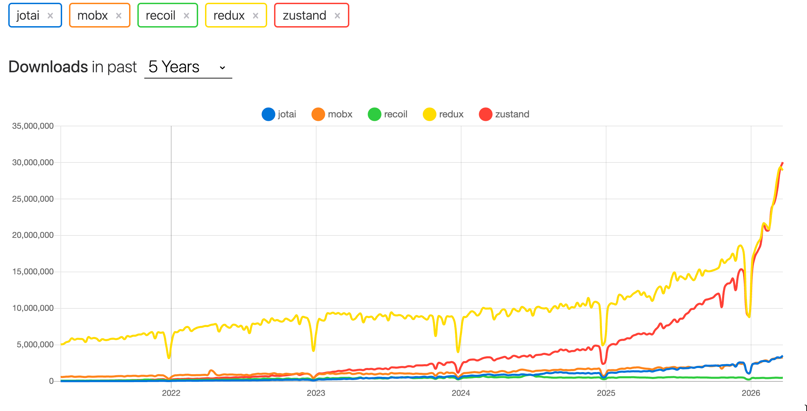
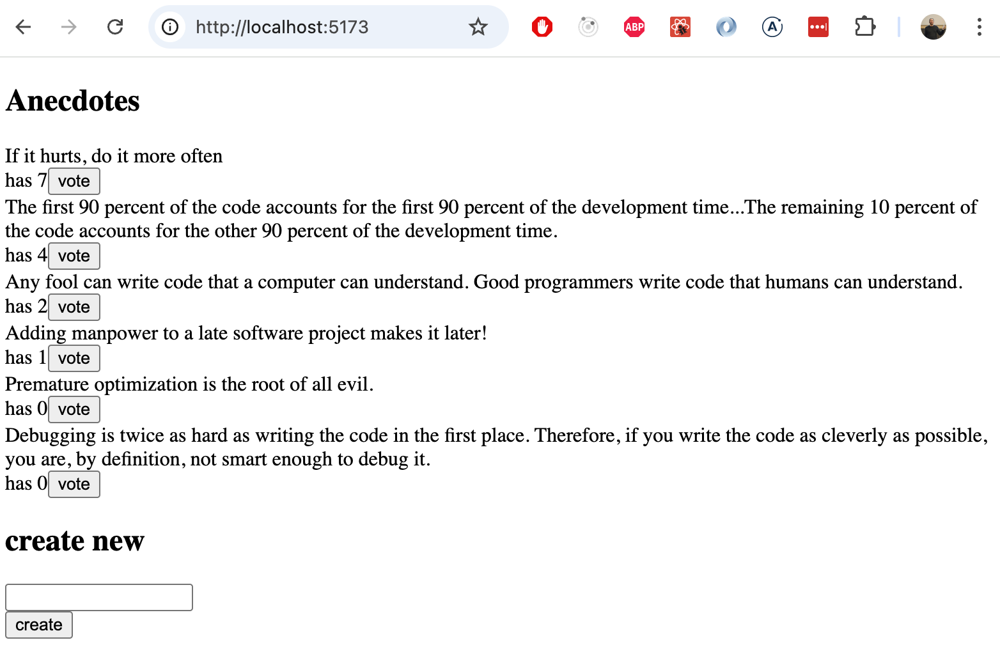

<div class="content">

Olemme noudattaneet sovelluksen tilan hallinnassa Reactin suosittelemaa käytäntöä määritellä useiden komponenttien tarvitsema tila ja sitä käsittelevät funktiot sovelluksen komponenttirakenteen [ylimmissä](https://reactjs.org/docs/lifting-state-up.html) kompontenteissa. Usein suurin osa tilaa ja sitä käsittelevistä funktioista on määritelty suoraan sovelluksen juurikomponentissa ja välitetty propsien avulla niitä tarvitseville komponenteille. Tämä toimii johonkin pisteeseen saakka, mutta sovelluksen kasvaessa tilan hallinta muuttuu haasteelliseksi.

### Flux-arkkitehtuuri

Facebook kehitti jo Reactin historian varhaisvaiheissa tilan hallinnan ongelmia helpottamaan [Flux](https://facebookarchive.github.io/flux/docs/in-depth-overview)-arkkitehtuurin. Fluxissa sovelluksen tilan hallinta erotetaan kokonaan Reactin komponenttien ulkopuolisiin varastoihin eli <i>storeihin</i>. Storessa olevaa tilaa ei muuteta suoraan, vaan tapahtumien eli <i>actionien</i> avulla.

Kun action muuttaa storen tilaa, renderöidään näkymät uudelleen:


Jos sovelluksen käyttö (esim. napin painaminen) aiheuttaa tarpeen tilan muutokseen, tehdään muutos actionin avulla. Tämä taas aiheuttaa uuden näytön renderöitymisen:


Flux tarjoaa siis standardin tavan sille miten ja missä sovelluksen tila pidetään sekä tavalle tehdä tilaan muutoksia.

### Redux

Flux-arkkitehtuuria noudattava [Redux](https://redux.js.org) oli lähes vuosikymmenen hallitseva tilanhallintaratkaisu React-sovelluksissa. Myös tällä kurssilla käytettiin Reduxia kevääseen 2026 asti. Reduxia on alusta asti vaivannut monimutkaisuus ja boilerplate-koodin suuri määrä. Tilanne parani huomattavasti [Redux Toolkitin](https://redux-toolkit.js.org/) ilmestymisen myötä, mutta tästä huolimatta yhteisö kehitti koko ajan vaihtoehtoisia tilantahallintaratkaisuja, kuten esimerkiksi [MobX](https://mobx.js.org/), [Recoil](https://recoiljs.org/)  ja [Joatai](https://www.npmjs.com/package/jotai). Näiden suosio on ollut vaihtelevaa. 

Mielenkiintoisin, ja suosituin uusista tulokkaista on ehdottomasti [Zustand](https://zustand.docs.pmnd.rs/), ja se on myös meidän valinta tilanhallintarkatkaisuksi. Zustand näyttää tavoittaneen suosiossaan jo itsensä Reduxin:



### Zustand

Tutustutaan Zustandiin tekemällä jälleen kerran laskurin toteuttava sovellus:


Tehdään uusi Vite‑sovellus ja asennetaan siihen <i>Zustand</i>:

```bash
npm install zustand
```

Ensimmäinen versio, missä vasta laskurin kasvatus toimii, sovelluksesta on seuraavasta:

```bash
import { create } from 'zustand'

const useCounterStore = create((set) => ({
  counter: 0,
  increment: () => set((state) => ({ counter: state.counter + 1 })),
}))

const App = () => {
  const counter = useCounterStore(state => state.counter)
  const increment = useCounterStore(state => state.increment)

  return (
    <div>
      <div>{counter}</div>
      <div>
        <button onClick={increment}>plus</button>
        <button>minus</button>
        <button>zero</button>
      </div>
      
    </div>
  )
}
```

Sovellus aloittaa luomalla <i>storen</i> eli globaalin tilan Zustandin funktiolla <i>create</i>: 

```bash
import { create } from 'zustand'

const useCounterStore = create((set) => ({
  counter: 0,
  increment: () => set((state) => ({ counter: state.counter + 1 })),
}))
```

Funktio saa parametriksi funktion, joka palauttaa sovellukselle määriteltävän tilan. Parametri on siis seuraava:

```js
(set) => ({
  counter: 0,
  increment: () => set(state => ({ counter: state.counter + 1 })),
})
```

Tilaan on siis määritelty <i>counter</i>, joka on arvoltaan nolla, sekä <i>increment</i> joka taas on funktio. 

Sovelluksen komponentit pääsevät käsiksi tilassa määriteltyihin arvoihin sekä funktioihin Zustandin <i>createn</i> avulla määritellyn funktion <i>useCounterStore</i> avulla. Komponentti <i>App</i> ottaa selektorien avulla tilasta käyttöönsä siellä olevan arvon <i>counter</i> sekä funktion <i>increment</i>:

```js
const App = () => {
  // highlight-start
  const counter = useCounterStore(state => state.counter)
  const increment = useCounterStore(state => state.increment)
  // highlight-end

  return (
    <div>
      <div>{counter}</div> // highlight-line
      <div>
        <button onClick={increment}>plus</button>  // highlight-line
        <button>minus</button>
        <button>zero</button>
      </div>
      
    </div>
  )
}
```

Napin "plus" klikkauksenkäsittelijäkti on annettu tilan funktio <i>increment</i>, joka  määriteltiin seuraavasti:

```js
const useCounterStore = create((set) => ({
  counter: 0,
  increment: () => set(state => ({ counter: state.counter + 1 })), // highlight-line
}))
```

Otetaan funktiomäärittely vielä erilleen:

```js
() => set(state => ({ counter: state.counter + 1 }))
```

Kyseessä on siis funktio, joka kutsuu funktiota <i>set</i> antaen parametriksi taas funktion. Tämä parametrina oleva funktio määrittelee miten tila muuttuu:

```js
state => ({ counter: state.counter + 1 })
```

joka taas on lyhennysmerkintä seuraavalle:

```js
state => {
  return { counter: state.counter + 1 }
}
```

Funktio siis palauttaa uuden tilan, jonka se laskee vanhan tilan perusteella, eli jos vanha tila on esim

```js
{
  counter: 1,
  increment: // function definition
}
```

tulee uudeksi tilaksi

```js
{
  counter: 2,
  increment: // function definition
}
```

Tilassa on siis koko ajan mukana myös tilaa muuttava funktio <i>increment</i> tilaa muuttava funktio  

```js
state => ({ counter: state.counter + 1 })
```

kuitenkin koskee ainoastaan tilassa olevaan arvoon <i>counter</i>.

Mikään ei estäisi muuttamasta tilanmuutosfunktiossa myös tilassa olevaa funktiota, eli jos määrittelisimme seuraavasti

```js
state => {
  return {
    counter: state.counter + 1 ,
    increment: console.log('increment broken')
  }
}
```

kasvatusnappi toimisi vain ensimmäisellä kerralla, tämän jälkeen napin painaminen ainoastaan tulostaisi konsoliin.

Kun uudeksi tilaksi asetetaan 

```js
state => ({ counter: state.counter + 1 })
```

päivitetään ainoastaan tilan avaimen <i>counter</i> arvo, eli uusi tila saadaa yhdistämällä vanha tila tilaa muuttavan funtion arvoon. Tämän takia seuraava tilanmuutosfunktio

```js
state => ({})
```

ei vaikuta tilaan ollenkaan.

Täydennetään vielä sovellus muidenkin nappien osalta:

```js
const useCounterStore = create((set) => ({
  counter: 0,
  increment: () => set(state => ({ counter: state.counter + 1 })),
  decrement: () => set(state => ({ counter: state.counter - 1 })),
  zero: () => set(() => ({ counter: 0 })),  
}))

const App = () => {
  const counter = useCounterStore(state => state.counter)
  const increment = useCounterStore(state => state.increment)
  const decrement = useCounterStore(state => state.decrement)
  const zero = useCounterStore(state => state.zero)

  return (
    <div>
      <div>{counter}</div>
      <div>
        <button onClick={increment}>plus</button>
        <button onClick={decrement}>minus</button>
        <button onClick={zero}>zero</button>
      </div>
      
    </div>
  )
}
```

### Tilan käyttö eri komponenteista

Muokataan sovelluksen rakennetta siten, että tilan määrittely siirtyy omaan tiedostoon <i>store.js</i>, näkymä jakautuu useampaan komponenttiin, jotka on määritelty omina tiedostoina.

Tiedoston <i>store.js</i> sisältö on yllätyksetön

```js
export const useCounterStore = create((set) => ({
  counter: 0,
  increment: () => set(state => ({ counter: state.counter + 1 })),
  decrement: () => set(state => ({ counter: state.counter - 1 })),
  zero: () => set(() => ({ counter: 0 })),  
}))
```

Komponentti <i>App</i> pelkistyy seuraavasti

```js
import Display from './Display'
import Controls from './Controls'

const App = () => {
  return (
    <div>
      <Display />
      <Controls />
    </div>
  )
}

export default App
```

Huomioinarvoista, tässä on se, että komponentti <i>App</i> ei nyt välitä tilaa lapsikompoenteillensa, itseasiassa komponentti ei edes millään tavalla koske tilaan, tilan määrittely on eriytetty täysin komponentin ulkopuolelle.

Laskurin arvon näyttävä komponentti on yksinkertainen

```js
import { useCounterStore } from './store'

const Display = () => {
  const counter = useCounterStore(state => state.counter)

  return (
    <div>{counter}</div>
  )
}

export default Display
```

Komponentti siis pääsee laskurin arvoon käsiksi tilan määrittelevän funktion <i>useCounterStore</i> kautta. Tämä on monella tapaa kätevää, ei ole esimerkiksi mitään tarvetta siirrellä tilaa komponentille sen propsien kautta.

Napit määrittelevä komponentti näyttää seuraavalta:


```js
import { useCounterStore } from './store'

const Controls = () => {
  const increment = useCounterStore(state => state.increment)
  const decrement = useCounterStore(state => state.decrement)
  const zero = useCounterStore(state => state.zero)

  return (
    <div>
      <button onClick={increment}>plus</button>
      <button onClick={decrement}>minus</button>
      <button onClick={zero}>zero</button>
    </div>
  )
}

export default Controls
```

Funktio <i>useCounterStore</i> siis toimii siten, että se palauttaa tilasta selektorifunktion avulla eritellyn tilan osan. Eli esim. seuraava

```js
  const increment = useCounterStore(state => state.increment)
```

ottaa tilasta avaimen <i>increment</i> arvon, eli lisäyksen suorittavan funktion ja tallettaa sen muuttujaan <i>increment</i>.

Voisimme myös ottaa käyttöömme koko tilan, seuraavasti:

```js
  const state = useCounterStore()
  // tekee saman asian kuin useCounterStore(state => state) eli valitsee koko tilan
```

Nyt voisimme viitata laskurin arvoon ja funktioinin pistenotaatiolla, eli <i>state.counter</i> ja <i>state.counter</i>.

Herääkin kysymys olisiko mahdollista ottaa useita tilan osia käyttöön destrukturoimalla:

```js
import { useCounterStore } from './store'

const Controls = () => {
  const { increment, decrement, zero } = useCounterStore() // highlight-line

  return (
    <div>
      <button onClick={increment}>plus</button>
      <button onClick={decrement}>minus</button>
      <button onClick={zero}>zero</button>
    </div>
  )
}

export default Controls
```

Ratkaisu tosiaankin toimii.

Siinä on kuitenkin eräs vakava heikkous. Käytettäessä destrukturointia, myös komponentti <i>Controls</i> renderöidään uudelleen joka kerta kun laskurin arvo muuttuu, vaikka tämä on tarpeetonta.

Zustandissa paras käytänne onkin valita tilasta mahdollisimman tarkasti vain ne osat, joita kussakin komponentissa käytetään. Komponentti uudelleenrenderöityy aina kuin jokin valitun tilan osan arvo muuttuu. Kun kutsutaan

```js
  const { increment, decrement, zero } = useCounterStore() 
```

valituksi tulee koko tila, siitäkin huolimatta, että tilasta destrukturoidaan komponentin käyttöön vain osa. 

Saamme kuitenkin aikaan varsin nätin ratkaisun uudelleenorganisoimalla tilaa seuraavasti:

```js
export const useCounterStore = create((set) => ({
  counter: 0,
  actions: {
    increment: () => set(state => ({ counter: state.counter + 1 })),
    decrement: () => set(state => ({ counter: state.counter - 1 })),
    zero: () => set(() => ({ counter: 0 })),
  }  
}))
```

Tilaa muuttavat funktiot on nyt koottu oman avaimen <i>actions</i> alle, ja ne voidaan valita kokonaisuudessaan ja destrukturoiden: 

```js
const Controls = () => {
  
  const { increment, decrement, zero } = useCounterStore(state => state.actions)

  return (
    <div>
      <button onClick={increment}>plus</button>
      <button onClick={decrement}>minus</button>
      <button onClick={zero}>zero</button>
    </div>
  )
}
```

Nyt uudelleenrenderöitymistä ei tapahdu, sillä tilasta on valittu ainoastaan funktiot, jotka pysyvät koko tilan elinajan samana.

Joidenkin [parhaiden käytänteiden](https://tkdodo.eu/blog/working-with-zustand#only-export-custom-hooks) mukaan, koko tilan määrittelevää funktiota ei kannata exportata koko ohjelman käyttöön. Sensijaan kannattaa luoda siitä pienempiä näkymiä, jotka paljastavat vain tarvittavat osat tilasta. Muokataan tilaa <i>state.js</i> seuraavasti:

```js
import { create } from 'zustand'

const useCounterStore = create((set) => ({
  counter: 0,
  actions: {
    increment: () => set(state => ({ counter: state.counter + 1 })),
    decrement: () => set(state => ({ counter: state.counter - 1 })),
    zero: () => set(() => ({ counter: 0 })),
  }  
}))

// the hook functions that are used elsewhere in app
export const useCounter = () => useCounterStore(state => state.counter)
export const useCounterControls = () => useCounterStore(state => state.actions)
```

Nyt siis tilan määrittelevän moduulin ulkopuolella on käytössä funktiot <i>useCounter</i>, jota kutsumalla saadaan laskurin arvo, ja  <i>useCounterControls</i> jota kutumalla saadaan laskurin arvoa muuttavat funktiot. Käyttö muuttuu hieman:

```js
import { useCounter } from './store' // highlight-line

const Display = () => {
  const counter = useCounter() // highlight-line

  return (
    <div>{counter}</div>
  )
}
```

```js
import { useCounterControls } from './store' // highlight-line

const Controls = () => {
  const { increment, decrement, zero } = useCounterControls() // highlight-line

  return (
    <div>
      <button onClick={increment}>plus</button>
      <button onClick={decrement}>minus</button>
      <button onClick={zero}>zero</button>
    </div>
  )
}
```

Näin käytettäessä tilaa, ei ole enää tarvetta käyttää selektorifunktiota, sillä niiden käyttö on piilotettu uusien apufunktioiden määrittelyn sisälle.


> ### Muutama huomio
>
> Tarkkasilmäisimmät kiinnittivät huomiota siihen että Zustandiin liittyvät funktiot on nimetty alkamaan sanalla <i>use</i>. Syynä tähän on se, että Zustandin funktion <i>create</i> palauttama funktio, eli esimerkissämme <i>useCounterStore</i> on Reaction [custom hook](https://react.dev/learn/reusing-logic-with-custom-hooks)-funktio, myös omat apufunktiomme <i>useCounter</i> ja <i>useCounterControls</i> ovat käytännössä custom hookeja, koska ne piilottavat sisälleen customhookin <i>useCounterStore</i> käytön. 
>
> Custom hookeihin liittyy joukko sääntöjä, esim. niiden nimeämisen oletetaan aina alkavan sanalla <i>use</i>. [Osassa 1](/osa1/monimutkaisempi_tila_reactin_debuggaus#hookien-saannot) läpikäydyt [hookien säännöt](https://react.dev/warnings/invalid-hook-call-warning) koskevat myös custom hookeja!

</div>

<div class="tasks">

### Tehtävä 6.1.

Tehdään uusi versio osan 1 Unicafe-tehtävästä. Hoidetaan sovelluksen tilan käsittely Zustandin avulla.

Voit ottaa sovelluksesi pohjaksi repositoriossa https://github.com/fullstack-hy2020/unicafe-zustandx olevan projektin.

<i>Aloita poistamalla kloonatun sovelluksen Git-konfiguraatio ja asentamalla riippuvuudet:</i>

```bash
cd unicafe-zustand   // mene kloonatun repositorion hakemistoon
rm -rf .git
npm install
```

#### 6.1: Unicafe revisited

Toteuta sitten sovellukseen koko sen varsinainen toiminnallisuus. 

Sovelluksesi ulkonäkö ja toiminnallisuus on sama kuin osassa 1:


</div>

<div class="content">

### Zustand-muistiinpanot

Tavoitteenamme on tehdä vanhasta kunnon muistiinpanosovelluksesta Zustandia käyttävä versio.


Sovelluksen ensimmäinen versio on seuraava. Komponentti <i>App</i>:

```js
import { useNotes } from './store'

const App = () => {
  const notes = useNotes()

  return (
    <div>
      <ul>
        {notes.map(note => (
          <li key={note.id}>
            {note.important ? <strong>{note.content}</strong> : note.content}
          </li>
        ))}
      </ul>
    </div>
  )
}
export default App
```

Tilan määrittely:

```js
import { create } from 'zustand'

const useNoteStore = create((set) => ({
  notes: [
    {
      id: 1,
      content: 'Zustand is less complex than Redux',
      important: true,
    },
  ],
}))

export const useNotes = () => useNoteStore((state) => state.notes)
```

Toistaiseksi sovelluksessa ei siis ole toiminnallisuutta uusien muistiinpanojen lisäämiseen, myöskään tila ei vielä sitä tue. Tila on alustettu siten, että sinne on lisätty jo yksi muistiinpano jotta voimme varmistua, että sovellus onnistuu renderöimään tilan.

### Puhtaat funktiot ja muuttumattomat (immutable) oliot

Ensimmäinen yritys muistiinpanon lisäävästsä actionista on seuraava:

```js
note => set(
          state => {
            state.notes.push(note)
            return state
          }
        )
```

Funktio saa parametiksi muistiinpanon, ja palauttaa tilan, missä vanhaan tilaan <i>state</i> on lisätty uusi muistiinpano.

Yrityksemme on kuitenkin sääntöjen vastainen. Zustandin [dokumentaatio](https://zustand.docs.pmnd.rs/learn/guides/immutable-state-and-merging) toteaa <i>Like with React's useState, we need to update state immutably</i>, Kuten tiedämme <i>state.notes.push</i> muuttaa tila olion tilaa, eli ratkaisua on muutettava.

Oikeaoppinen tapa on käyttää esimerkiksi [Array.concat](https://developer.mozilla.org/en-US/docs/Web/JavaScript/Reference/Global_Objects/Array/concat) funktiota, joka ei muuta olemassaolevaa tilaa, vaan luo uuden siitä kopion, mihin uusi mustiinpano on listty:

```js
note => set(
          state => {
            return { notes: state.notes.concat(note) }
          }
        )
```

Kokonaisuudessaan tilan määrittely näyttää nyt seuraavalta


```js
import { create } from 'zustand'

const useNoteStore = create((set) => ({
  notes: [],
  actions: {
    add: note => set(
      state => ({ notes: state.notes.concat(note) })
    )
  }
}))

export const useNotes = () => useNoteStore((state) => state.notes)
export const useNoteActions = () => useNoteStore((state) => state.actions)

> ### Array spread -syntaksi
>
> Toinen usein nähty tapa hoitaa sama asia on käyttää taulukkojen [spread](https://developer.mozilla.org/en-US/docs/Web/JavaScript/Reference/Operators/Spread_syntax) -syntaksia:
>
> ```js
> state => ({ notes: [...state.notes, note] })
> ```
>
> Tässä siis muodostetaan taulukko, johon otetaan spread-syntaksilla jokainen taulukon <i>tate.notes</i> alkioista sekä lisätään vielä loppuun uusi muistiinpano <i>notes</i>. On makuasia käyttääkö spreadia vai funktiota <i>concat</i>.

Teknisesti ilmaisten Zustandilla muodostettu tila on [muuttumaton (immutable)](https://developer.mozilla.org/en-US/docs/Glossary/Immutable), ja tilaa muuttavien action-funktioiden tulee olla [puhtaita funktioita](https://en.wikipedia.org/wiki/Pure_function).

Puhtaat funktiot ovat sellaisia, että ne <i>eivät aiheuta mitään sivuvaikutuksia</i> ja ne palauttavat aina saman vastauksen samoilla parametreilla kutsuttaessa.

### Ei-kontrolloitu lomake

Lisätään sovellukseen mahdollisuus uusien muistiinpanojen tekemiseen:

```js
import { useNotes, useNoteActions } from './store'

const App = () => {
  const notes = useNotes()
  const { add } = useNoteActions()

  const generateId = () => Number((Math.random() * 1000000).toFixed(0))

  const addNote = (e) => {
    e.preventDefault()
    const content = e.target.note.value
    add({ id: generateId(), content, important: false })
    e.target.reset()
  }

  return (
    <div>
      <form onSubmit={addNote}>
        <input name="note" />
        <button type="submit">add</button>
      </form>
      <ul>
        {notes.map(note => (
          <li key={note.id}>
            {note.important ? <strong>{note.content}</strong> : note.content}
          </li>
        ))}
      </ul>
    </div>
  )
}
```

Toteutus on melko suoraviivainen. Huomionarvoista uuden muistiinpanon lisäämisessä on nyt se, että toisin kuin aiemmat Reactilla toteutetut lomakkeet, <i>emme ole</i> nyt sitoneet lomakkeen kentän arvoa komponentin <i>App</i> tilaan. React kutsuu tällaisia lomakkeita [ei-kontrolloiduiksi](https://react.dev/learn/sharing-state-between-components#controlled-and-uncontrolled-components).

> Ei-kontrolloiduilla lomakkeilla on tiettyjä rajoitteita. Ne eivät mahdollista esim. lennossa annettavia validointiviestejä, lomakkeen lähetysnapin disabloimista sisällön perusteella yms. Meidän käyttötapaukseemme ne kuitenkin tällä kertaa sopivat.
Voit halutessasi lukea aiheesta enemmän esim. [täältä](https://goshakkk.name/controlled-vs-uncontrolled-inputs-react/).

Lomake on erittäin yksinkertainen:

```js
<form onSubmit={addNote}>
  <input name="note" />
  <button type="submit">add</button>
</form>
```

Huomioinarvoista lomakkeessa on se, että syötekentällä on nimi. Tämän ansiosta käsittelijäfunktio pääsee kentän arvoon käsiksi.

Lisäyksen käsittelijä on sekin suoraviivainen

```js
  const addNote = (e) => {
    e.preventDefault()
    const content = e.target.note.value
    add({ id: generateId(), content, important: false })
    e.target.reset()
  }
```

Lomakkeen tekstikentästä haetaan sisältö <i>e.target.note.value</i> muuttujaan, jota käytetään parametrina muistiinpanon lisäysfunktion <i>add</i> kutsussa. 

Viimeinen rivi eli, eli <i>e.target.reset()</i> tyhjentää lomakkeen.

Sovelluksen tämänhetkinen koodi on kokonaisuudessaan [GitHubissa](https://github.com/fullstack-hy2020/zustand-notes/tree/part6-1), branchissa <i>part6-1</i>.

### Lisää komponentteja ja toiminnallisuutta

Jaetaan sovellus useampaan komponenttiin. Eriytetään uuden muistiinpanon luominen, muistiinpanojen lista sekä yksittäisen muistiinpanon esittäminen omiksi komponenteikseen.

Komponentti <i>App</i> on muutoksen jälkeen yksinkertainen:

```js
const App = () => (
  <div>
    <NoteForm />
    <NoteList />
  </div>
)
```

Muistiinpanon luominen eli <i>NoteForm</i> ei sisällä mitään dramaattista. Muistiinpanojen listaamisesta vastaava komponentti <i>NoteList</i> näyttää seuraavalta

 sisältää ainoastaan 

```js
import { useNotes } from './store'
import Note from './Note'

const NoteList = () => {
  const notes = useNotes()

  return (
    <ul>
      {notes.map(note => (
        <Note key={note.id} note={note} />
      ))}
    </ul>
  )
}
```

Komponentti siis hakee tilasta muistinpanojen listan, ja luo jokaista vastaavan <i>Note</i> komponentin, jolle se välittää muistinpanon tiedot propsina:

```js
const Note = ({ note }) => (
  <li>
    {note.important ? <strong>{note.content}</strong> : note.content}
  </li>
)
```

Lisätään vielä sovellukseen mahdollisuus muistiinpanon tärkeyden muuttamiseen. Komponentti on muutoksen jälkeen seuraava:

```js
import { useNoteActions } from './store'

const Note = ({ note }) => {
  const { toggleImportance } = useNoteActions()

  return (
    <li>
      {note.important ? <strong>{note.content}</strong> : note.content}
      <button onClick={() => toggleImportance(note.id)}>
        {note.important ? 'make not important' : 'make important'}
      </button>
    </li>
  )
}
```

Komponentti saa destrukturoi funktion <i>useNoteActions</i> paluuarvosta tärkeyttä muuttavan funktion, jota se kutsuu muutosnappia klikatessa.

Tärkeyden muuttavan funktion toteutus näyttää seuraavalta:

```js
import { create } from 'zustand'

const useNoteStore = create((set) => ({
  notes: [],
  actions: {
    add: note => set(
      state => ({ notes: state.notes.concat(note) })
    ),
    // highlight-start
    toggleImportance: id => set(
      state => ({
        notes: state.notes.map(note =>
          note.id === id ? { ...note, important: !note.important } : note
        )
      })
    )
     // highlight-end
  }
}))

```

Funktio siis saa parametrikseen muutettavan muistiinpanon id:n. Uusi tila muodostetaan vanhan perusteella funktion <i>map</i> avulla siten, että mukaan otetaan kaikki vanhat 
muistiinpanot, paitsi muutettavasta muistiinpanoata tehdään versio, jossa sen tärkeys muuttuu päinvastaiseksi:

```js
{ ...note, important: !note.important } 
```

Sovelluksen tämänhetkinen koodi on kokonaisuudessaan [GitHubissa](https://github.com/fullstack-hy2020/redux-notes/tree/part6-2), branchissa <i>part6-2</i>.

</div>

<div class="tasks">

### Tehtävät 6.2.-6.6.

Toteutetaan nyt uusi versio ensimmäisen osan anekdoottien äänestyssovelluksesta. Ota ratkaisusi pohjaksi repositoriossa https://github.com/fullstack-hy2020/zustand-anecdotes oleva projekti.

Jos kloonaat projektin olemassaolevan Git-repositorion sisälle, <i>poista kloonatun sovelluksen Git-konfiguraatio:</i>

```bash
cd zustand-anecdotes  // mene kloonatun repositorion hakemistoon
rm -rf .git
```

Sovellus käynnistyy normaaliin tapaan, mutta joudut ensin asentamaan sen riippuvuudet:

```bash
npm install
npm run dev
```

Kun teet seuraavat tehtävät, tulisi sovelluksen näyttää seuraavalta:



#### 6.2: anekdootit, step1

Toteuta mahdollisuus anekdoottien äänestämiseen. Äänien määrä tulee tallettaa Zustand-storeen.

#### 6.3: anekdootit, step2

Tee sovellukseen mahdollisuus uusien anekdoottien lisäämiselle.

Voit pitää lisäyslomakkeen aiemman esimerkin tapaan [ei-kontrolloituna](/osa6/flux_arkkitehtuuri_ja_zustand#ei-kontrolloitu-lomake).

#### 6.5: anekdootit, step3

Eriytä uuden anekdootin luominen omaksi komponentikseen nimeltään <i>AnecdoteForm</i> ja Eriytä anekdoottilistan näyttäminen omaksi komponentikseen nimeltään <i>AnecdoteList</i>.

Tämän tehtävän jälkeen komponentin <i>App</i> pitäisi näyttää seuraavalta:

```js
import AnecdoteForm from './components/AnecdoteForm'
import AnecdoteList from './components/AnecdoteList'

const App = () => {
  return (
    <div>
      <h2>Anecdotes</h2>
      <AnecdoteList />
      <AnecdoteForm />
    </div>
  )
}

export default App
```

#### 6.3: anekdootit, step4

Huolehdi siitä, että anekdootit pysyvät äänten mukaisessa suuruusjärjestyksessä.

**HUOM** tässä tehtävässä kannattanee hyödyntää funktiota [Array.toSorted](https://developer.mozilla.org/en-US/docs/Web/JavaScript/Reference/Global_Objects/Array/toSorted), joka ei järjestä alkuperäistä taulukkoa vaan luo siitä järjestetyn kopion. Tämä sen takia, että Zustand-tilaa ei saa muuttaa!

</div>
