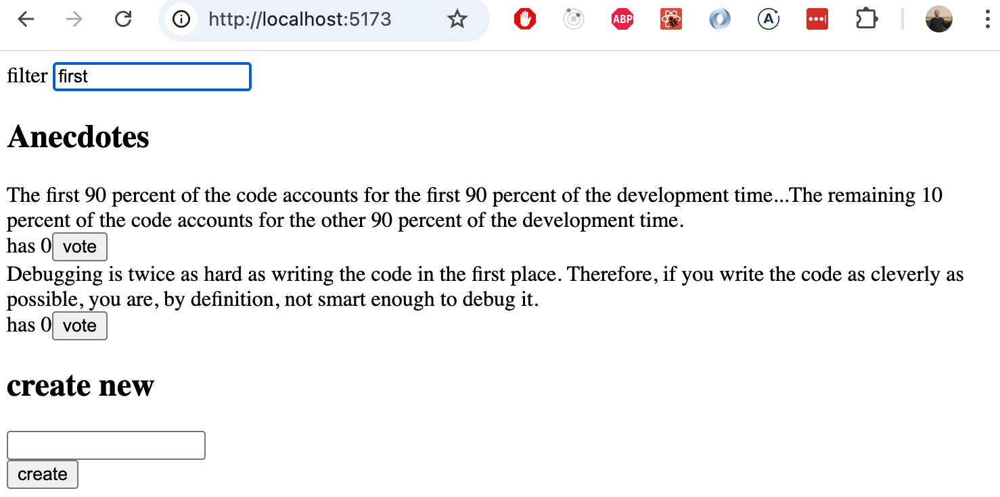
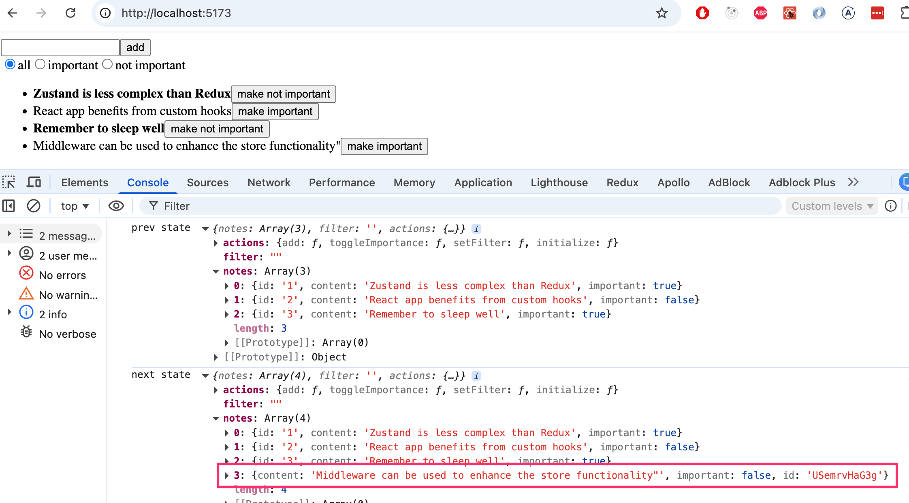

<div class="content">

Jatketaan muistiinpanosovelluksen Zustand-version laajentamista.

Sovelluskehitystä helpottaaksemme muutetaan alkutilaa siten, että siellä on jo muutama muistiinpano:

```js
// highlight-start
const initialNotes = [
    {
      id: 1,
      content: 'Zustand is less complex than Redux',
      important: true,
    }, {
      id: 2,
      content: 'React app benefits from custom hooks',
      important: false,
    }, {
      id: 3,
      content: 'Remember to sleep well',
      important: true,
    }
  ]


//highlight-end

const useNoteStore = create((set) => ({
  notes: initialNotes,
  // ...
}
```

### Monimutkaisempi tila

Toteutetaan sovellukseen näytettävien muistiinpanojen filtteröinti, jonka avulla näytettäviä muistiinpanoja voidaan rajata. Filtterin toteutus tapahtuu [radiopainikkeiden](https://developer.mozilla.org/en-US/docs/Web/HTML/Element/input/radio) avulla:


Herää kysymys, miten filtterin tilanhallinta kannattaisi hoitaa. Vaihtoehtoja on käytännössä kaksi: tehdään filterille erillinen store Zustandilla, tai lisätään se samaan tilaan. Kumpikin näistä ratkaisuista on perusteltavissa. Internetistä löytyvät [parhaat käytänteet](https://tkdodo.eu/blog/working-with-zustand#keep-the-scope-of-your-store-small) kehottavat pitämään toisistaan täysin erilliset asiat erillisissä storeissa. Muistiinpanojen lista ja filtteröinti ovat kuitenkin sen verran sidoksissa toisiinsa, että päädymme sijoittamaan molemmat samaan storeen:

```js
const useNoteStore = create((set) => ({
  notes: initialNotes,
  filter: 'all',
  actions: {
    add: note => set(
      state => ({ notes: state.notes.concat(note) })
    ),
    toggleImportance: id => set(
      state => ({
        notes: state.notes.map(note =>
          note.id === id ? { ...note, important: !note.important } : note
        )
      })
    ),
    setFilter: value => set(() => ({ filter: value })) // highlight-line
  }
}))

export const useNotes = () => useNoteStore((state) => state.notes)
export const useFilter = () => useNoteStore((state) => state.filter) // highlight-line
export const useNoteActions = () => useNoteStore((state) => state.actions)
```

Filtterille arvon asettava komponentti:

```js
import { useNoteActions } from './store'

const VisibilityFilter = () => {
  const { setFilter } = useNoteActions()

  return (
    <div>
      <input
        type="radio"
        name="filter"
        onChange={() => setFilter('all')}
        defaultChecked
      />
      all
      <input
        type="radio"
        name="filter"
        onChange={() => setFilter('important')}
      />
      important
      <input
        type="radio"
        name="filter"
        onChange={() => setFilter('nonimportant')}
      />
      not important
    </div>
  )
}

export default VisibilityFilter
```

Komponentti <i>App</i> renderöi filtterin:

```js
const App = () => (
  <div>
    <NoteForm />
    <VisibilityFilter />
    <NoteList />
  </div>
)
```

Näytettävien muistiinpanojen filtteröinti voitaisiin hoitaa komponentissa <i>NoteList</i> esim. seuraavassa:

```js
import { useNotes, useFilter } from './store'
import Note from './Note'

const NoteList = () => {
  const notes = useNotes()
  const filter = useFilter() // highhlight-line

  // highhlight-start
  const notesToShow = notes.filter(note => {
    if (filter === 'important') return note.important
    if (filter === 'nonimportant') return !note.important
    return true
  })
  // highhlight-end

  return (
    <ul>
      {notesToShow.map(note => ( // highhlight-line
        <Note key={note.id} note={note} />
      ))}
    </ul>
  )
}
```

Parempi ratkaisuun päädytään jos filtteröintilogiikka sisällytetään suoraan storen funktiossa  <i>useNotes</i>:

```js
import { create } from 'zustand'

const useNoteStore = create((set) => ({
  // ...
}))

// highlight-start
export const useNotes = () => {
  const notes = useNoteStore((state) => state.notes)
  const filter = useNoteStore((state) => state.filter)

  if (filter === 'important') return notes.filter(n => n.important)
  if (filter === 'nonimportant') return notes.filter(n => !n.important)

  return notes
}
// highlight-end
```

Eli funktio <i>useNotes</i> palauttaa aina halutulla tavalla filtteröidyn muistiinpanojen listan. Funktion käyttäjän, eli komponentin <i>NoteList</i> ei tarvitse edes olla tietoinen filtterin olemassaolosta:

```js
import { useNotes } from './store'
import Note from './Note'

const NoteList = () => {
  // component gets always the properly filtered set of notes
  const notes = useNotes()

  return (
    <ul>
      {notes.map(note => (
        <Note key={note.id} note={note} />
      ))}
    </ul>
  )
}
```

Ratkaisu on elegantti! 

>
>```js
>export const useNotes = () => useNoteStore(({ notes, filter }) => {
>  if (filter === 'important') return notes.filter(n => n.important)
>  if (filter === 'nonimportant') return notes.filter(n => !n.important)
>  return notes
>})
>```
>
>Mutta se ei kuitenkaan toimi, sovellus hajoaa kun yritetään rajoittaa näytettävät >muistiinpanot ainoastaan tärkeisiin.
>
>Korjaus on onneksi helppo kunhan sen vain keksii:
>
>```js
>import { useShallow } from 'zustand/react/shallow'
>
>//...
>
>export const useNotes = () => useNoteStore(useShallow(({ notes, filter }) => {
>  if (filter === 'important') return notes.filter(n => n.important)
>  if (filter === 'nonimportant') return notes.filter(n => !n.important)
>  return notes
>}))
>```
>
>Syy ongelmalle on seuraava: ilman funktion <i>useShallow</i> Zustand vertaa selektorin paluuarvoa ===-operaattorilla. Koska <i>notes.filter(...)</i> luo joka renderöinnillä uuden taulukon, React tulkitsee sen aina uudeksi tilaksi ja renderöi komponentin uudelleen loputtomasti.
>
><i>useShallow</i> korvaa ===-vertailun "matalalla" vertailulla, eli se vertaa >taulukon alkioita yksitellen. Jos sisältö ei ole muuttunut, se palauttaa vanhan >taulukon viitteen uuden sijaan, jolloin React näkee tilan vakaana eikä renderöi >uudelleen.

Sovelluksen tämänhetkinen koodi on kokonaisuudessaan [GitHubissa](https://github.com/fullstack-hy2020/redux-notes/tree/part6-3), branchissa <i>part6-3</i>.

</div>

<div class="tasks">

### Tehtävä 6.6

Jatketaan anekdoottisovelluksen parissa.

#### 6.6 anekdootit, step5

Toteuta sovellukseen näytettävien anekdoottien filtteröiminen:



Tee filtterin ruudulla näyttämistä varten komponentti <i>Filter</i>. Voit ottaa sen pohjaksi seuraavan koodin:

```js
const Filter = () => {
  const handleChange = (event) => {
    // input-kentän arvo muuttujassa event.target.value
  }
  const style = {
    marginBottom: 10
  }

  return (
    <div style={style}>
      filter <input onChange={handleChange} />
    </div>
  )
}

export default Filter
```

</div>

<div class="content">

### Data palvelimelle

Laajennetaan sovellusta siten, että muistiinpanot talletetaan backendiin. Käytetään osasta 2 tuttua [JSON Serveriä](/osa2/palvelimella_olevan_datan_hakeminen).

Tallennetaan projektin juureen tiedostoon <i>db.json</i> tietokannan alkutila:

```json
{
  "notes": [
    {
      "id": 1,
      "content": "Zustand is less complex than Redux",
      "important": true
    },
    {
      "id": 2,
      "content": "React app benefits from custom hooks",
      "important": false
    },
    {
      "id": 3,
      "content": "Remember to sleep well",
      "important": true
    }
  ]
}
```

Asennetaan projektiin JSON Server

```bash
npm install json-server --save-dev
```

ja lisätään tiedoston <i>package.json</i> osaan <i>scripts</i> rivi

```js
"scripts": {
  "server": "json-server -p 3001 db.json",
  // ...
}
```

Käynnistetään JSON Server komennolla _npm run server_.

### Fetch API

Ohjelmistokehityksessä joudutaan usein pohtimaan, kannattaako jokin toiminnallisuus toteuttaa käyttämällä ulkoista kirjastoa vai onko parempi hyödyntää ympäristön tarjoamia natiiveja ratkaisuja. Molemmilla lähestymistavoilla on omat etunsa ja haasteensa. 

Olemme käyttäneet HTTP-pyyntöjen tekemiseen kurssin aiemmissa osissa [Axios](https://axios-http.com/docs/intro)-kirjastoa. Tutustutaan nyt vaihtoehtoiseen tapaan tehdä HTTP-pyyntöjä natiivia [Fetch APIa](https://developer.mozilla.org/en-US/docs/Web/API/Fetch_API) hyödyntäen.

On tyypillistä, että ulkoinen kirjasto kuten <i>Axios</i> on toteutettu hyödyntäen muita ulkoisia kirjastoja. Esimerkiksi jos Axioksen asentaa projektiin komennolla _npm install axios_, konsoliin tulostuu: 

```bash
$ npm install axios

added 23 packages, and audited 302 packages in 1s

71 packages are looking for funding
  run `npm fund` for details

found 0 vulnerabilities
```

Komento asentaisi projektiin siis Axios-kirjaston lisäksi yli 20 muuta npm-pakettia, jotka Axios tarvitsisi toimiakseen. 

<i>Fetch API</i> tarjoaa samankaltaisen tavan tehdä HTTP-pyyntöjä kuin Axios, mutta Fetch APIn käyttäminen ei vaadi ulkoisten kirjastojen asentamista. Sovelluksen ylläpito helpottuu, kun päivitettäviä kirjastoja on vähemmän, ja myös tietoturva paranee, koska sovelluksen mahdollinen hyökkäyspinta-ala pienenee. Sovellusten tietoturvaa ja ylläpitoa sivutaan kurssin [osassa 7](https://fullstackopen.com/osa7/luokkakomponentit_sekalaista#react-node-sovellusten-tietoturva).

Pyyntöjen tekeminen tapahtuu käytännössä käyttämällä _fetch()_-funktiota. Käytettävässä syntaksissa on jonkin verran eroja verrattuna Axiokseen. Huomaamme myös pian, että Axios on huolehtinut joistakin asioista puolestamme ja helpottanut elämäämme. Käytämme nyt kuitenkin Fetch APIa, koska se on laajasti käytetty natiiviratkaisu, joka jokaisen Full Stack -kehittäjän on syytä tuntea.

### Datan hakeminen palvelimelta

Tehdään backendistä dataa hakeva funktio tiedostoon <i>src/services/notes.js</i>:

```js
const baseUrl = 'http://localhost:3001/notes'

const getAll = async () => {
  const response = await fetch(baseUrl)

  if (!response.ok) {
    throw new Error('Failed to fetch notes')
  }

  const data = await response.json()
  return data
}

export default { getAll }
```

Tutkitaan _getAll_-metodin toteutusta tarkemmin. Muistiinpanot haetaan backendistä nyt kutsumalla _fetch()_-funktiota, jolle on annettu argumentiksi backendin URL-osoite. Pyynnön tyyppiä ei ole erikseen määritelty, joten _fetch_ toteuttaa oletusarvoisen toiminnon eli GET-pyynnön.

Kun vastaus on saapunut, tarkistetaan pyynnön onnistuminen vastauksen kentästä _response.ok_ ja heitetään tarvittaessa virhe:

```js
if (!response.ok) {
  throw new Error('Failed to fetch notes')
}
```

Attribuutti _response.ok_ saa arvon _true_, jos pyyntö on onnistunut eli jos vastauksen statuskoodi on välillä 200-299. Kaikilla muilla statuskoodeilla, esimerkiksi 404 tai 500, se saa arvon _false_. 

Huomaa, että _fetch_ ei automaattisesti heitä virhettä, vaikka vastauksen statuskoodi olisi esimerkiksi 404. Virheenkäsittely tulee toteuttaa manuaalisesti, kuten olemme nyt tehneet.

Jos pyyntö on onnistunut, vastauksen sisältämä data muunnetaan JSON-muotoon:

```js
const data = await response.json()
```

_fetch_ ei siis automaattisesti muunna vastauksen mukana mahdollisesti olevaa dataa JSON-muotoon, vaan muunnos tulee tehdä manuaalisesti. On myös hyvä huomata, että _response.json()_ on asynkroninen metodi, eli sen kanssa tulee käyttää <i>await</i>-avainsanaa.

Suoraviivaistetaan koodia vielä hieman palauttamalla suoraan metodin _response.json()_ palauttama data:

```js
const getAll = async () => {
  const response = await fetch(baseUrl)

  if (!response.ok) {
    throw new Error('Failed to fetch notes')
  }

  return await response.json() // highlight-line
}
```

Lisätään storeen funktio, jonka avulla tila voidaan alustaa palvelimelta haettavilla muistiinpanoilla:

```js
const useNoteStore = create((set) => ({
  notes: [], // highlight-line
  filter: '',
  actions: {
    // ...
    setFilter: value => set(() => ({ filter: value })),
    initialize: notes => set(() => ({ notes })) // highlight-line
  }
}))
```

Toteutetaan muistiinpanojen alustus <i>App</i>-komponentiin, eli kuten yleensä dataa palvelimelta haettaessa, käytetään <i>useEffect</i>-hookia:

```js
const App = () => {
  const { initialize } = useNoteActions()

  useEffect(() => {
    noteService.getAll().then(notes => initialize(notes))
  }, [initialize])

  return (
    <div>
      <NoteForm />
      <VisibilityFilter />
      <NoteList />
    </div>
  )
}
```


Muistiinpanot haetaan palvelimelta siis käyttäen määrittelemäämme _getAll()_-metodia ja tallennetaan sitten storen funktiolla <i>initialize</i> . Toiminnot tehdään <i>useEffect</i>-hookissa eli ne suoritetaan App-komponentin ensimmäisen renderoinnin yhteydessä.

Tutkitaan vielä tarkemmin erästä pientä yksityiskohtaa. Olemme lisänneet <i>initialize</i>-funktion <i>useEffect</i>-hookin riippuvuustaulukkoon. Jos yritämme käyttää tyhjää riippuvuustaulukkoa, ESLint antaa seuraavan varoituksen: <i>React Hook useEffect has a missing dependency: 'dispatch'</i>. Mistä on kyse?

Koodi toimisi loogisesti täysin samoin, vaikka käyttäisimme tyhjää riippuvuustaulukkoa, koska <i>initialize</i> viittaa samaan funktioon koko ohjelman suorituksen ajan. On kuitenkin hyvän ohjelmointikäytännön mukaista lisätä _useEffect_-hookin riippuvuuksiksi kaikki sen käyttämät muuttujat ja funktiot, jotka on määritelty kyseisen komponentin sisällä. Näin voidaan välttää yllättäviä bugeja.

### Datan lähettäminen palvelimelle

Toteutetaan seuraavaksi toiminnallisuus uuden muistiinpanon lähettämiseksi palvelimelle. Pääsemme samalla harjoittelemaan, miten POST-pyyntö tehdään _fetch()_-metodia käyttäen.

Laajennetaan tiedostossa <i>src/services/notes.js</i> olevaa palvelimen kanssa kommunikoivaa koodia seuraavasti:

```js
const baseUrl = 'http://localhost:3001/notes'

const getAll = async () => {
  const response = await fetch(baseUrl)

  if (!response.ok) {
    throw new Error('Failed to fetch notes')
  }

  return await response.json()
}

// highlight-start
const createNew = async (content) => {
  const response = await fetch(baseUrl, {
    method: 'POST',
    headers: { 'Content-Type': 'application/json' },
    body: JSON.stringify({ content, important: false }),
  })
  
  if (!response.ok) {
    throw new Error('Failed to create note')
  }
  
  return await response.json()
}
// highlight-end

export default { getAll, createNew } // highlight-line
```

Tutkitaan _createNew_-metodin toteutusta tarkemmin. _fetch()_-funktion ensimmäinen parametri määrittelee URL-osoitteen, johon pyyntö tehdään. Toinen parametri on olio, joka määrittelee muut pyynnön yksityiskohdat, kuten pyynnön tyypin, otsikot ja pyynnön mukana lähetettävän datan. Voimme selkeyttää koodia vielä hieman tallentamalla pyynnön yksityiskohdat määrittelevän olion erilliseen <i>options</i>-apumuuttujaan:

```js
const createNew = async (content) => {
  // highlight-start
  const options = {
    method: 'POST',
    headers: { 'Content-Type': 'application/json' },
    body: JSON.stringify({ content, important: false }),
  }
  
  const response = await fetch(baseUrl, options)
  // highlight-end

  if (!response.ok) {
    throw new Error('Failed to create note')
  }
  
  return await response.json()
}
```

Tutkitaan <i>options</i>-oliota tarkemmin:

- <i>method</i> määrittelee pyynnön tyypin, joka tässä tapauksessa on <i>POST</i>
- <i>headers</i> määrittelee pyynnön otsikot. Liitämme pyyntöön otsikon _'Content-Type': 'application/json'_, jotta palvelin tietää, että pyynnön mukana oleva data on JSON-muotoista, ja osaa käsitellä pyynnön oikein
- <i>body</i> sisältää pyynnön mukana lähetettävän datan. Kentään ei voi suoraan sijoittaa JavaScript-oliota, vaan se tulee ensin muuntaa JSON-merkkijonoksi kutsumalla funktiota _JSON.stringify()_

Kuten GET-pyynnön kanssa, myös nyt vastauksen statuskoodi tutkitaan virheiden varalta:

```js
if (!response.ok) {
  throw new Error('Failed to create note')
}
```

Jos pyyntö onnistuu, <i>JSON Server</i> palauttaa juuri luodun muistiinpanon, jolle se on generoinut myös yksilöllisen <i>id</i>:n. Vastauksen sisältämä data tulee kuitenkin vielä muuntaa JSON-muotoon metodilla _response.json()_: 

```js
return await response.json()
```

Muutetaan sitten sovelluksemme <i>NoteForm</i>-komponenttia siten, että uusi muistiinpano lähetetään backendiin. Komponentin metodi _addNote_ muuttuu hiukan:

```js
import { useNoteActions } from './store'
import noteService from './services/notes'

const NoteForm = () => {
  const { add } = useNoteActions()

  const addNote = async (e) => {
    e.preventDefault()
    const content = e.target.note.value
    const newNote = await noteService.createNew(content) // highlight-line
    add(newNote)
    e.target.reset()
  }

  return (
    <form onSubmit={addNote}>
      <input name="note" />
      <button type="submit">add</button>
    </form>
  )
}

export default NoteForm
```

Kun uusi muistiinpano luodaan backendiin kutsumalla funktiota <i>createNew()</i>, saadaan paluuarvona muistiinpanoa kuvaava olio, jolle backend on generoinut <i>id</i>:n.

Sovelluksen tämänhetkinen koodi on kokonaisuudessaan [GitHubissa](https://github.com/fullstack-hy2020/redux-notes/tree/part6-4), branchissa <i>part6-4</i>.

### Asynkroniset actionit

Lähestymistapamme on melko hyvä, mutta siinä mielessä ikävä, että palvelimen kanssa kommunikointi tapahtuu komponentit määrittelevien funktioiden koodissa. Olisi parempi, jos kommunikointi voitaisiin abstrahoida komponenteilta siten, että niiden ei tarvitsisi kuin kutsua sopivaa storen tarjoamaa funktiota. 

Haluammekin, että <i>App</i> alustaa sovelluksen tilan seuraavasti:

```js
const App = () => {
  const { initialize } = useNoteActions()

  useEffect(() => {
    initialize()
  }, [initialize])

  return (
    <div>
      <NoteForm />
      <VisibilityFilter />
      <NoteList />
    </div>
  )
}
```


<i>NoteForm</i> puolestaan luo uuden muistiinpanon näin:

```js
const NoteForm = () => {
  const { add } = useNoteActions()

  const addNote = async (e) => {
    e.preventDefault()
    const content = e.target.note.value
    await add(content)
    e.target.reset()
  }

  return (
    <form onSubmit={addNote}>
      <input name="note" />
      <button type="submit">add</button>
    </form>
  )
}
```

Tiedostoon <i>store.js</i> tehtävä muutos on seuraava:

```js
import { create } from 'zustand'
import noteService from './services/notes' // highlight-line

const useNoteStore = create((set) => ({
  notes: [],
  filter: '',
  actions: {
    add: async (content) => {
      const newNote = await noteService.createNew(content)
      set(state => ({ notes: state.notes.concat(newNote) }))
    },
    initialize: async () => {
      const notes = await noteService.getAll()
      set(() => ({ notes }))
    },
    // ...
  }
}))
```

Funktiot <i>add</i> ja <i>initialize</i> on siis muutettu asynkronisiksi funktioiksi, jotka kutsuvat ensin sopivaa noteServicen funktiota, ja päivittävät tilan tämän jälkeen.

Ratkaisu on tyylikäs, tilan käsittely ja palvelimen kanssa kommunikointi on kokonaisuudessaan eriytetty React-komponenttien ulkopuolelle.

Viimeistellään vielä sovellus siten, että muistiinpanojen tärkeyden muutos synkronoidaan palvelimelle.

<i>noteService.js</i> laajenee seuraavasti:

```js
const update = async (id, note) => {
  const response = await fetch(`${baseUrl}/${id}`, {
    method: 'PUT',
    headers: { 'Content-Type': 'application/json' },
    body: JSON.stringify(note),
  })

  if (!response.ok) {
    throw new Error('Failed to update note')
  }

  return await response.json()
}

export default { getAll, createNew, update } 
```

Storen funktion <i>toggleImportance</i> muutos on seuraava

```js
const useNoteStore = create((set) => ({
  notes: [],
  filter: '',
  actions: {
    add: async (content) => {
      const newNote = await noteService.createNew(content)
      set(state => ({ notes: state.notes.concat(newNote) }))
    },
    // highlight-start
    toggleImportance: async (id) => {
      const note = useNoteStore.getState().notes.find(n => n.id === id)
      const updated = await noteService.update(id, { ...note, important: !note.important })
      set(state => ({
        notes: state.notes.map(n => n.id === id ? updated : n)
      }))
    },
    // highlight-end
    setFilter: value => set(() => ({ filter: value })),
    initialize: async () => {
      const notes = await noteService.getAll()
      set(() => ({ notes }))
    }
  }
}))
```

Uudessa funktiossa on eräs huomioinarvoinen seikka. Funktio saa parametrina muistinpanon id:n. Backendiin on kuitenkin lähetettävä muuttettu muistiinpano. Se saadaan selville kutsumalla storen funktiota <i>getState</i>:

```js
const note = useNoteStore.getState().notes.find(n => n.id === id)
```

Zustand-storeilla on myös joukko muita [apufunktioita](https://zustand.docs.pmnd.rs/reference/apis/create#returns), mille saattaa olla joissain tilanteissa käyttöä. 

Muutetaan kuitenkin vielä storen määrittelyä siten, että välitetään <i>createlle</i> annettavalle funktiolle myös parametri <i>get</i>, jonka kautta pääsemme sitten tarpeen tullen käsiksi tilan arvoihin:

```js
const useNoteStore = create((set, get) => ({ // highlight-line
  notes: [],
  filter: '',
  actions: {
    toggleImportance: async (id) => {
      const note = get().notes.find(n => n.id === id) // highlight-line
      const updated = await noteService.update(id, { ...note, important: !note.important })
      set(state => ({
        notes: state.notes.map(n => n.id === id ? updated : n)
      }))
    },
    // ...
  }
}))
```

Sovelluksen koodi on [GitHubissa](https://github.com/fullstack-hy2020/redux-notes/tree/part6-5) branchissa <i>part6-5</i>.

</div>

<div class="tasks">

### Tehtävät 6.7.-6.11.

#### 6.7 anekdootit, step6

Hae sovelluksen käynnistyessä anekdootit JSON Serverillä toteutetusta backendistä. Käytä HTTP-pyynnön tekemiseen Fetch APIa.

Backendin alustavan sisällön saat esim. [täältä](https://github.com/fullstack-hy2020/misc/blob/master/anecdotes.json).

#### 6.8 anekdootit, step7

Muuta uusien anekdoottien luomista siten, että anekdootit talletetaan backendiin. Hyödynnä toteutuksessasi jälleen Fetch APIa.

#### 6.9 anekdootit, step8

Äänestäminen ei vielä talleta muutoksia backendiin. Korjaa tilanne.

#### 6.10 anekdootit, step9

Sovelluksessa on valmiina komponentin <i>Notification</i> runko:

```js
const Notification = () => {
  const style = {
    border: 'solid',
    padding: 10,
    borderWidth: 1,
    marginBottom: 10
  }

  return (
    <div style={style}>
      render here notification...
    </div>
  )
}

export default Notification
```

Laajenna sovellusta siten, että se näyttää <i>Notification</i>-komponentin avulla viiden sekunnin ajan, kun sovelluksessa äänestetään tai luodaan uusia anekdootteja:


Käytä notifikaation tilanhallintaan Zustandia. Notifikaatioita varten kannattanee tehdä oma Zustand store sillä notifikaation käyttö saattaa liittyä sovelluksen laajentuessa muuhunkin kuin anektootteihin, esimerkiksi käyttäjän kirjautumiseen.

#### 6.11 anekdootit, step10

Huomaamme, että osa käyttäjien lisäämistä anekdooteista on huonoja. Toteuta sovellukseen ominaisuus, joka mahdollistaa sellaisten anekdoottien poiston, joilla ei ole yhtään ääntä.

</div>

<div class="content">

### Middlewaret

Zustand tukee ns. middlewareja, joiden avulla voidaan lisätä toiminnallisuutta storeihin. Middlewarefunktioiden muoto on hieman kryptinen. Seuraavassa on <i>logger</i>, joka tulostaa aina tilan vaihtuessa storen vanhan ja uuden tilan:

```js
const logger = (config) => (set, get) => config(
  (...args) => {
    console.log('prev state', get());
    set(...args);
    console.log('next state', get());
  },
  get
);
```

Middleware otetaan käyttöön "kietomalla" Zustandin <i>create</i>:lle annettava funktio sen parametriksi:

```js
const useNoteStore = create(logger((set, get) => ({ // highlight-line
  notes: [],
  filter: '',
  actions: {
    // ...
  }
}))) // highlight-line
```

Nyt storen tilan muuttuessa näemme konsolista aina miten tila muuttuu:



Käytännössä määrittelemämme middleware toimii siten, että se korvaa alkuperäisen funktion <i>set</i> funktiolla 

```js
  (...args) => {
    console.log('prev state', get());
    set(...args);
    console.log('next state', get());
  }
```

joka sen tulostaa vanhan ja uuden tilan (joihin se pääsee käsiksi funktiolla <i>get</i>) konsoliin sen lisäksi että se kutsuu funktiota <i>set</i>. Toisena parametrina on vanha <i>get</i> muuttumattomana.

### Zustand-storejen testaaminen

Tarkastellaan vielä lopuksi Zustand-storejen testausta Vitestillä.

Aloitetaan yksinkertaisuuden vuoksi laskurin storesta:

```js
import { create } from 'zustand'

const useCounterStore = create(set => ({
  counter: 0,
  actions: {
    increment: () => set(state => ({ counter: state.counter + 1 })),
    decrement: () => set(state => ({ counter: state.counter - 1 })),
    zero: () => set(() => ({ counter: 0 })),
  }  
}))

export const useCounter = () => useCounterStore(state => state.counter)
export const useCounterControls = () => useCounterStore(state => state.actions)

export default useCounterStore // highlight-line
```

Lisäsimme testejä varten määrittelyyn eksportin, jonka avulla testi pääsee käsiksi stroreen.

Asennetaan Vitest:

```
npm install --save-dev vitest
```

Toteutetaan testi tiedostoon <i>store.test.js</i>:

```js
import { beforeEach, describe, expect, it } from 'vitest'
import useCounterStore from './store'

beforeEach(() => {
  useCounterStore.setState({ counter: 0 })
})

describe('counter store', () => {
  it('initial state is 0', () => {
    expect(useCounterStore.getState().counter).toBe(0)
  })

  it('increment increases counter by 1', () => {
    useCounterStore.getState().actions.increment()
    expect(useCounterStore.getState().counter).toBe(1)
  })

  it('decrement decreases counter by 1', () => {
    useCounterStore.getState().actions.decrement()
    expect(useCounterStore.getState().counter).toBe(-1)
  })

  it('zero resets counter to 0', () => {
    useCounterStore.getState().actions.increment()
    useCounterStore.getState().actions.increment()
    useCounterStore.getState().actions.zero()
    expect(useCounterStore.getState().counter).toBe(0)
  })
})
```

Testit ovat varsin suoraviivaiset, hyödyntävät storen funktiota [getState](https://zustand.docs.pmnd.rs/reference/apis/create#returns), joiden avulla ne pääsevät lukemaan storen tilaa, sekä suorittamaan storen funktiota.

Ennen jokaista testiä store palautetaan alkutilaan <i>beforeEach</i>-lohkossa komennon storen funktion [setState](https://zustand.docs.pmnd.rs/reference/apis/create#returns) avulla.

Storen palauttaminen alkutilaan on tapauksessamme yksinkertaista. Aina ei välttämättä näin ole. Zustandin [dokumentaatio](https://zustand.docs.pmnd.rs/learn/guides/testing#vitest) neuvoo tavan, miten storeista voidaan luoda testejä varten versio, joka asetetaan automaattisesti alkutilaan ennen jokaista testiä. Tapa on kuitenkin sen verran monimutkainen ja meille tarpeeton, joten emme siihen nyt mene.

Testit siis käyttävät storea suoraan. Jos storejen käyttöön on toteutettu custom hookeina monimutkaisempaa logiikkaa, saattaa olla tarpeen tehdä testit siten, että ne myös hyödyntävät hookkeja. Laskurissa storen käyttö tapahtuu hookien <i>useCounter</i> ja <i>useCounterControls</i> kautta:


```js
const useCounterStore = create(set => ({
  // ...
}))

// hightlight-start
export const useCounter = () => useCounterStore(state => state.counter)
export const useCounterControls = () => useCounterStore(state => state.actions)
// hightlight-end
```

Tässä tapauksessa hookit eivät sisällä mitään logiikkaa, ne vaan paljastavat erikseen storen tallettaman arvon ja storen funktiot. Yllä käyttämämme testaustapa on siis oikein hyvä.

Tehdään kuitenkin esimerkin vuoksi vielä toinen version testeistä, missä storea käytetään täysin samalla tavalla kuin sovellus sitä käyttää.

<i>useCounter</i> ja <i>useCounterControls</i> ovat React hookeja, joten niiden testaamiseen tarvitsemme [React Testing Libraryn](https://github.com/testing-library/react-testing-library) sekä [jsdom](https://github.com/jsdom/jsdom)-kirjaston:

```
npm install --save-dev @testing-library/react jsdom
```

Lisätään tiedostoon <i>vite.config.js</i> testausympäristöstä kertova konfiguraatio:

```js
import { defineConfig } from 'vite'
import react from '@vitejs/plugin-react'

export default defineConfig({
  plugins: [react()],
  // highlight-start
  test: {
    environment: 'jsdom',
  },
   // highlight-end
})
```

Testit ovat seuraavassa:

```js
import { beforeEach, describe, expect, it } from 'vitest'
import { renderHook, act } from '@testing-library/react'
import useCounterStore, { useCounter, useCounterControls } from './store'

beforeEach(() => {
  useCounterStore.setState({ counter: 0 })
})

describe('counter hooks', () => {
  it('useCounter returns initial value of 0', () => {
    const { result } = renderHook(() => useCounter())
    expect(result.current).toBe(0)
  })

  it('increment updates counter', () => {
    const { result: counter } = renderHook(() => useCounter())
    const { result: controls } = renderHook(() => useCounterControls())

    act(() => controls.current.increment())

    expect(counter.current).toBe(1)
  })

  it('decrement updates counter', () => {
    const { result: counter } = renderHook(() => useCounter())
    const { result: controls } = renderHook(() => useCounterControls())

    act(() => controls.current.decrement())

    expect(counter.current).toBe(-1)
  })

  it('zero resets counter', () => {
    const { result: counter } = renderHook(() => useCounter())
    const { result: controls } = renderHook(() => useCounterControls())

    act(() => {
      controls.current.increment()
      controls.current.increment()
      controls.current.zero()
    })

    expect(counter.current).toBe(0)
  })
})
```

Testissä on muutama mielenkiintoinen asia. Testien aluksi hookit renderöidään funktion [renderHook](https://testing-library.com/docs/react-testing-library/api/#renderhook) avulla:

```js
const { result: counter } = renderHook(() => useCounter())
const { result: controls } = renderHook(() => useCounterControls())
```

Näin testi pääsee käsiksi hookien palauttamiin funktioihin, jotka sijoitetaan muuttujiin <i>counter</i> ja <i>controls</i>.

Hookeja kutsutaan wrappaamalla kutsu funktion [act](https://testing-library.com/docs/react-testing-library/api/#act) sisälle:

```js
act(() => {
  controls.current.increment()
  controls.current.increment()
  controls.current.zero()
})
```

Lopuksi tapahtuu testin ekpektatio:

```js
expect(counter.current).toBe(0)
```

Kuten huomaamme, päästäksemme hookiin itseensä käsiksi joudumme vielä ottamaan funktion <i>renderHook</i> palauttamasta oliosta kentän <i>current</i>, joka vastaa hookin nykyistä arvoa.

> ### Mikä act?
>
> <i>act</i> on apufunktio, joka varmistaa että kaikki tilan päivitykset ja niiden aiheuttamat sivuvaikutukset on käsitelty loppuun ennen kuin testikoodi jatkuu.
>
> Kun React-komponentissa tai hookissa tapahtuu tilan muutos React ei päivitä tilaa välittömästi vaan jonottaa päivitykset. act pakottaa nämä jonossa olevat päivitykset suoritettaviksi
>
>Ilman actia testi saattaisi tarkistaa tilan ennen kuin React on ehtinyt päivittää sen, jolloin testi epäonnistuisi tai antaisi väärän tuloksen.
>
> React Testing Library käärii monet toimintonsa (kuten fireEvent, userEvent) automaattisesti act:iin, mutta hookeja suoraan testattaessa se tarvitaan usein manuaalisesti, tai käyttämällä renderHook:in tarjoamaa actia.

Hookien kautta tapahtuva testaaminen käyttää React Testing Libraryä, ja 
renderöi hookit oikeassa React-kontekstissa jsdomin avulla. Tämä lähestymistapa on huomattavasti hitaampi kuin suoraan storea käyttävät testit, eli jos hookit eivät sisällä kompleksista logiikkaa, voi olla riittävää suorittaa testit suoraan storea käyttäen.

Zustand-laskurin testit sisältävä koodi löytyy [GitHubista](https://github.com/fullstack-hy2020/zustand-counter).

### Muistiinpanostoren testaaminen

Muistiinpanosovelluksen storen testaaminen on hieman haastavampi tapaus, sillä store sisältää asynkronisia funktioita, jotka kutsuvat palvelina:

```js
import { create } from 'zustand'
import noteService from './services/notes'

const useNoteStore = create(set => ({
  notes: [],
  filter: '',
  actions: {
    add: async (content) => {
      const newNote = await noteService.createNew(content) // highlight-line
      set(state => ({ notes: state.notes.concat(newNote) }))
    },
    toggleImportance: async (id) => {
      const note = useNoteStore.getState().notes.find(n => n.id === id)
      // highlight-start
      const updated = await noteService.update(
        id, { ...note, important: !note.important }
      )
       // highlight-end
      set(state => ({
        notes: state.notes.map(n => n.id === id ? updated : n)
      }))
    },
    setFilter: value => set(() => ({ filter: value })),
    initialize: async () => {
      const notes = await noteService.getAll() // highlight-line
      set(() => ({ notes }))
    }
  }
}))

export const useNotes = () => { 
  const notes = useNoteStore((state) => state.notes)
  const filter = useNoteStore((state) => state.filter)
  if (filter === 'important') return notes.filter(n => n.important)
  if (filter === 'nonimportant') return notes.filter(n => !n.important)
  return notes
}

export const useFilter = () => useNoteStore((state) => state.filter)
export const useNoteActions = () => useNoteStore((state) => state.actions)
```

Tälläkertaa myös <i>useNotes</i> sisältää merkittävissä määrin logiikkaa, joten testaus lienee syytä tehdä hookien kautta React Testing Libraryllä.

Asennetaan tarvittavat kirjastot:

```
npm install --save-dev vitest @testing-library/react jsdom
```

Lisätään tiedostoon <i>vite.config.js</i> testausympäristöstä kertova konfiguraatio:

```js
import { defineConfig } from 'vite'
import react from '@vitejs/plugin-react'

export default defineConfig({
  plugins: [react()],
  // highlight-start
  test: {
    environment: 'jsdom',
  },
   // highlight-end
})
```

Testien ensimmäinen osa seuraavassa:

```js
import { describe, it, expect, beforeEach, vi } from 'vitest'
import { renderHook, act } from '@testing-library/react'

vi.mock('./services/notes', () => ({
  default: {
    getAll: vi.fn(),
    createNew: vi.fn(),
    update: vi.fn(),
  }
}))

import noteService from './services/notes'
import useNoteStore, { useNotes, useFilter, useNoteActions } from './store'

beforeEach(() => {
  useNoteStore.setState({ notes: [], filter: '' })
  vi.clearAllMocks()
})

describe('useNoteActions', () => {
  it('initialize loads notes from service', async () => {
    const mockNotes = [{ id: 1, content: 'Test', important: false }]
    noteService.getAll.mockResolvedValue(mockNotes)

    const { result } = renderHook(() => useNoteActions())

    await act(async () => {
      await result.current.initialize()
    })

    const { result: notesResult } = renderHook(() => useNotes())
    expect(notesResult.current).toEqual(mockNotes)
  })

  it('add appends a new note', async () => {
    const newNote = { id: 2, content: 'New note', important: false }
    noteService.createNew.mockResolvedValue(newNote)

    const { result } = renderHook(() => useNoteActions())

    await act(async () => {
      await result.current.add('New note')
    })

    const { result: notesResult } = renderHook(() => useNotes())
    expect(notesResult.current).toContainEqual(newNote)
  })

  it('toggleImportance flips important flag', async () => {
    const note = { id: 1, content: 'Test', important: false }
    useNoteStore.setState({ notes: [note] })
    noteService.update.mockResolvedValue({ ...note, important: true })

    const { result } = renderHook(() => useNoteActions())

    await act(async () => {
      await result.current.toggleImportance(1)
    })

    const { result: notesResult } = renderHook(() => useNotes())
    expect(notesResult.current[0].important).toBe(true)
  })

  it('setFilter updates filter', () => {
    const { result: actionsResult } = renderHook(() => useNoteActions())
    const { result: filterResult } = renderHook(() => useFilter())

    act(() => {
      actionsResult.current.setFilter('important')
    })

    expect(filterResult.current).toBe('important')
  })
})
```

Testeissä on paljon pureskeltavaa. Testit muodostavat Vitestin avulla [mock](https://vitest.dev/guide/mocking)-version palvelimen kanssa kommunikoinnista huolehtivasta <i>noteServicestä</i>:
 
```js
import { describe, it, expect, beforeEach, vi } from 'vitest'

vi.mock('./services/notes', () => ({
  default: {
    getAll: vi.fn(),
    createNew: vi.fn(),
    update: vi.fn(),
  }
}))
```

[vi.mock](https://vitest.dev/api/vi.html#vi-mock) korvaa hakemiston <i>./services/notes</i> siltävän <i>noteServicen</i> omalla versiollaan, missä kaikki funktiot on korvattu [vi.fn](https://vitest.dev/api/vi.html#vi-fn) palauttamalla mock-funktiolla.

Ennen jokaista testiä store palautetaan alkutilaan ja mock-funktiot nollataan:

```js
beforeEach(() => {
  useNoteStore.setState({ notes: [], filter: '' })
  vi.clearAllMocks()
})
```

Jokaisen testin alussa mockatulle <i>noteServicelle</i> kerrotaan funktion [mockResolvedValue](https://vitest.dev/api/mock.html#mockresolvedvalue) kuinka sen tulee toimia testin kontekstissa:

```js
it('initialize loads notes from service', async () => {
  // highlight-start
  const mockNotes = [{ id: 1, content: 'Test', important: false }]
  noteService.getAll.mockResolvedValue(mockNotes)
  // highlight-end

  const { result } = renderHook(() => useNoteActions())

  await act(async () => {
    await result.current.initialize()
  })

  const { result: notesResult } = renderHook(() => useNotes())
  expect(notesResult.current).toEqual(mockNotes)
})
```

Aluksi testi määrittelee, että kutsuttaessa funktiota <i>noteService.getAll</i> palautetaan storelle taulukossa <i>mockNotes</i> olevat muistiinpanot.

Testattava asia on funktion <i>initialize</i> kutsu:

```js
await act(async () => {
  await result.current.initialize()
})
```

Koska kyse on asynkronisesta funktiosta, tulee kutsun valmistumista odottaa komennolla <i>await</i>. 

Lopuksi tewti varmistaa, että storen tilassa on sama lista muistinpanoja, mitä mockattu  <i>noteService.getAll</i> palautti:

```js
const { result: notesResult } = renderHook(() => useNotes())
expect(notesResult.current).toEqual(mockNotes)
```

Muut testit noudattavat samaa kaavaa: ensin määritellään mitä storen kutsuma <i>noteServicen</i> funktio palauttaa, ja tämän jälkeen suoritetaan itse testi.

Testien jälkimmäinen osa varmistaa filtteröinnin toimivuuden:

```js
describe('useNotes filtering', () => {
  const notes = [
    { id: 1, content: 'A', important: true },
    { id: 2, content: 'B', important: false },
  ]

  beforeEach(() => {
    useNoteStore.setState({ notes })
  })

  it('returns all notes with no filter', () => {
    const { result } = renderHook(() => useNotes())
    expect(result.current).toHaveLength(2)
  })

  it('filters important notes', () => {
    useNoteStore.setState({ notes, filter: 'important' })
    const { result } = renderHook(() => useNotes())
    expect(result.current).toEqual([notes[0]])
  })

  it('filters nonimportant notes', () => {
    useNoteStore.setState({ notes, filter: 'nonimportant' })
    const { result } = renderHook(() => useNotes())
    expect(result.current).toEqual([notes[1]])
  })
})
```

Sovelluksen lopullinen koodi on [GitHubissa](https://github.com/fullstack-hy2020/redux-notes/tree/part6-6) branchissa <i>part6-6</i>.

</div>

<div class="tasks">

### Tehtävät 6.12.-6.n

#### 6.12 anekdootit, step11

Redux devtool, asenna selaimeen extensio

#### 6.13 anekdootit, step12

testaa filter suoraan storesta

#### 6.14 anekdootit, step13

moar test

#### 6.15 anekdootit, step14

moar test2

</div>
