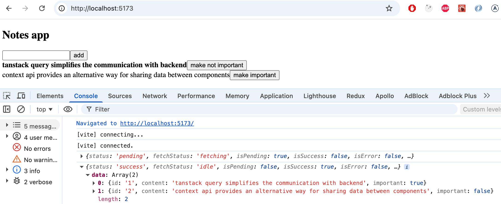
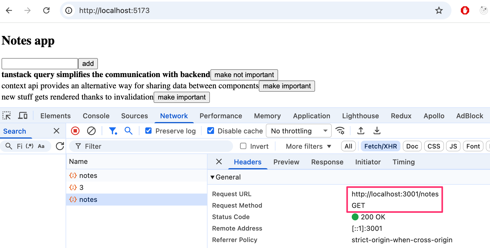
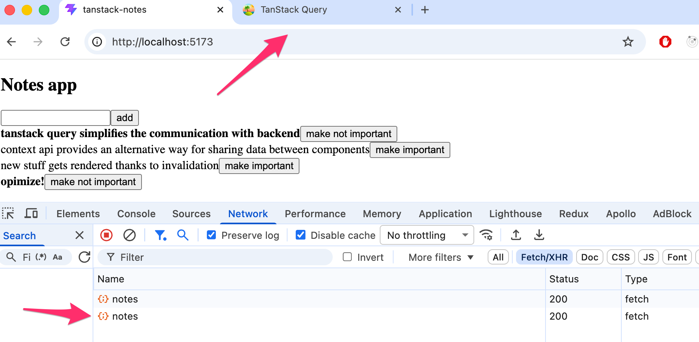
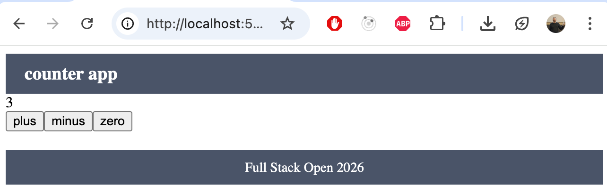

<div class="content">

Tarkastellaan osan lopussa vielä muutamaa erilaista tapaa sovelluksen tilan hallintaan.

Jatketaan muistiinpano-sovelluksen parissa. Otetaan fokukseen palvelimen kanssa tapahtuva kommunikointi. Aloitetaan sovellus puhtaalta pöydältä. Ensimmäinen versio on seuraava:

```js
const App = () => {
  const addNote = async (event) => {
    event.preventDefault()
    const content = event.target.note.value
    event.target.reset()
    console.log(content)
  }

  const toggleImportance = (note) => {
    console.log('toggle importance of', note.id)
  }

  const notes = []

  return (
    <div>
      <h2>Notes app</h2>
      <form onSubmit={addNote}>
        <input name="note" />
        <button type="submit">add</button>
      </form>
      {notes.map((note) => (
        <li key={note.id} onClick={() => toggleImportance(note)}>
          {note.important ? <strong>{note.content}</strong> : note.content}
          <button onClick={() => toggleImportance(note.id)}>
            {note.important ? 'make not important' : 'make important'}
          </button>            
        </li>
      ))}
    </div>
  )
}

export default App
```

Alkuvaiheen koodi on GitHubissa repositorion [https://github.com/fullstack-hy2020/query-notes](https://github.com/fullstack-hy2020/query-notes/tree/part6-0) branchissa <i>part6-0</i>.

### Palvelimella olevan datan hallinta TanStack Query ‑kirjaston avulla

Hyödynnämme nyt [TanStack Query](https://tanstack.com/query/latest) ‑kirjastoa palvelimelta haettavan datan säilyttämiseen ja hallinnointiin.

Asennetaan kirjasto komennolla

```bash
npm install @tanstack/react-query
```

Tiedostoon <i>main.jsx</i> tarvitaan muutama lisäys, jotta kirjaston funktiot saadaan välitettyä koko sovelluksen käyttöön:

```js
import { createRoot } from 'react-dom/client'
import { QueryClient, QueryClientProvider } from '@tanstack/react-query' // highlight-line

import App from './App.jsx'

const queryClient = new QueryClient() // highlight-line

createRoot(document.getElementById('root')).render(
  <QueryClientProvider client={queryClient}> // highlight-line
    <App />
  </QueryClientProvider> // highlight-line
)
```

Käytetään aiemmista osista tuttuun tapaan [JSON Serveriä](https://github.com/typicode/json-server) simuloimaan backendin toimintaa. JSON Server on valmiiksi konfiguroituna esimerkkiprojektiin, ja projektin juuressa on tiedosto <i>db.json</i>, joka sisältää oletuksena kaksi muistiinpanoa. Voimme siis käynnistää serverin suoraan komennolla: 

```js
npm run server
```

Voimme nyt hakea muistiinpanot komponentissa <i>App</i>. Koodi laajenee seuraavasti:

```js
import { useQuery } from '@tanstack/react-query' // highlight-line

const App = () => {
  const addNote = async (event) => {
    event.preventDefault()
    const content = event.target.note.value
    event.target.reset()
    console.log(content)
  }

  const toggleImportance = (note) => {
    console.log('toggle importance of', note.id)
  }

  // highlight-start
  const result = useQuery({
    queryKey: ['notes'],
    queryFn: async () => {
      const response = await fetch('http://localhost:3001/notes')
      if (!response.ok) {
        throw new Error('Failed to fetch notes')
      }
      return await response.json()
    }
  })
 
  console.log(JSON.parse(JSON.stringify(result)))
 
  if (result.isPending) {
    return <div>loading data...</div>
  }
 
  const notes = result.data
  // highlight-end

  return (
    // ...
  )
}
```

Datan hakeminen palvelimelta tapahtuu edellisen luvun tapaan Fetch APIn <i>fetch</i>-funktiolla. Funktiokutsu on kuitenkin nyt kääritty [useQuery](https://tanstack.com/query/latest/docs/react/reference/useQuery)-funktiolla muodostetuksi [kyselyksi](https://tanstack.com/query/latest/docs/react/guides/queries). <i>useQuery</i>-funktiokutsun parametrina on olio, jolla on kentät <i>queryKey</i> ja <i>queryFn</i>. Kentän <i>queryKey</i> arvona on taulukko, joka sisältää merkkijonon <i>notes</i>. Se toimii [avaimena](https://tanstack.com/query/latest/docs/react/guides/query-keys) määriteltyyn kyselyyn, eli muistiinpanojen listaan.

Funktion <i>useQuery</i> paluuarvo on olio, joka kertoo kyselyn tilan. Konsoliin tehty tulostus havainnollistaa tilannetta:



Eli ensimmäistä kertaa komponenttia renderöitäessä kysely on vielä tilassa <i>pending</i>, eli siihen liittyvä HTTP-pyyntö on kesken. Tässä vaiheessa renderöidään ainoastaan:

```
<div>loading data...</div>
```

HTTP-pyyntö kuitenkin valmistuu niin nopeasti, että tekstiä eivät edes tarkkasilmäisimmät ehdi näkemään. Kun pyyntö valmistuu, renderöidään komponentti uudelleen. Kysely on toisella renderöinnillä tilassa <i>success</i>, ja kyselyolion kenttä <i>data</i> sisältää pyynnön palauttaman datan, eli muistiinpanojen listan, joka renderöidään ruudulle.

Sovellus siis hakee datan palvelimelta ja renderöi sen ruudulle käyttämättä ollenkaan luvuissa 2-5 käytettyjä Reactin hookeja <i>useState</i> ja <i>useEffect</i>. Palvelimella oleva data on nyt kokonaisuudessaan TanStack Query ‑kirjaston hallinnoinnin alaisuudessa, ja sovellus ei tarvitse ollenkaan Reactin <i>useState</i>-hookilla määriteltyä tilaa!

Siirretään varsinaisen HTTP-pyynnön tekevä funktio omaan tiedostoonsa <i>src/requests.js</i>:

```js
const baseUrl = 'http://localhost:3001/notes'

export const getNotes = async () => {
  const response = await fetch(baseUrl)
  if (!response.ok) {
    throw new Error('Failed to fetch notes')
  }
  return await response.json()
}
```

Komponentti <i>App</i> yksinkertaistuu nyt seuraavasti:

```js
import { useQuery } from '@tanstack/react-query'
import { getNotes } from './requests' // highlight-line

const App = () => {
  // ...

  const result = useQuery({
    queryKey: ['notes'],
    queryFn: getNotes // highlight-line
  })

  // ...
}
```

Sovelluksen tämän hetken koodi on [GitHubissa](https://github.com/fullstack-hy2020/query-notes/tree/part6-1) branchissa <i>part6-1</i>.

### Datan vieminen palvelimelle TanStack Queryn avulla

Data haetaan jo onnistuneesti palvelimelta. Huolehditaan seuraavaksi siitä, että lisätty ja muutettu data tallennetaan palvelimelle. Aloitetaan uusien muistiinpanojen lisäämisestä.

Tehdään tiedostoon <i>requests.js</i> funktio <i>createNote</i> uusien muistiinpanojen talletusta varten:

```js
const baseUrl = 'http://localhost:3001/notes'

export const getNotes = async () => {
  const response = await fetch(baseUrl)
  if (!response.ok) {
    throw new Error('Failed to fetch notes')
  }
  return await response.json()
}

// highlight-start
export const createNote = async (newNote) => {
  const options = {
    method: 'POST',
    headers: { 'Content-Type': 'application/json' },
    body: JSON.stringify(newNote)
  }
 
  const response = await fetch(baseUrl, options)
 
  if (!response.ok) {
    throw new Error('Failed to create note')
  }
 
  return await response.json()
}
// highlight-end
```

Komponentti <i>App</i> muuttuu seuraavasti

```js
import { useQuery, useMutation } from '@tanstack/react-query' // highlight-line
import { getNotes, createNote } from './requests' // highlight-line

const App = () => {
  //highlight-start
  const newNoteMutation = useMutation({
    mutationFn: createNote,
  })
  // highlight-end

  const addNote = async (event) => {
    event.preventDefault()
    const content = event.target.note.value
    event.target.reset()
    newNoteMutation.mutate({ content, important: true }) // highlight-line
  }

  //

}
```

Uuden muistiinpanon luomista varten määritellään siis [mutaatio](https://tanstack.com/query/latest/docs/react/guides/mutations) funktion [useMutation](https://tanstack.com/query/latest/docs/react/reference/useMutatio) avulla:

```js
const newNoteMutation = useMutation({
  mutationFn: createNote,
})
```

Parametrina on tiedostoon <i>requests.js</i> lisäämämme funktio, joka lähettää Fetch APIn avulla uuden muistiinpanon palvelimelle.

Tapahtumakäsittelijä <i>addNote</i> suorittaa mutaation kutsumalla mutaatio-olion funktiota <i>mutate</i> ja antamalla uuden muistiinpanon parametrina:

```js
newNoteMutation.mutate({ content, important: true })
```

Ratkaisumme on hyvä. Paitsi se ei toimi. Uusi muistiinpano kyllä tallettuu palvelimelle, mutta se ei päivity näytölle.

Jotta saamme renderöityä myös uuden muistiinpanon, meidän on kerrottava TanStack Querylle, että kyselyn, jonka avaimena on merkkijono <i>notes</i>, vanha tulos tulee mitätöidä eli
[invalidoida](https://tanstack.com/query/latest/docs/react/guides/invalidations-from-mutations).

Invalidointi on onneksi helppoa, se voidaan tehdä kytkemällä mutaatioon sopiva <i>onSuccess</i>-takaisinkutsufunktio:

```js
import { useQuery, useMutation, useQueryClient } from '@tanstack/react-query' // highlight-line
import { getNotes, createNote } from './requests'

const App = () => {
  const queryClient = useQueryClient() // highlight-line

  const newNoteMutation = useMutation({
    mutationFn: createNote,
    onSuccess: () => {  // highlight-line
      queryClient.invalidateQueries({ queryKey: ['notes'] }) // highlight-line
    }, // highlight-line
  })

  // ...
}
```

Kun mutaatio on nyt suoritettu onnistuneesti, suoritetaan funktiokutsu

```js
queryClient.invalidateQueries({ queryKey: ['notes'] })
```

Tämä taas saa aikaan sen, että TanStack Query päivittää automaattisesti kyselyn, jonka avain on  <i>notes</i> eli hakee muistiinpanot palvelimelta. Tämän seurauksena sovellus renderöi ajantasaisen palvelimella olevan tilan, eli myös lisätty muistiinpano renderöityy.

Toteutetaan vielä muistiinpanojen tärkeyden muutos. Lisätään tiedostoon <i>requests.js</i> muistiinpanojen päivityksen hoitava funktio:

```js
export const updateNote = async (updatedNote) => {
  const options = {
    method: 'PUT',
    headers: { 'Content-Type': 'application/json' },
    body: JSON.stringify(updatedNote)
  }

  const response = await fetch(`${baseUrl}/${updatedNote.id}`, options)

  if (!response.ok) {
    throw new Error('Failed to update note')
  }

  return await response.json()
}
```

Myös muistiinpanon päivittäminen tapahtuu mutaation avulla. Komponentti <i>App</i> laajenee seuraavasti:

```js
import { useQuery, useMutation, useQueryClient } from '@tanstack/react-query'
import { getNotes, createNote, updateNote } from './requests' // highlight-line

const App = () => {
  const queryClient = useQueryClient()

  const newNoteMutation = useMutation({
    mutationFn: createNote,
    onSuccess: () => {
      queryClient.invalidateQueries({ queryKey: ['notes'] })
    }
  })

  // highlight-start
  const updateNoteMutation = useMutation({
    mutationFn: updateNote,
    onSuccess: () => {
      queryClient.invalidateQueries({ queryKey: ['notes'] })
    }
  })
  // highlight-end

  const addNote = async (event) => {
    event.preventDefault()
    const content = event.target.note.value
    event.target.reset()
    newNoteMutation.mutate({ content, important: true })
  }

  const toggleImportance = (note) => {
    updateNoteMutation.mutate({...note, important: !note.important }) // highlight-line
  }

  // ...
}
```

Eli jälleen luotiin mutaatio, joka invalidoi kyselyn <i>notes</i>, jotta päivitetty muistiinpano saadaan renderöitymään oikein. Mutaation käyttö on helppoa, funktio <i>mutate</i> saa parametrikseen muistiinpanon, jonka tärkeys on vaihdettu vanhan arvon negaatioon.

Sovelluksen tämän hetken koodi on [GitHubissa](https://github.com/fullstack-hy2020/query-notes/tree/part6-2) branchissa <i>part6-2</i>.

### Suorituskyvyn optimointi

Sovellus toimii hyvin, ja koodikin on suhteellisen yksinkertaista. Erityisesti yllättää muistiinpanojen listan muutoksen toteuttamisen helppous. Esim. kun muutamme muistiinpanon tärkeyttä, riittää kyselyn <i>notes</i> invalidointi siihen, että sovelluksen data päivittyy:

```js
const updateNoteMutation = useMutation({
  mutationFn: updateNote,
  onSuccess: () => {
    queryClient.invalidateQueries({ queryKey: ['notes'] }) // highlight-line
  }
})
```

Tästä on toki seurauksena se, että sovellus tekee muistiinpanon muutoksen aiheuttavan PUT-pyynnön jälkeen uuden GET-pyynnön, jonka avulla se hakee palvelimelta kyselyn datan:



Jos sovelluksen hakema datamäärä ei ole suuri, ei asialla ole juurikaan merkitystä. Selainpuolen toiminnallisuuden kannaltahan ylimääräisen HTTP GET ‑pyynnön tekeminen ei juurikaan haittaa, mutta joissain tilanteissa se saattaa rasittaa palvelinta.

Tarvittaessa on myös mahdollista optimoida suorituskykyä [päivittämällä itse](https://tanstack.com/query/latest/docs/react/guides/updates-from-mutation-responses) TanStack Queryn ylläpitämää kyselyn tilaa.

Muutos uuden muistiinpanon lisäävän mutaation osalta on seuraavassa:

```js
const App = () => {
  const queryClient = useQueryClient()

  const newNoteMutation = useMutation({
    mutationFn: createNote,
    // highlight-start
    onSuccess: (newNote) => {
      const notes = queryClient.getQueryData(['notes'])
      queryClient.setQueryData(['notes'], notes.concat(newNote))
    // highlight-end
    }
  })

  // ...
}
```

Eli <i>onSuccess</i>-takaisinkutsussa ensin luetaan <i>queryClient</i>-olion avulla olemassaoleva kyselyn <i>notes</i> tila ja päivitetään sitä lisäämällä mukaan uusi muistiinpano, joka saadaan takaisunkutsufunktion parametrina. Parametrin arvo on funktion <i>createNote</i> palauttama arvo, jonka määriteltiin tiedostossa <i>requests.js</i> seuraavasti:

```js
export const createNote = async (newNote) => {
  const options = {
    method: 'POST',
    headers: { 'Content-Type': 'application/json' },
    body: JSON.stringify(newNote)
  }

  const response = await fetch(baseUrl, options)

  if (!response.ok) {
    throw new Error('Failed to create note')
  }

  return await response.json() // highlight-line
}
```

Samankaltainen muutos olisi suhteellisen helppoa tehdä myös muistiinpanon tärkeyden muuttavaan mutaatioon, jätämme sen kuitenkin vapaaehtoiseksi harjoitustehtäväksi.

Kiinnitetään lopuksi huomio erikoiseen yksityiskohtaan. TanStack Query hakee kaikki muistiinpanot uudestaan, jos siirrymme selaimessa toiselle välilehdelle ja sen jälkeen palaamme sovelluksen välilehdelle. Tämän voi havaita Developer Consolen network-välilehdeltä:



Mistä on kyse? Hieman [dokumentaatiota](https://tanstack.com/query/latest/docs/react/reference/useQuery)
tutkimalla huomataan, että TanStack Queryn kyselyjen oletusarvoinen toiminnallisuus on se, että kyselyt (joiden tila on <i>stale</i>) päivitetään kun <i>window focus</i> vaihtuu. Voimme halutessamme kytkeä toiminnallisuuden pois luomalla kyselyn seuraavasti:

```js
const App = () => {
  // ...
  const result = useQuery({
    queryKey: ['notes'],
    queryFn: getNotes,
    refetchOnWindowFocus: false // highlight-line
  })

  // ...
}
```

Konsoliin tehtävillä tulostuksilla voit tarkkailla sitä miten usein TanStack Query aiheuttaa sovelluksen uudelleenrenderöinnin. Nyrkkisääntönä on se, että uudelleenrenderöinti tapahtuu vähintään aina kun sille on tarvetta, eli kun kyselyn tila muuttuu. Voit lukea lisää asiasta esim. [täältä](https://tkdodo.eu/blog/react-query-render-optimizations).

### useNotes custom hook

Ratkaisumme on aika hyvä, hieman häiritsevää on kuitenkin se, että paljon Tanstack Queryn yksityiskohtiin liittyviä määrittelyjä on tehty React-komponentissa. Eristetään nämä vielä omaan custom hook -funktioonsa:

```js
import { useQuery, useMutation, useQueryClient } from '@tanstack/react-query'
import { getNotes, createNote, updateNote } from '../requests'

export const useNotes = () => {
  const queryClient = useQueryClient()

  const result = useQuery({
    queryKey: ['notes'],
    queryFn: getNotes,
    refetchOnWindowFocus: false
  })

  const newNoteMutation = useMutation({
    mutationFn: createNote,
    onSuccess: (newNote) => {
      const notes = queryClient.getQueryData(['notes'])
      queryClient.setQueryData(['notes'], notes.concat(newNote))
    }
  })

  const updateNoteMutation = useMutation({
    mutationFn: updateNote,
    onSuccess: () => {
      queryClient.invalidateQueries({ queryKey: ['notes'] })
    }
  })

  return {
    notes: result.data,
    isPending: result.isPending,
    addNote: (content) => newNoteMutation.mutate({ content, important: true }),
    toggleImportance: (note) => updateNoteMutation.mutate({ 
      ...note, important: !note.important 
    }),
  }
}
```

Hook-funktio siis kapseloi sisälleen kaiken TanStack Queryyn liittyvän: kyselyn muistiinpanojen hakemiseen sekä molemmat mutaatiot muistiinpanojen luomiseen ja päivittämiseen. Hookin käyttäjälle nämä yksityiskohdat ovat piilossa, sillä funktio palauttaa yksinkertaisen olion, jossa on

- <i>notes</i>: lista muistiinpanoista
- <i>isPending</i>: tieto siitä, onko data vielä latautumassa
- <i>addNote</i>: funktio uuden muistiinpanon lisäämiseen pelkällä sisältömerkkijonolla
- <i>toggleImportance</i>: funktio muistiinpanon tärkeyden vaihtamiseen

Komponentti <i>App</i> yksinkertaistuu huomattavasti:

```js
import { useNotes } from './hooks/useNotes'

const App = () => {
  const { notes, isPending, addNote: addNoteToServer, toggleImportance } = useNotes()

  const addNote = async (event) => {
    event.preventDefault()
    const content = event.target.note.value
    event.target.reset()
    addNoteToServer(content)
  }

  if (isPending) {
    return <div>loading data...</div>
  }

  return (
    <div>
      <h2>Notes app</h2>
      <form onSubmit={addNote}>
        <input name="note" />
        <button type="submit">add</button>
      </form>
      {notes.map((note) => (
        <li key={note.id}>
          {note.important ? <strong>{note.content}</strong> : note.content}
          <button onClick={() => toggleImportance(note)}>
            {note.important ? 'make not important' : 'make important'}
          </button>
        </li>
      ))}
    </div>
  )
}
```

Sovelluksen lopullinen koodi on [GitHubissa](https://github.com/fullstack-hy2020/query-notes/tree/part6-3) branchissa <i>part6-3</i>.

TanStack Query on monipuolinen kirjasto joka jo nyt nähdyn perusteella yksinkertaistaa sovellusta. Tekeekö TanStack Query monimutkaisemmat tilanhallintaratkaisut kuten esim. Zustandin tarpeettomaksi? Ei. TanStack Query voi joissain tapauksissa korvata osin sovelluksen tilan, mutta kuten [dokumentaatio](https://tanstack.com/query/latest/docs/react/guides/does-this-replace-client-state) toteaa

- TanStack Query is a <i>server-state library</i>, responsible for managing asynchronous operations between your server and client
- Zustand, etc. are <i>client-state libraries</i> that can be used to store asynchronous data, albeit inefficiently when compared to a tool like TanStack Query

TanStack Query on siis kirjasto, joka ylläpitää frontendissä <i>palvelimen tilaa</i>, eli toimii ikäänkuin välimuistina sille, mitä palvelimelle on talletettu. TanStack Query yksinkertaistaa palvelimella olevan datan käsittelyä, ja voi joissain tapauksissa eliminoida tarpeen sille, että palvelimella oleva data haettaisiin frontendin tilaan. Useimmat React-sovellukset tarvitsevat palvelimella olevan datan tilapäisen tallettamisen lisäksi myös jonkun ratkaisun sille, miten frontendin muu tila (esim. lomakkeiden tai notifikaatioiden tila) käsitellään.

</div>

<div class="tasks">

### Tehtävät 6.16.-6.19.

Tehdään nyt anekdoottisovelluksesta uusi, TanStack Query ‑kirjastoa hyödyntävä versio. Ota lähtökohdaksesi [täällä](https://github.com/fullstack-hy2020/query-anecdotes) oleva projekti. Projektissa on valmiina asennettuna JSON Server, jonka toimintaa on hieman modifioitu. Käynnistä palvelin komennolla <i>npm run server</i>.

Käytä pyyntöjen tekemiseen Fetch APIa. 

#### Tehtävä 6.16

Toteuta anekdoottien hakeminen palvelimelta TanStack Queryn avulla.

Sovelluksen tulee toimia siten, että jos palvelimen kanssa kommunikoinnissa ilmenee ongelmia, tulee näkyviin ainoastaan virhesivu:


Löydät ohjeen virhetilanteen havaitsemiseen [täältä](https://tanstack.com/query/latest/docs/react/guides/queries).

Voit simuloida palvelimen kanssa tapahtuvaa ongelmaa esim. sammuttamalla JSON Serverin. Huomaa, että kysely on ensin jonkin aikaa tilassa <i>isPending</i> sillä epäonnistuessaan TanStack Query yrittää pyyntöä muutaman kerran ennen kuin se toteaa, että pyyntö ei onnistu. Voit halutessasi määritellä, että uudelleenyrityksiä ei tehdä:

```js
const result = useQuery(
  {
    queryKey: ['anecdotes'],
    queryFn: getAnecdotes,
    retry: false
  }
)
```

tai, että pyyntöä yritetään uudelleen esim. vain kerran:

```js
const result = useQuery(
  {
    queryKey: ['anecdotes'],
    queryFn: getAnecdotes,
    retry: 1
  }
)
```

#### Tehtävä 6.17

Toteuta uusien anekdoottien lisääminen palvelimelle TanStack Queryn avulla. Sovelluksen tulee automaattisesti renderöidä lisätty anekdootti. Huomaa, että anekdootin sisällön pitää olla vähintään 5 merkkiä pitkä, muuten palvelin ei hyväksy POST pyyntöä. Virheiden käsittelystä ei tarvitse nyt välittää.

#### Tehtävä 6.18

Toteuta anekdoottien äänestäminen hyödyntäen jälleen TanStack Queryä. Sovelluksen tulee automaattisesti renderöidä äänestetyn anekdootin kasvatettu äänimäärä.

#### Tehtävä 6.19

Eriytä TanStack Queryn yksityiskohdat custom hook -funktioon.

</div>

<div class="content">

### Context API

Palataan vielä vanhaan kunnon laskurisovellukseen. Sovellus on määritelty seuraavasti

```js
import { useState } from 'react'
import Display from './components/Display'
import Controls from './components/Controls'

const App = () => {
  const [counter, setCounter] = useState(0)

  return (
    <div>
      <Display counter={counter} />
      <Controls counter={counter} setCounter={setCounter} />
    </div>
  )
}
```

Komponentti <i>App</i> siis määrittelee sovelluksen tilan, jonka se välittää laskurin arvon näyttävälle komponentille <i>Display</i>

```js
const Display = ({ counter }) => {

  return (
    <div>{counter}</div>
  )
}
```

sekä napit renderöivälle komponentille <i>Controls</i>:

```js
const Controls = ({ counter, setCounter }) => {
  const increment = () => setCounter(counter + 1)
  const decrement = () => setCounter(counter - 1)
  const zero = () => setCounter(0)

  return (
    <div>
      <button onClick={increment}>plus</button>
      <button onClick={decrement}>minus</button>
      <button onClick={zero}>zero</button>
    </div>
  )
}
```

Sovellus kasvaa:



Komponentin <i>App</i> rooli muuttuu, se sälyttää edelleen sovelluksen tilan, mutta ei enää itse renderöi suoraan laskurin tilaa käyttäviä komponentteja:

```js
const App = () => {
  const [counter, setCounter] = useState(0)

  return (
    <div>
      <Navbar />
      <Panel counter={counter} setCounter={setCounter} />
      <Footer />
    </div>
  )
}
```

Uuden komponentin <i>Panel</i> vastuulle tulee laskurin näytöstä ja napeista huolehtivien komponenttien renderöinti: 

```js
import Display from './Display'
import Controls from './Controls'

const Panel = ({ counter, setCounter }) => {
  return (
    <div>
      <Display counter={counter} />
      <Controls counter={counter} setCounter={setCounter} />
    </div>
  )
}
```

Sovelluksen komponenttihierarkia on siis seuraava:

```
App (state)
 ├── Panel 
 │    ├── Display
 │    └── Controls
 └── Footer
```

Sovelluksen tila on siis edelleen komponentissa <i>App</i>. Jotta laskurin tilaan päästään käsiksi komponenteissa <i>Display</i> ja <i>Controls</i>, välitetään tila ja sen muutosfunktio propseina komponentin <i>Panel</i> kautta, vaikka komponentti ei itse tilaa tarvitse. Vastaavanlaisia tilanteita syntyy helposti kun käytetään hookilla <i>useState</i> muodostettua tilaa. Ilmiöstä käytetään nimitystä [prop drilling](https://kentcdodds.com/blog/prop-drilling).

Reactin sisäänrakennettu [Context API](https://react.dev/learn/passing-data-deeply-with-context) tuo tilanteeseen ratkaisun. Reactin konteksti on eräänlainen sovelluksen globaali tila, johon on mahdollista antaa suora pääsy mille tahansa komponentille.

Luodaan sovellukseen nyt konteksti, joka tallettaa laskurin tilanhallinnan.

Konteksti luodaan Reactin hookilla [createContext](https://react.dev/reference/react/createContext). Luodaan konteksti tiedostoon <i>src/CounterContext.jsx</i>:

```js
import { createContext } from 'react'

const CounterContext = createContext()

export default CounterContext
```

Komponentti <i>App</i> voi nyt <i>tarjota</i> kontekstin sen alikomponenteille seuraavasti:

```js
// ...
import CounterContext from './components/CounterContext'

const App = () => {
  const [counter, setCounter] = useState(0)

  return (
    <CounterContext.Provider value={{counter, setCounter}}> // highlight-line
      <Panel /> // highlight-line
      <Footer />
    </CounterContext.Provider> // highlight-line
  )
}
```

Kontekstin tarjoaminen siis tapahtuu käärimällä lapsikomponentit komponentin <i>CounterContext.Provider</i> sisälle ja asettamalla kontekstille sopiva arvo.

Kontekstin arvoksi annetaan nyt olio, jolla on attribuutit <i>counter</i> ja <i>setCounter</i>, eli laskurin tila ja sitä muuttava funktio.

Huomioinarvoista on nyt se, että komponentille <i>Panel</i> ei enää välitetä laskurin tilaan liittyviä propseja, eli komponentti pelkistyy muotoon

```js
const Panel = () => {
  return (
    <div>
      <Display />
      <Controls />
    </div>
  )
}
```

Muut komponentit saavat nyt kontekstin käyttöön hookin [useContext](https://react.dev/reference/react/useContext) avulla. <i>Display</i>-komponentti muuttuu seuraavasti:

```js
import { useContext } from 'react' // highlight-line
import CounterContext from './CounterContext' // highlight-line

const Display = () => {  // highlight-line
  const { counter } = useContext(CounterContext) // highlight-line

  return <div>{counter}</div>
}
```

<i>Display</i>-komponentti ei siis tarvitse enää propseja, vaan se saa laskurin arvon käyttöönsä kutsumalla <i>useContext</i>-hookia, jolle se antaa parametriksi <i>CounterContext</i>-olion.

Vastaavasti <i>Controls</i>-komponentti muuttuu muotoon: 

```js
import { useContext } from 'react' // highlight-line
import CounterContext from './CounterContext' // highlight-line

const Controls = () => {
  const { counter, setCounter } = useContext(CounterContext) // highlight-line

  const increment = () => setCounter(counter + 1)
  const decrement = () => setCounter(counter - 1)
  const zero = () => setCounter(0)

  return (
    <div>
      <button onClick={increment}>plus</button>
      <button onClick={decrement}>minus</button>
      <button onClick={zero}>zero</button>
    </div>
  )
}

export default Controls
```

Komponentit saavat siis näin tietoonsa kontekstin tarjoajan siihen asettaman sisällön, eli laskurin tilan sekä sen arvoa muuttavan funktion.

Komponentit ottavat käyttöönsä tarvitsemansa attribuutit käyttäen hyödykseen JavaScriptin destrukturointisyntaksia:

```js
const { counter } = useContext(CounterContext)
```

### Laskurikontekstin määrittely omassa tiedostossa

Sovelluksessamme on vielä sellainen ikävä piirre, että laskurin tilanhallinnan toiminnallisuus on määritelty komponentissa <i>App</i>. Siirretään nyt kaikki laskuriin liittyvä tiedostoon <i>CounterContext.jsx</i>:

```js
import { createContext, useState } from 'react'

const CounterContext = createContext()

export default CounterContext

// highlight-start
export const CounterContextProvider = (props) => {
  const [counter, setCounter] = useState(0)

  return (
    <CounterContext.Provider value={{ counter, setCounter }}>
      {props.children}
    </CounterContext.Provider>
  )
}
// highlight-end
```

Tiedosto eksporttaa nyt kontekstia vastaavan olion <i>CounterContext</i> lisäksi komponentin <i>CounterContextProvider</i> joka on käytännössä kontekstin tarjoaja (context provider), jonka arvona on laskuri ja sen tilan asettava funktio.

Otetaan kontekstin tarjoaja käyttöön suoraan tiedostossa <i>main.jsx</i>

```js
import { StrictMode } from 'react'
import { createRoot } from 'react-dom/client'

import App from './App'
import { CounterContextProvider } from './CounterContext' // highlight-line

createRoot(document.getElementById('root')).render(
  <CounterContextProvider> // highlight-line
    <App />
  </CounterContextProvider> // highlight-line
)
```

Nyt laskurin arvon ja toiminnallisuuden määrittelevä konteksti on <i>kaikkien</i> sovelluksen komponenttien käytettävissä.

Komponentti <i>App</i> yksinkertaistuu seuraavaan muotoon:

```js
import Panel from './components/Panel'
import Footer from './components/Footer'

const App = () => {

  return (
    <div>
      <Navbar />
      <Panel />
      <Footer />
  </div>
  )
}

export default App
```

Kontekstia käytetään edelleen samalla tavalla, eikä muihin komponentteihin tarvita muutoksia, eli esim. <i>Controls</i> on edelleen muotoa

```js
const Controls = () => {
  const { counter, setCounter } = useContext(CounterContext)
  const increment = () => setCounter(counter + 1)
  const decrement = () => setCounter(counter - 1)
  const zero = () => setCounter(0)

  return (
    <div>
      <button onClick={increment}>plus</button>
      <button onClick={decrement}>minus</button>
      <button onClick={zero}>zero</button>
    </div>
  )
}
```

Ratkaisu on varsin hyvä. Koko sovelluksen tila eli laskurin arvo on nyt eristetty tiedostoon <i>CounterContext</i>. Komponentit saavat käyttöönsä juuri tarvitsemansa osan kontekstia <i>useContext</i>-hookia ja JavaScriptin destrukturointi-syntaksia käyttäen.

Tehdään vielä pieni parannus, ja määritellään myös laskurin arvoa muuttavat funktiot <i>increment</i>, <i>decrement</i> ja <i>zero</i> kontekstissa:

```js
import { createContext, useState } from 'react'

const CounterContext = createContext()

export default CounterContext

export const CounterContextProvider = (props) => {
  const [counter, setCounter] = useState(0)

// highlight-start
  const increment = () => setCounter(counter + 1)
  const decrement = () => setCounter(counter - 1)
  const zero = () => setCounter(0)
// highlight-end

  return (
    <CounterContext.Provider value={{ counter, increment, decrement, zero }}> // highlight-line
      {props.children}
    </CounterContext.Provider>
  )
}
```

Nyt voimme käyttää nappien tapahtumankäsittelijöinä suoraan kontekstista saatuja funktiota:

```js
import { useContext } from 'react'
import CounterContext from '../CounterContext' 

const Controls = () => {
  const { increment, decrement, zero } = useContext(CounterContext) // highlight-line

  return (
    <div>
      <button onClick={increment}>plus</button>
      <button onClick={decrement}>minus</button>
      <button onClick={zero}>zero</button>
    </div>
  )
}
```

Parantamisen varaa on vielä erään asian suhteen. Jos tarkastelemme lasskurikontekstin käyttöönottoa, huomaamme, että sama toimistuu molemmissa sitä käyttävissä komponenteissa:

```js
import { useContext } from 'react'
import CounterContext from '../CounterContext' 

const Display = () => {
  const { counter } = useContext(CounterContext)
  // ...
}
```

```js
import { useContext } from 'react'
import CounterContext from '../CounterContext' 

const Controls = () => {
  const { increment, decrement, zero } = useContext(CounterContext) // highlight-line
  // ...
}
```

Voimme viedä ratkaisun aseleen pidemmälle muodostamalla custom hookin, joka palauttaa suoraan oikean kontekstin. Lisätään se tiedostoon <i>hooks/useCoutet.js</i>:

```js
import { useContext } from 'react'
import CounterContext from '../CounterContext'

const useCounter = () => useContext(CounterContext)

export default useCounter

```

Kontekstin käyttöönotto on nyt yhden askeleen helpompaa:

```js
import { useCounter } from '../hooks/useCounter'

const Display = () => {
  const { counter } = useCounter()
  // ...
}

import { useCounter } from '../hooks/useCounter'

const Controls = () => {
  const { increment, decrement, zero } = useCounter()
  // ...
}
```

Olemme tyytyväisiä ratkaisuun, se eristää tilan käsittelyn kokonaisuudessaan kontekstiin. Tilaa käyttävät komponentit eivät ole millään tavalla tietoisia siitä miten tila on toteutettu, custom hookin ansioista ne eivät oikeastaan edes ole tietoisia siitä että ratkaisu perustuu Context API:n käyttöön.

Sovelluksen koodi on GitHubissa repositoriossa [https://github.com/fullstack-hy2020/context-counter](https://github.com/fullstack-hy2020/context-counter).

</div>

<div class="tasks">

### Tehtävät 6.20.-6.22.

#### Tehtävä 6.20.

Sovelluksessa on valmiina komponentti <i>Notification</i> käyttäjälle tehtävien notifikaatioiden näyttämistä varten.

Toteuta sovelluksen notifikaation tilan hallinta Context API:n avulla. Notifikaatio kertoo kun uusi anekdootti luodaan tai anekdoottia äänestetään:


Notifikaatio näytetään viiden sekunnin ajan.

#### Tehtävä 6.21.

Kuten tehtävässä 6.17 todettiin, palvelin vaatii, että lisättävän anekdootin sisällön pituus on vähintään 5 merkkiä. Toteuta nyt lisäämisen yhteyteen virheenkäsittely. Käytännössä riittää, että näytät epäonnistuneen lisäyksen yhteydessä käyttäjälle notifikaation:


Virhetilanne kannattaa käsitellä sille rekisteröidyssä takaisinkutsufunktiossa, ks [täältä](https://tanstack.com/query/latest/docs/react/reference/useMutation) miten rekisteröit funktion.

#### Tehtävä 6.22.

Jos et jo niin tehnyt, siirrä notifikaatioon liittyvä konteksti omaan tiedostoonsa <i>NotificationContext.jsx</i>, samaan tapaan kuin laskurisovelluksessa konteksti siirrettiin tiedostoon <i>CounterContext.jsx</i>. Luo myös custom hook <i>useNotify</i>, joka kapseloi notifikaatioon liittyvän logiikan. Yksinkertaista notifikaatiota käyttäviä komponentteja siten, että ne käyttävät hookia suoraan sen sijaan, että kutsuvat <i>useContext</i>ia erikseen.

Tämä oli osan viimeinen tehtävä ja on aika pushata koodi GitHubiin sekä merkata tehdyt tehtävät [palautussovellukseen](https://studies.cs.helsinki.fi/stats/courses/fullstackopen).

</div>

<div class="content">

### Tilanhallintaratkaisun valinta

Osissa 1-5 kaikki sovelluksen tilanhallinta hoidettiin Reactin hookin <i>useState</i> avulla. Backendiin tehtävät asynkroniset kutsut edellyttivät joissain tilanteissa hookin <i>useEffect</i> käyttöä. Mitään muuta ei periaatteessa tarvita.

Hienoisena ongelmana <i>useState</i>-hookilla luotuun tilaan perustuvassa ratkaisussa on se, että jos jotain osaa sovelluksen tilasta tarvitaan useissa sovelluksen komponenteissa, tulee tila ja sen muuttamiseksi tarvittavat funktiot välittää propsien avulla kaikille tilaa käsitteleville komponenteille. Joskus propseja on välitettävä usean komponentin läpi, ja voi olla, että matkan varrella olevat komponentit eivät edes ole tilasta millään tavalla kiinnostuneita. Tästä hieman ikävästä ilmiöstä käytetään nimitystä <i>prop drilling</i>.

Aikojen saatossa React-sovellusten tilanhallintaan on kehitelty muutamiakin vaihtoehtoisia ratkaisuja, joiden avulla ongelmallisia tilanteita (esim. prop drilling) saadaan helpotettua. Mikään ratkaisu ei kuitenkaan ole ollut "lopullinen", kaikilla on omat hyvät ja huonot puolensa, ja uusia ratkaisuja kehitellään koko ajan.

Aloittelijaa ja kokenuttakin web-kehittäjää tilanne saattaa hämmentää. Mitä ratkaisua tulisi käyttää?

Yksinkertaisessa sovelluksessa <i>useState</i> on varmasti hyvä lähtökohta. Jos sovellus kommunikoi palvelimen kanssa, voi kommunikoinnin hoitaa lukujen 1-5 tapaan itse sovelluksen tilaa hyödyntäen. Viime aikoina on kuitenkin yleistynyt se, että kommunikointi ja siihen liittyvä tilanhallinta siirretään ainakin osin TanStack Queryn (tai jonkun muun samantapaisen kirjaston) hallinnoitavaksi. Jos useState ja sen myötä aiheutuva prop drilling arveluttaa, voi kontekstin käyttö olla hyvä vaihtoehto. On myös tilanteita, joissa osa tilasta voi olla järkevää hoitaa useStaten ja osa kontekstien avulla.

Pitkään suosituin kattavin tilanhallintaratkaisu on ollut Redux, joka on eräs tapa toteuttaa ns. [Flux](https://facebookarchive.github.io/flux/)-arkkitehtuuri. Redux on kuitenkin tunnettu monimutkaisuudestaan ja runsaasta boilerplate-koodistaan, mikä on ollut motivaationa uudemmille tilanhallintaratkaisuille. Kurssimateriaalissa Redux onkin korvattu [Zustand](https://zustand.docs.pmnd.rs/)-kirjastolla, joka tarjoaa vastaavan toiminnallisuuden huomattavasti yksinkertaisemmalla rajapinnalla. Zustand on noussut suosituksi vaihtoehdoksi erityisesti silloin, kun tarvitaan enemmän kuin mitä useState tarjoaa, mutta Reduxin täysi koneisto tuntuu ylimitoitetulta. Osa Reduxin jäykkyyteen kohdistuvasta kritiikistä tosin on vanhentunut [Redux Toolkit](https://redux-toolkit.js.org/):in ansiosta, ja Redux on edelleen laajasti käytössä erityisesti suuremmissa projekteissa.

Myöskään Zustandia tai Reduxia ei ole pakko käyttää sovelluksessa kokonaisvaltaisesti. Saattaa olla mielekästä hoitaa esim. sovellusten lomakkeiden datan tallentaminen niiden ulkopuolella, erityisesti niissä tilanteissa, missä lomakkeen tila ei vaikuta muuhun sovellukseen. Myös Zustandin tai Reduxin ja TanStack Queryn yhteiskäyttö samassa sovelluksessa on täysin mahdollista.

Kysymys siitä mitä tilanhallintaratkaisua tulisi käyttää ei ole ollenkaan suoraviivainen. Yhtä oikeaa vastausta on mahdotonta antaa, ja on myös todennäköistä, että valittu tilanhallintaratkaisu saattaa sovelluksen kasvaessa osoittautua siinä määrin epäoptimaaliseksi, että tilanhallinnan ratkaisuja täytyy vaihtaa vaikka sovellus olisi jo ehditty viedä tuotantokäyttöön.

</div>
