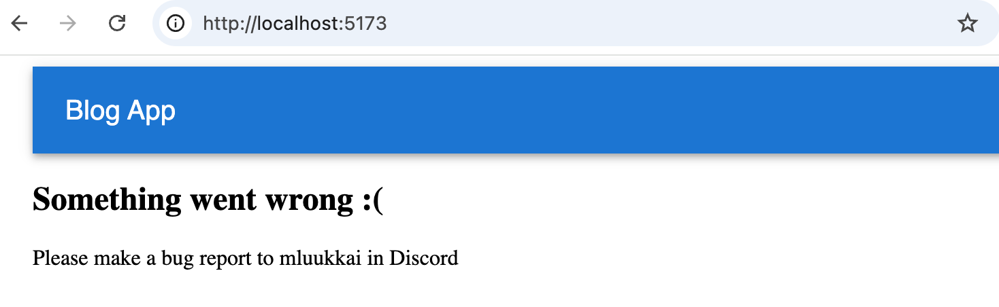
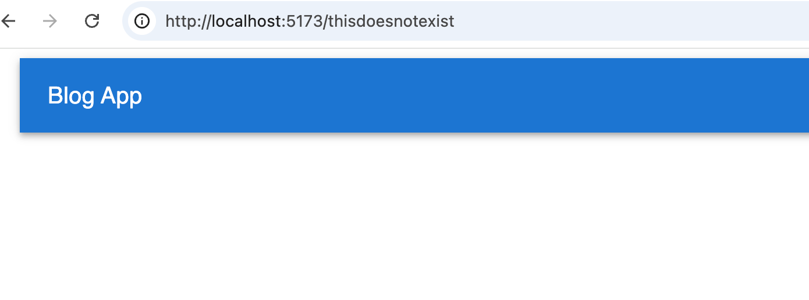
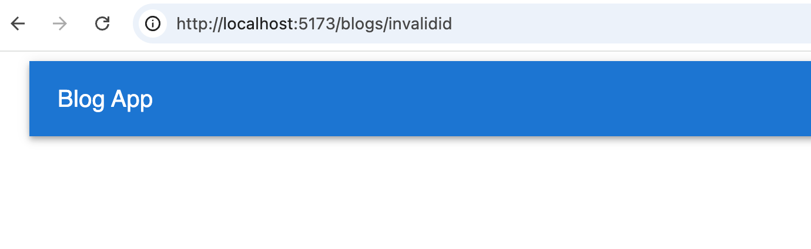
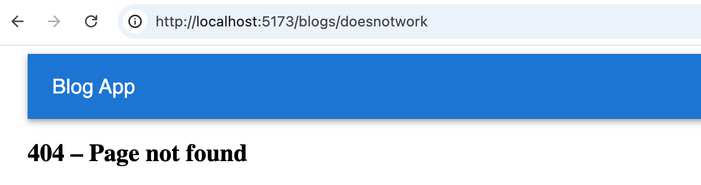

<div class="content">

In addition to the six exercises in the [React Hooks](/en/part7/more_about_react_hooks) sections of this part of the course material, 13 exercises continue our work on the BlogList application that we worked on in parts four and five of the course material. Some of the following exercises are "features" that are independent of one another, meaning that there is no need to finish them in any particular order. You are free to skip over a part of the exercises if you wish to do so. Quite many of them are about applying the advanced state management technique (Zustand, React Query and context) covered in [part 6](/en/part6).

If you do not want to use your BlogList application, you are free to use the code from the model solution as a starting point for these exercises.

Many of the exercises in this part of the course material will require the [refactoring](https://en.wikipedia.org/wiki/Code_refactoring) of existing code. This is a common reality of extending existing applications, meaning that refactoring is an important and necessary skill even if it may feel difficult and unpleasant at times.

One good piece of advice for both refactoring and writing new code is to take <i>baby steps</i>. Losing your sanity is almost guaranteed if you leave the application in a completely broken state for long periods while refactoring.

**These exercises assume that you have already completed the exercises [5.24-5.29](/en/part5/react_router_ui_frameworks#exercises-5-24-5-29). If you have not, do those first.**

</div>

<div class="tasks">

### Exercises 7.7.-7.19.

These exercises assume that you have already completed the exercises [5.24-5.29](/en/part5/react_router_ui_frameworks#exercises-5-24-5-29). If you have not, do those first.

#### 7.7: Frontend and backend in the same repository

During the course, the frontend and backend of the BlogList application have lived in separate repositories. A common real-world practice is to place both into a single repository, which simplifies deployment and makes it easier to share code between the two.

Read the section [Frontend and backend in the same repository](/en/part7/miscellaneous#frontend-and-backend-in-the-same-repository) from the course material and restructure your application accordingly. Place the frontend and backend source code in the same repository while keeping their <i>package.json</i> files separate.

Make sure that the development workflow still works: running <i>npm run dev</i> in the frontend directory should start the Vite dev server with hot reload as before. Also verify that the production build works: the backend should be able to serve the built frontend as a static site using a command such as <i>npm run build && npm start</i> (or equivalent scripts you define).

<i>Note:</i> if you run into strange dependency errors after reorganising the repository, the safest fix is often to delete all <i>node_modules</i> directories and run <i>npm install</i> again from scratch in each of the relevant directories.

#### 7.8: Error boundary

Errors in a React application that are not caught anywhere will result in a blank page. This is not a good user experience. The standard React solution to this problem is the concept of an error boundary, that is a component that wraps part of the component tree and catches any rendering errors that occur within it, displaying a fallback UI instead of crashing the whole page.

Read the section [Error boundary](/en/part7/miscellaneous#error-boundary) from the course material. Then add an error boundary component to your application that catches any rendering errors and displays a user-friendly error message instead of a blank page.

The error boundary should be added to the app so that the navigation bar remains outside it. If a rendering error occurs anywhere in the rest of the application, the error boundary catches it and displays a user-friendly error message like this:



You can simulate a rendering error by temporarily throwing an exception inside one of your components, for example:

```js
const BlogList = ({ blogs }) => {
  throw new Error('simulated error') /*/ highlight line
  return (
    // ...
  )
}
```

#### 7.9: Nonexisting routes

App has also another kind of error. If user tries to navigate to a non existing route such as



or



the result is a blank page. Fix the routing so that navigating to a non-existing path shows a proper "Page not found" message instead. React Router's [splat route](https://reactrouter.com/start/framework/routing#splats) (<i>path="*"</i>) is the right tool for this: it matches any path that no other route covers. The result should look like this:



#### 7.10: Automatic Code Formatting

In the previous parts, we used ESLint to ensure that the code follows the defined conventions. [Prettier](https://prettier.io/) is yet another approach for the same. According to the documentation, Prettier is <i>an opinionated code formatter</i>, that is, Prettier not only controls the code style but also formats the code according to the definition.

Prettier is easy to integrate into the code editor so that when it is saved, it is automatically formatted.

Take Prettier to use in your app and configure it to work with your editor.

### State Management: Zustand

<i>There are two alternative versions to choose for exercises 7.11-7.14: you can do the state management of the application either using Zustand or React Query and Context</i>. If you want to maximize your learning, you should do both versions!

Note: if you completed part 6 using Redux, you can of course use Redux instead of Zustand in this exercise series!

#### 7.11: Zustand, Step 1

Refactor the application to use Zustand to manage the notification data.

#### 7.12: Zustand, Step 2

<i>Note</i> that this and the next two exercises are quite laborious but incredibly educational.

Store the information about blog posts in the Zustand store. In this exercise, it is enough that you can see the blogs in the backend and create a new blog.

You are free to manage the state for logging in and creating new blog posts by using the internal state of React components.

#### 7.13: Zustand, Step 3

Expand your solution so that it is again possible to like and delete a blog.

#### 7.14: Zustand, Step 4

Store the information about the signed-in user in the Zustand store.

### State Management: React Query and Context

<i>There are two alternative versions to choose for exercises 7.11-7.14: you can do the state management of the application either using Zustand or React Query and Context</i>. If you want to maximize your learning, you should do both versions!

#### 7.11: React Query and Context step 1

Refactor the app to use the useReducer-hook and context to manage the notification data.

#### 7.12: React Query and Context step 2

Use React Query to manage the state for blog posts. For this exercise, it is sufficient that the application displays existing blogs and that the creation of a new blog is successful.

You are free to manage the state for logging in and creating new blog posts by using the internal state of React components.

#### 7.13: React Query and Context step 3

Expand your solution so that it is again possible to like and delete a blog.

#### 7.14: React Query and Context step 4

Use the Context API to manage the data for the logged in user.

### Cleanup

#### 7.15: Custom hooks

Your application most likely contains code that handles the logged-in user via <i>localStorage</i> in several places:

```js
const userJSON = window.localStorage.getItem('loggedBlogappUser')

// ...

window.localStorage.setItem('loggedBlogappUser', JSON.stringify(user))

// ...

window.localStorage.removeItem('loggedBlogappUser')
```

Extract this logic into a custom hook called <i>usePersistentUser</i>. The hook should read the initial value from <i>localStorage</i> on mount and keep the stored value in sync whenever it is updated or cleared. It should be usable like this:

```js
const {user, setUser, removeUser} = usePersistentUser('loggedBlogappUser')
```

Also take the [useField](/en/part7/more_about_react_hooks) hook introduced earlier in this part into use in the forms.

### More views

The rest of the tasks are common to both the Zustand and React Query versions.

#### 7.16: Users view

Implement a view to the application that displays all of the basic information related to users:


#### 7.17: Individual User View

Implement a view for individual users that displays all of the blog posts added by that user:


You can access this view by clicking the name of the user in the view that lists all users:


<i>**NB:**</i> you will almost certainly stumble across the following error message during this exercise:


The error message will occur if you refresh the individual user page.

The cause of the issue is that, when we navigate directly to the page of an individual user, the React application has not yet received the data from the backend. One solution for this problem is to use conditional rendering:

```js
const User = () => {
  const user = ...
  // highlight-start
  if (!user) {
    return null
  }
  // highlight-end

  return (
    <div>
      // ...
    </div>
  )
}
```

#### 7.18: Comments, step 1

Implement the functionality for commenting the blog posts:


Comments should be anonymous, meaning that they are not associated with the user who left the comment.

In this exercise, it is enough for the frontend to only display the comments that the application receives from the backend.

An appropriate mechanism for adding comments to a blog post would be an HTTP POST request to the <i>api/blogs/:id/comments</i> endpoint.

#### 7.19: Comments, step 2

Extend your application so that users can add comments to blog posts from the frontend:


This was the last exercise for this part of the course and it's time to push your code to GitHub and mark all of your finished exercises to the [exercise submission system](https://studies.cs.helsinki.fi/stats/courses/fullstackopen).

</div>
