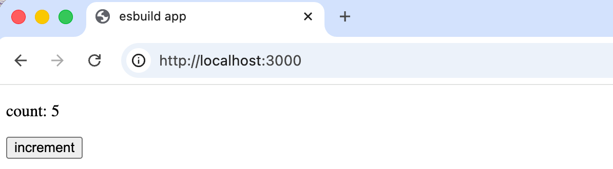
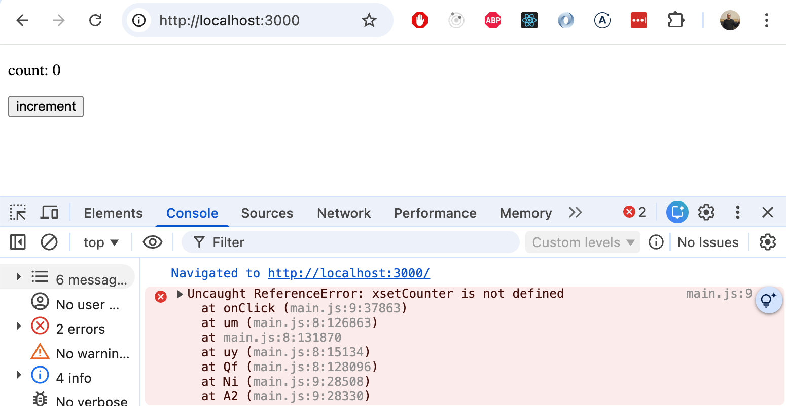
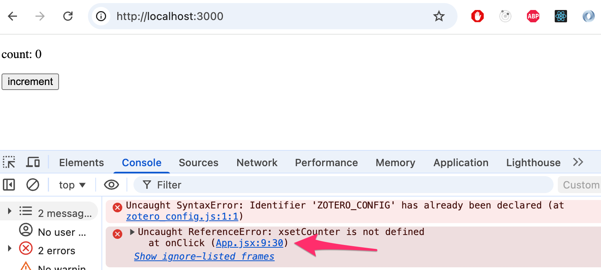

<div class="content">

React oli alkuaikoina jonkin verran tunnettu siitä, että sovelluskehityksen työkalujen konfigurointi oli hyvin hankalaa. Tilanteen helpottamiseksi kehitettiin [Create React App](https://github.com/facebookincubator/create-react-app), joka poisti konfigurointiin liittyvät ongelmat. [Vite](https://vitejs.dev/), jota käytetään läpi tämän kurssin, on sittemmin syrjäyttänyt Create React Appin uusien React-sovellusten standardina.

Sekä Vite että Create React App käyttävät <i>bundlereita</i> varsinaiseen työhön. Tässä osiossa tarkastelemme lähemmin, mitä bundlerit oikeastaan tekevät, miten Vite toimii konepellin alla ja miten sitä voidaan konfiguroida eri tilanteisiin. Tutustumme lyhyesti myös [esbuildiin](https://esbuild.github.io/), matalan tason bundleriin, jota Vite itse käyttää sisäisesti – esbuildiin tutustuminen auttaa selventämään, mitä bundlaus perustavanlaatuisesti tarkoittaa.

> #### Entä Webpack?
>
>Webpack oli hallitseva bundleri suurimman osan 2010-luvusta ja sitä kohdataan edelleen vanhemmissa ja yritystason koodikannoissa. Myös tämä kurssi käsitteli Webpackia kevääseen 2026 asti.
>
> Jos työskentelet legacy-projektin parissa, on hyödyllistä tietää, että Webpack on olemassa ja käyttää samoja peruskäsitteitä (sisääntulopisteet, loaderit/pluginit, ulostulo). Uuden projektin käynnistämistä Webpackilla vuonna 2026 ei kuitenkaan suositella. Sen konfigurointi on monimutkaista, ja modernit työkalut kuten Vite tarjoavat huomattavasti paremman kehittäjäkokemuksen. Webpack-konfiguraatiota ei käsitellä tällä kurssilla.

### Bundlaus

Olemme toteuttaneet sovelluksiamme jakamalla koodin erillisiin moduuleihin, jotka on <i>importattu</i> niitä tarvitseviin paikkoihin. Vaikka ES6-moduulit on määritelty ECMAScript-standardissa, kaikki suoritusympäristöt eivät käsittele moduulipohjaista koodia automaattisesti. Jopa modernit selaimet hyötyvät siitä, että riippuvuudet on esikäsitelty ja optimoitu ennen toimitusta.

Tästä syystä moduuleihin jaettu koodi <i>bundlataan</i> tuotantoa varten, eli lähdekooditiedostot muunnetaan ja yhdistetään optimoiduksi tiedostojoukoksi, jonka selain voi ladata tehokkaasti. Kun aiemmissa osissa suoritimme komennon <i>npm run build</i>, Vite suoritti tämän bundlauksen. Tulos löytyy <i>dist</i>-hakemistosta:

```
├── assets
│   ├── index-d526a0c5.css
│   ├── index-e92ae01e.js
│   └── react-35ef61ed.svg
├── index.html
└── vite.svg
```

Juuressa oleva <i>index.html</i> lataa bundlatun JavaScriptin <i>script</i>-tagilla:

```html
<!doctype html>
<html lang="en">
  <head>
    <meta charset="UTF-8" />
    <link rel="icon" type="image/svg+xml" href="/vite.svg" />
    <meta name="viewport" content="width=device-width, initial-scale=1.0" />
    <title>Vite + React</title>
    <script type="module" crossorigin src="/assets/index-e92ae01e.js"></script> // highlight-line
    <link rel="stylesheet" href="/assets/index-d526a0c5.css">  // highlight-line
  </head>
  <body>
    <div id="root"></div>
  </body>
</html>
```

CSS bundlataan myös yhdeksi tiedostoksi.

Käytännössä bundlaus alkaa sisääntulopisteestä, joka on tyypillisesti <i>main.jsx</i>. Vite sisällyttää paitsi sisääntulopisteestä löytyvän koodin myös kaiken sen importtaaman – rekursiivisesti – kunnes koko riippuvuusgraafi on ratkaistu.

Koska osa importatuista tiedostoista on paketteja kuten React, Redux ja Axios, bundlattu JavaScript-tiedosto sisältää myös jokaisen näistä kirjastoista.

> Ennen bundlereita vanha lähestymistapa perustui siihen, että index.html latasi kaikki sovelluksen erilliset JavaScript-tiedostot script-tagien avulla. Tämä heikensi suorituskykyä, koska jokaisen erillisen tiedoston lataaminen aiheuttaa ylimääräistä kuormaa. Tästä syystä nykyään suosittu tapa on bundlata koodi yhdeksi tiedostoksi. Bundlaus mahdollistaa myös optimoinnit kuten minifioinnin ja tree-shakingin (käyttämättömän koodin poistaminen).

### Miten Vite toimii

Vitellä on kaksi selvästi erilaista toimintatilaa.

**Kehitystila** (<i>npm run dev</i>) ei bundlaa koodiasi lainkaan. Sen sijaan Vite käynnistää kehitysserverin, joka tarjoaa lähdekooditiedostosi natiiveina ES-moduuleina suoraan selaimelle, jolloin selain ratkaisee importit itse. Tästä syystä käynnistys on lähes välitöntä riippumatta projektin koosta.
Poikkeuksena: kolmannen osapuolen riippuvuudet node_modulesista esibundlataan esbuildilla ennen serverin käynnistystä. Tämä ratkaisee kaksi ongelmaa: monet npm-paketit ovat edelleen CommonJS-muodossa (jota selaimet eivät voi kuluttaa natiivisti), ja jotkut kirjastot koostuvat sadoista pienistä sisäisistä tiedostoista, jotka muuten aiheuttaisivat satoja erillisiä pyyntöjä. esbuild muuntaa ja yhdistelee ne, tallentaa tuloksen levylle välimuistiin, ja seuraavat käynnistykset ovat lähes välittömiä.

**Tuotantotila** (<i>npm run build</i>) käyttää [Rollup](https://rollupjs.org/)ia bundlaukseen esbuildsin hoitaessa edelleen muita tehtäviä kuten transpilointia (JSX, TypeScript) ja minifiointia. Rollup on suunniteltu alusta alkaen ES-moduuleille, mikä tekee siitä poikkeuksellisen hyvän <i>tree-shakingin</i> suhteen – tekniikka, joka analysoi staattisesti, mitä eksportteja kustakin moduulista oikeasti käytetään, ja poistaa loput lopullisesta bundlesta. Esimerkiksi jos importtaat vain yhden apufunktion suuresta kirjastosta, tree-shaking varmistaa, että muu kirjaston koodi ei päädy bundleen. Tämä voi merkittävästi pienentää bundlen kokoa.

Vastuunjako – esbuild nopeudesta, Rollup bundlen laadusta – on keskeinen osa Viten suunnittelua.

> Saatat miettiä, miksi Vite ei käytä esbuildia myös tuotantobundlaukseen, ottaen huomioon kuinka nopea se on. Syy on se, että esbuildsin bundlauksen tulos, vaikkakin oikea, tuottaa heikommin optimoituja tuloksia vaativissa tilanteissa: sillä on rajallinen tuki code splittingille, se ei tuota yhtä tasokasta chunkkioptimointia, ja sen plugin-ekosysteemi bundle-tason muunnoksia varten on vielä kypsymässä. Rollupin tulos on ennustettavampaa ja paremmin viritettyä todellisten sovellusten monimutkaisille riippuvuusgraafeille. Viten tekijät [ovat ilmoittaneet](https://vitejs.dev/guide/why.html#why-not-bundle-with-esbuild) aikovansa siirtyä esbuildiin tuotantobundlauksessa, kun sen ominaisuudet sulkevat tämän aukon.

### esbuildiin tutustuminen

Bundlauksen perusolemuksen ymmärtämiseksi on hyödyllistä työskennellä [esbuildsin](https://esbuild.github.io/) kanssa suoraan, ilman Viten lisäämää abstraktiokerrosta. Rakennetaan minimaalinen React-ympäristö tyhjästä.

Luodaan ensin yksinkertainen React-sovellus seuraavalla hakemistorakenteella:

```
├── dist
│   └── index.html
├── src
│   ├── index.jsx
│   └── App.jsx
└── package.json
```

Asennetaan ensin React ja react-dom:

```bash
npm install react react-dom
```

Asennetaan myös esbuild:

```bash
npm install --save-dev esbuild
```

Lisätään aluksi kaksi skriptiä <i>package.json</i>-tiedostoon:

```json
{
  "scripts": {
    "build": "esbuild src/main.jsx --bundle --outfile=dist/main.js --jsx=automatic",
    "serve": "npx serve dist"
  },
  // ...
}
```

Sovellusta varten tarvitsemme tiedoston <i>dist/index.html</i>, joka lataa JavaScript-bundlen:

```html
<!DOCTYPE html>
<html lang="en">
  <head>
    <meta charset="UTF-8" />
    <title>esbuild app</title>
  </head>
  <body>
    <div id="root"></div>
    <script src="./main.js"></script>
  </body>
</html>
```

Sisääntulopiste <i>src/main.jsx</i> on tyypillinen:

```jsx
import React from 'react'
import ReactDOM from 'react-dom/client'
import App from './App'

ReactDOM.createRoot(document.getElementById('root')).render(<App />)
```

Yksinkertainen sovelluskomponentti <i>src/App.jsx</i> on seuraavanlainen:

```jsx
import React, { useState } from 'react'

const App = () => {
  const [counter, setCounter] = useState(0)

  return (
    <div>
      <p>count: {counter}</p>
      <button onClick={() => setCounter(counter + 1)}>increment</ button>
    </div>
  )
}

export default App
```

Nyt voimme bundlata sovelluksen:

```bash
npm run build
```

Tulostus on yksittäinen <i>dist/main.js</i>-tiedosto, joka sisältää sovelluskoodisi yhdessä React-kirjaston kanssa bundlattuna.

Voimme nyt ajaa bundlatun sovelluksen komennolla <i>npm run serve</i>. Tämä käyttää [serve](https://www.npmjs.com/package/serve)-pakettia käynnistääkseen paikallisen staattisten tiedostojen palvelimen <i>dist</i>-hakemistolle, jolloin sovellus on saatavilla osoitteessa <i>http://localhost:3000</i>:



esbuild tukee myös [minifiointia](https://en.wikipedia.org/wiki/Minification_(programming)) komentorivilippujen avulla. Minifiointi poistaa välilyönnit ja kommentit, lyhentää muuttujanimiä ja soveltaa muita kokooptimointeja. Bundle on huomattavan suuri, koska se sisältää koko React-kirjaston. Minifiointi pienentää sen kokoa merkittävästi.

Otetaan nyt käyttöön minifiointi:

```json
{
  "scripts": {
    "build": "esbuild src/main.jsx --bundle --minify --outfile=dist/main.js --jsx=automatic",  // highlight-line
    "serve": "npx serve dist"
  }
}
```

Minifiointi pienentää bundlen koon noin 1,1 megatavusta noin 190 kilotavuun, mikä on merkittävä pienennys.

Minifioinnissa on kuitenkin haittapuoli: jos sovellus heittää ajonaikaisen virheen, selaimen kehittäjätyökalut osoittavat riville minifioidussa <i>main.js</i>-tiedostossa, jota on lähes mahdoton lukea:



Ratkaisu on [source map](https://developer.mozilla.org/en-US/docs/Glossary/Source_map): oheistiedosto (<i>dist/main.js.map</i>), joka tallentaa, miten jokainen minifioidun bundlen rivi vastaa alkuperäistä lähdekoodia. Kun se on käytössä, pinojäljitys osoittaa tarkkaan riviin <i>App.jsx</i>- tai <i>main.jsx</i>-tiedostossa minifioidun koodin lukukelvottoman seinän sijaan.

Voimme ottaa source mapit käyttöön lisäämällä <i>--sourcemap</i>-lipun:

```json
{
  "scripts": {
    "build": "esbuild src/main.jsx --bundle --minify --sourcemap --outfile=dist/main.js --jsx=automatic",  // highlight-line
    "serve": "npx serve dist"
  }
}
```

Nyt virhe on ymmärrettävä:



Huomaa, että source mapit ovat korvaamattomia kehityksen ja debuggauksen aikana, mutta saatat haluta jättää ne pois julkisesta tuotantobuildista. Koska source map sisältää alkuperäisen lähdekoodisi, kuka tahansa, joka avaa selaimen kehittäjätyökalut, voi lukea minifioimattoman sovelluslogiikkasi. Jos tämä on huolenaihe, jätä yksinkertaisesti <i>--sourcemap</i>-lippu pois tuotantobuild-komennosta.

### Transpilaus

Bundlauksen ohella esbuild suorittaa toisen keskeisen tehtävän: <i>transpilauksen</i>. Transpilaus tarkoittaa lähdekoodin muuntamista yhdestä JavaScript-muodosta toiseen, tyypillisesti modernista tai laajennetusta syntaksista tavalliseksi JavaScriptiksi, jonka selaimet voivat suorittaa.

Selaimet ymmärtävät tavallista JavaScriptiä, mutta JSX ei ole kelvollista JavaScriptiä – yksikään selain ei voi jäsentää sitä suoraan. Kun kirjoitamme:

```jsx
const element = <App />
```

se täytyy transpiloida sellaiseen muotoon, jonka selain voi suorittaa:

```js
const element = React.createElement(App, null)
```

Tästä syystä transpilaus on pakollinen vaihe kaikissa React-projekteissa, ei valinnainen optimointi. esbuild suorittaa sen automaattisesti bundlauksen yhteydessä. <i>--jsx=automatic</i>-lipun ansiosta esbuild käsittelee JSX:n ilman ulkoisia työkaluja. Vanhassa Webpack-pohjaisessa työnkulussa piti asentaa ja konfiguroida [Babel](https://babeljs.io/) ja siihen liittyvät paketit JSX:n transpilointia varten. esbuildilla <i>.jsx</i>-päätteiset tiedostot transpiloidaan automaattisesti.

### Kehitysympäristö

Tähän asti jokainen muutos on vaatinut komennon <i>npm run build</i> ajamisen ja selaimen manuaalisen päivityksen – hidas sykli, joka käy nopeasti tylsäksi. esbuildsin sisäänrakennettu [kehitysserveri](https://esbuild.github.io/api/#serve) ratkaisee tämän. Lisätään <i>dev</i>-skripti <i>package.json</i>-tiedostoon:

```json
{
  "scripts": {
    "build": "esbuild src/main.jsx --bundle --minify --sourcemap --outfile=dist/main.js --jsx=automatic",
    "serve": "npx serve dist",
    "dev": "esbuild src/main.jsx --bundle --outfile=dist/main.js --jsx=automatic --servedir=./dist --watch" // highlight-line
  }
}
```

Komennon <i>npm run dev</i> ajaminen tekee kaksi asiaa yhtä aikaa. Ensiksi [--watch](https://esbuild.github.io/api/#watch) käskee esbuildsia tarkkailemaan kaikkia importattuja lähdekooditiedostoja muutosten varalta ja rakentamaan bundlen automaattisesti uudelleen aina kun jokin niistä tallennetaan. Toiseksi [--servedir](https://esbuild.github.io/api/#serve) käynnistää kevyen HTTP-palvelimen, joka tarjoaa <i>dist</i>-hakemiston sisällön – <i>index.html</i>:n ja juuri rakennetun <i>main.js</i>:n – osoitteessa <i>http://localhost:8000</i>.

<i>--servedir</i>-lippu on se, joka saa molemmat osat toimimaan yhdessä: ilman sitä esbuild vain rakentaisi uudelleen watch-tilassa mutta ei tarjoilisi mitään. Sen kanssa palvelin toimittaa aina viimeisimmän bundlen, joten sinun tarvitsee vain päivittää selain tiedoston tallentamisen jälkeen.

Huomaa, että toisin kuin Viten kehitysserveri, esbuild ei tue hot module replacementia. Lähdekoodin muutokset vaativat manuaalisen selaimen päivityksen tullakseen voimaan.

esbuildsin rajapinnan selkeys havainnollistaa, mitä bundleri perimmiltään tekee: se ottaa sisääntulopisteen, seuraa kaikki importit ja tuottaa optimoidun tulostuksen. Vite rakentuu tämän perustan päälle ja lisää kehittäjäkokemuksen kerroksen: kehitysserverin, hot module replacementin ja järkevät oletukset React-projekteille.

Nyt kun meillä on selkeämpi käsitys siitä, mitä bundlaus ja transpilaus perimmiltään tarkoittavat, palataan Viten pariin ja katsotaan, miten sitä voidaan konfiguroida.

### Viten konfigurointi

Suurimmassa osassa React-projekteja Vite toimii ilman minkäänlaista konfigurointia. Kun käyttäytymistä kuitenkin täytyy mukauttaa, muokataan <i>vite.config.js</i>-tiedostoa (tai <i>vite.config.ts</i>).

Minimaalinen Vite-konfiguraatio React-projektille näyttää tältä:

```js
import { defineConfig } from 'vite'
import react from '@vitejs/plugin-react'

export default defineConfig({
  plugins: [react()],
})
```

<i>@vitejs/plugin-react</i>-plugin mahdollistaa JSX-muunnoksen, fast refreshin (hot module replacement, joka säilyttää komponenttien tilan) ja muita React-kohtaisia ominaisuuksia.

#### Kehitysserverin konfigurointi

Kehitysserverin portin ja muita asetuksia voidaan konfiguroida <i>server</i>-avaimen alla:

```js
export default defineConfig({
  plugins: [react()],
  server: {
    port: 3000,
    open: true,        // avaa selain automaattisesti
  },
})
```

#### API-pyyntöjen proxytys

Paikallisessa kehityksessä React-sovellus pyörii tyypillisesti yhdessä portissa (esim. 3000) ja backend toisessa (esim. 3001). Selaimen same-origin-käytäntö estäisi normaalisti pyyntöjen tekemisen niiden välillä. Viten proxy-asetus ratkaisee tämän ilman CORS-konfigurointia backendissä:

```js
export default defineConfig({
  plugins: [react()],
  server: {
    port: 3000,
    proxy: {
      '/api': {
        target: 'http://localhost:3001',
        changeOrigin: true,
      },
    },
  },
})
```

Tällä konfiguraatiolla Viten kehitysserveri välittää automaattisesti kaikki React-sovelluksen tekemät pyynnöt osoitteeseen <i>/api/notes</i> osoitteeseen <i>http://localhost:3001/api/notes</i>. Frontend-koodin ei koskaan tarvitse sisällyttää <i>localhost:3001</i>-osoitetta URL-osoitteisiinsa kehityksen aikana.

#### Ympäristömuuttujat

Vitellä on sisäänrakennettu tuki ympäristömuuttujille <i>.env</i>-tiedostojen avulla. Tämä on moderni korvike vakioiden manuaaliselle injektoinnille bundleen.

Luodaan <i>.env</i>-tiedosto projektin juureen:

```
VITE_BACKEND_URL=http://localhost:3001/api/notes
```

Ja <i>.env.production</i>-tiedosto tuotantoarvoille:

```
VITE_BACKEND_URL=https://myapp.fly.dev/api/notes
```

**Tärkeää:** kaikkien selaimelle näkyvien ympäristömuuttujien täytyy alkaa etuliitteellä <i>VITE_</i>. Muuttujat ilman tätä etuliitettä pysyvät vain palvelinpuolella, eikä niitä sisällytetä bundleen. Tämä on tietoinen turvallisuustoimenpide, joka estää salaisuuksien vahingollisen vuotamisen.

Muuttujaan pääsee käsiksi sovelluskoodissa <i>import.meta.env</i>:n kautta:

```js
const App = () => {
  const notes = useNotes(import.meta.env.VITE_BACKEND_URL)

  return (
    <div>
      {notes.length} notes on server {import.meta.env.VITE_BACKEND_URL}
    </div>
  )
}
```

Vite valitsee automaattisesti oikean <i>.env</i>-tiedoston moden perusteella:

- <i>npm run dev</i> käyttää tiedostoja <i>.env</i> ja <i>.env.development</i>
- <i>npm run build</i> käyttää tiedostoja <i>.env</i> ja <i>.env.production</i>

Lisää <i>.env.production</i> <i>.gitignore</i>-tiedostoon, jos se sisältää arkaluonteisia arvoja, ja käytä <i>.env.example</i>-tiedostoa dokumentoimaan, mitä muuttujia tarvitaan.

#### Transpilaus

Vite käsittelee koodin transpilauksen automaattisesti. Kehityksen aikana esbuild transpiloi TypeScript- ja JSX-koodisi tarpeen mukaan. Se on tarpeeksi nopea tekemään tämän tiedostokohtaisesti ilman havaittavaa viivettä. Tuotantobuildien aikana Rollup hoitaa bundlauksen esbuildsin hoitaessa transpilauksen.

Viten oletustranspilointikohde on modernit selaimet, jotka tukevat natiiveja ES-moduuleita (Chrome 87+, Firefox 78+, Safari 14+, Edge 88+). Jos sinun täytyy tukea vanhempia selaimia, voit konfiguroida kohteen eksplisiittisesti ja lisätä <i>@vitejs/plugin-legacy</i>-pluginin:

```bash
npm install --save-dev @vitejs/plugin-legacy
```

```js
import { defineConfig } from 'vite'
import react from '@vitejs/plugin-react'
import legacy from '@vitejs/plugin-legacy'

export default defineConfig({
  plugins: [
    react(),
    legacy({
      targets: ['defaults', 'not IE 11'],
    }),
  ],
})
```

Legacy-plugin generoi automaattisesti erillisen bundlen vanhemmille selaimille Babelin avulla.

#### CSS

Vite käsittelee CSS:n ilman minkäänlaista konfigurointia. Importtaa CSS-tiedosto JavaScriptistäsi:

```js
import './index.css'
```

Vite käsittelee sen ja sisällyttää sen buildiin. Tuotannossa CSS extraktoidaan erilliseen tiedostoon. Kehityksen aikana se injektoidaan <i>&lt;style&gt;</i>-tagien kautta hot reload -tuella.

Vite tukee myös natiivisti [CSS Moduleita](https://github.com/css-modules/css-modules) scoped-tyyleille. Jokainen <i>.module.css</i>-päätteinen tiedosto käsitellään CSS Modulena:

```js
import styles from './App.module.css'

const App = () => (
  <div className={styles.container}>
    hello vite
  </div>
)
```

CSS-esiprosessorit kuten [Sass](https://sass-lang.com/) voidaan lisätä yksinkertaisesti asentamalla esiprosessori – pluginia tai konfigurointia ei tarvita:

```bash
npm install --save-dev sass
```

Sen jälkeen <i>.scss</i>-tiedostot toimivat automaattisesti.

#### Minifiointi

Komennon <i>npm run build</i> ajamisen yhteydessä Vite minifioi tulostuksen. Minifiointi poistaa välilyönnit ja kommentit, lyhentää muuttujanimiä ja soveltaa muita kokooptimointeja. Tuloksena on paljon pienempi tiedosto, joka latautuu nopeammin selaimessa.

Vite käyttää esbuildsia JavaScript-minifiointiin ja sisäänrakennettua CSS-minifioijaa tyylitiedostoille.

#### Source mapit

Source mapit mahdollistavat sen, että selaimen kehittäjätyökalut voivat yhdistää virheet ja breakpointit takaisin alkuperäiseen lähdekoodiin minifioidun bundlen sijaan. Ilman niitä pinojäljitys, joka osoittaa <i>main.js</i>:n riville 1, on lähes hyödytön debuggauksessa.

Kehityksessä Vite generoi source mapit automaattisesti. Tuotantobuildeja varten ne voidaan ottaa käyttöön eksplisiittisesti:

```js
export default defineConfig({
  plugins: [react()],
  build: {
    sourcemap: true,
  },
})
```

Huomaa, että tuotannon source mapit pidentävät buildausaikaa ja paljastavat lähdekoodisi kaikille, jotka katsovat verkko-välilehteä. Monissa tapauksissa on parempi ladata source mapit virheenseurantapalveluun (kuten Sentryyn) ja pitää ne poissa julkiselta palvelimelta.

#### Pluginit

Viten toiminnallisuutta laajennetaan [plugineilla](https://vite.dev/plugins/). Plugin-ekosysteemi on kasvanut nopeasti ja kattaa useimmat yleiset tarpeet. Joitakin laajasti käytettyjä plugineja ovat:

- <i>@vitejs/plugin-react</i> — React-tuki (JSX, fast refresh)
- <i>@vitejs/plugin-legacy</i> — vanhojen selainten tuki
- <i>vite-plugin-svgr</i> — SVG-tiedostojen importtaus React-komponentteina
- <i>rollup-plugin-visualizer</i> — bundlen koon analyysi

Pluginit määritellään <i>plugins</i>-taulukossa <i>vite.config.js</i>-tiedostossa. Ne noudattavat samaa rajapintaa kuin Rollup-pluginit, joten monet Rollup-pluginit toimivat myös Vitessä.

#### Polyfillsit

<i>Polyfill</i> on koodi, joka toteuttaa ominaisuuden selaimille, jotka eivät sitä natiivisti tue. Transpilaus yksin ei riitä ominaisuuksille, jotka ovat syntaktisesti kelvollisia mutta toteuttamattomia. Esimerkiksi selain saattaa jäsentää <i>Promise</i>n oikein mutta sillä ei ole toteutusta sille.

Vitessä polyfillit hoitaa <i>@vitejs/plugin-legacy</i>-plugin, joka sisällyttää automaattisesti tarvittavat polyfillit selainkohteidesi perusteella. Jos tarvitset tietyn polyfillin ilman legacy-pluginia, voit asentaa sen suoraan ja importtaa sen sisääntulotiedostosi alussa.

Voit tarkistaa selaintuen tietyille API:ille osoitteesta [https://caniuse.com](https://caniuse.com) tai [Mozillan MDN-dokumentaatiosta](https://developer.mozilla.org/).

</div>

